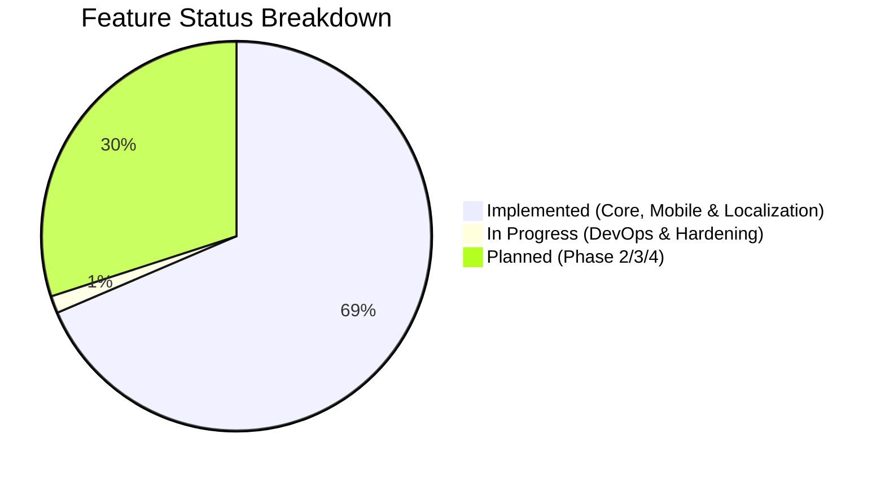

# Grahvani Master Feature Tracking Document

> [!NOTE]
> **Document Purpose**: This master feature tracking backlog consolidates **every feature, technical capability, and system requirement** identified across the entire Grahvani documentation suite. It serves as an authoritative source for engineering sprint planning, implementation ticketing, scope boundary verification, and product roadmap tracking.
> **Last Verified**: August 6, 2026 (Codebase Audit Completed)

---

## 1. Executive Summary & Feature Breakdown

- **Total Features Documented**: 70 Features
- **Implemented (Backend API, Core Astrology, RAG & Mobile UI)**: 48 Features
- **In Progress (DevOps & Hardening)**: 1 Feature
- **Planned (Phase 2/3/4 Expansion Features)**: 21 Features
- **Deprecated / Out of Scope**: 0 Features
- **Unknown / Ambiguous Status**: 0 Features

---

## 2. Master Feature Backlog Table

| Feature Description & Scope | Status | Importance | Category / Notes |
| :--- | :---: | :---: | :--- |
| **Google Sign-In, Apple ID & Phone OTP Authentication** | `Implemented` | `Critical` | **Authentication**: Backend verification ready (`security.py`); Flutter `LoginScreen` built. |
| **Stateless Firebase JWT Verification Middleware** | `Implemented` | `Critical` | **Authentication**: FastAPI backend middleware checking signature, issuer, and JWKS keys. |
| **Redis Token Blacklisting & Revocation** | `Implemented` | `High` | **Authentication**: Instant logout revocation check via Redis `revoked_token:<jti>`. |
| **Automatic First-Login User Provisioning** | `Implemented` | `Critical` | **Authentication**: Auto-creates `users` row with default `'user'` role and `'free'` tier. |
| **Multi-Tenant Profile Isolation Enforcement** | `Implemented` | `Critical` | **Authentication**: DB queries enforce `WHERE user_id = :id` for data privacy. |
| **Add Birth Profile (Name, DOB, TOB, City Autocomplete)** | `Implemented` | `Critical` | **Profiles**: Backend API `/profiles` implemented; Flutter `AddProfileScreen` built. |
| **Google Places Geocoding & IANA Timezone Resolution** | `Implemented` | `Critical` | **Profiles**: Auto-resolves lat/long coordinates & timezone ID; mobile autocomplete UI built. |
| **Birth Profile Storage & Drift SQLite Offline Cache** | `Implemented` | `High` | **Profiles**: Drift SQLite database (`ProfileCaches` & `ChartCaches`) for offline viewing of profiles and charts. |
| **Free / Premium Profile Capacity Limits** | `Implemented` | `High` | **Profiles**: Server-enforced limits (1 profile Free vs Unlimited Premium). |
| **Primary Profile Soft-Delete Protection** | `Implemented` | `High` | **Profiles**: Soft-delete column `deleted_at` & primary profile protection active. |
| **Swiss Ephemeris C-Library (`pyswisseph`) Integration** | `Implemented` | `Critical` | **Astrology Engine**: Core astronomical calculation engine for sub-arcsecond planetary precision. |
| **Lahiri (Chitra Paksha) Ayanamsa Calculation** | `Implemented` | `Critical` | **Astrology Engine**: Default sidereal ayanamsa calculation standard. |
| **Custom Ayanamsa Support (Raman, KP, Fagan-Bradley)** | `Implemented` | `Medium` | **Astrology Engine**: Supported in `ephemeris_service.py` (`AYANAMSA_MAP`); UI config toggle pending. |
| **Placidus & Equal House System Calculations** | `Implemented` | `Critical` | **Astrology Engine**: House cusp calculation algorithms. |
| **D1 (Rasi) & D9 (Navamsha) Chart Calculation** | `Implemented` | `Critical` | **Astrology Engine**: Core planetary and divisional chart calculation engine. |
| **D10 (Dasamsa), D12 (Dwadasamsa), D60 (Shashtiamsa) Charts** | `Implemented` | `High` | **Astrology Engine**: Ephemeris calculation engine & Flutter divisional chart selector widget built. |
| **Vimshottari Maha Dasha Timeline Calculation** | `Implemented` | `Critical` | **Astrology Engine**: Planetary major timeline period calculations. |
| **Vimshottari Antar Dasha & Pratyantar Dasha Breakdown** | `Implemented` | `High` | **Astrology Engine**: Complete nested dasha breakdown calculated in `ephemeris_service.py`. |
| **Planetary Degrees, Nakshatras, Pada & Retrograde Detection** | `Implemented` | `Critical` | **Astrology Engine**: Full planetary state calculation. |
| **Ashtakvarga & Planetary Dignity Scoring** | `Implemented` | `Medium` | **Astrology Engine**: Numerical strength and dignity calculations built (`ashtakvarga_service.py` & `dignity_service.py`). |
| **Immutable Chart Snapshot Persistence (`chart_facts_json`)** | `Implemented` | `Critical` | **Astrology Engine**: JSONB storage in PostgreSQL to prevent silent recalculations. |
| **Native Flutter `CustomPainter` North Indian Diamond Chart** | `Implemented` | `Critical` | **Chart UI**: Native vector rendering grid & divisional chart selector built in `ChartScreen`. |
| **House-Tap Interactive Details Bottom Sheet** | `Implemented` | `High` | **Chart UI**: Tapping house opens details sheet in `ChartScreen`. |
| **Retrograde & Zodiac Sign Placement Indicators** | `Implemented` | `High` | **Chart UI**: Visual rendering for retrograde ℛ and sign placements built. |
| **Current Dasha Timeline Auto-Scroll & Highlight** | `Implemented` | `High` | **Chart UI**: Auto-scroll and highlight for current dasha built. |
| **High-Resolution PDF Birth Chart Export** | `Implemented` | `High` | **Chart UI**: Dramatiq task created; WeasyPrint PDF template rendering built. |
| **South Indian Chart Style Rendering** | `Implemented` | `High` | **Chart UI**: Native vector grid renderer (`SouthIndianChart`) & North/South Indian style selector toggle built in `ChartScreen`. |
| **Grounded RAG Pipeline (pgvector + Google Gemini Flash)** | `Implemented` | `Critical` | **AI & RAG**: Grounded RAG search + Gemini Flash SSE streaming built in `interpretation/router.py`. |
| **Hybrid Search (BM25 GIN Full-Text + HNSW Cosine Vector via RRF)** | `Implemented` | `Critical` | **AI & RAG**: HNSW vector + GIN tsvector RRF fusion search implemented in `interpretation/router.py`. |
| **Server-Sent Events (SSE) Token-by-Token Chat Streaming** | `Implemented` | `Critical` | **AI & RAG**: SSE streaming endpoint and client listener built in `interpretation/router.py` & `chat_screen.dart`. |
| **Interactive Classical Citation Chips (`[BPHS Ch 12]`) & Shloka Modal** | `Implemented` | `Critical` | **AI & RAG**: Citation chips and source text modal built in `chat_screen.dart`. |
| **500-Character Prompt Input Cap & Error Handling** | `Implemented` | `High` | **AI & RAG**: Input validation on chat prompts and character counter active. |
| **Chat History Retention (7 Days Free / 12 Months Premium)** | `Implemented` | `High` | **AI & RAG**: Automated cleanup worker schemas for free vs premium sessions. |
| **AI Content Guardrails (Medical, Financial, Legal, Prompt Injection)** | `Implemented` | `Critical` | **AI & RAG**: Hard blocking rules preventing non-astrological or dangerous advice. |
| **Langfuse AI Trace Logging & Cost Accounting** | `Implemented` | `High` | **AI & RAG**: LLM tracing, prompt cost accounting, and hallucination evaluation setup (`app/core/tracing.py`). |
| **Post-Retrieval Reranking (`bge-reranker-large`)** | `Planned` | `Medium` | **AI & RAG**: Cross-encoder reranking model planned for Phase 3 retrieval enhancement. |
| **LangGraph Multi-Step Admin Editorial Ingestion Pipeline** | `Planned` | `Medium` | **AI & RAG**: Admin pipeline for classical text ingestion, citation checking, and human review. |
| **Server-Side Entitlement Engine & 403 `ENTITLEMENT_REQUIRED` Interceptor** | `Implemented` | `Critical` | **Billing**: Global API entitlement check catching limits (`/billing/entitlements`). |
| **Free Tier Daily AI Question Limit Enforcement (3 Qs/Day)** | `Implemented` | `Critical` | **Billing**: Rate limit check returning HTTP 403 when daily quota is exhausted. |
| **Google Play In-App Billing Integration & RTDN Webhooks** | `Implemented` | `Critical` | **Billing**: Native Android billing and Real-Time Developer Notifications handler built. |
| **Apple App Store In-App Purchases & Server Notifications v2** | `Implemented` | `Critical` | **Billing**: Native iOS IAP and App Store Server Notifications v2 handler built. |
| **Razorpay Web / UPI Subscription Checkout & Webhooks** | `Implemented` | `High` | **Billing**: India web subscription checkout and HMAC signature verification webhooks built. |
| **Flutter Modal Bottom Sheet Upgrade Paywall UI** | `Implemented` | `High` | **Billing**: Flutter `PaywallSheet` UI built with comparison table & price cards. |
| **7-Day Free Premium Trial** | `Planned` | `Medium` | **Billing**: Friction reduction trial flow planned post-launch. |
| **Family Plan Subscription Sharing (up to 5 profiles)** | `Planned` | `Medium` | **Billing**: Multi-profile subscription tier planned for Phase 3. |
| **Lifetime License Option** | `Planned` | `Low` | **Billing**: One-time purchase tier planned for Phase 3. |
| **FastAPI Modular Monolith Architecture (Python 3.12)** | `Implemented` | `Critical` | **Backend Architecture**: Async backend structure with isolated domain modules. |
| **SQLAlchemy 2.0 AsyncEngine & PGBouncer Connection Pooling** | `Implemented` | `Critical` | **Backend Architecture**: High-concurrency async database connection pool. |
| **Dramatiq Worker Task Queue (Redis 7 Message Broker)** | `Implemented` | `Critical` | **Backend Architecture**: Async background task processing for ephemeris & heavy jobs. |
| **Redis Sliding-Window Rate Limiting & NVIDIA Fallback Engine** | `Implemented` | `High` | **Backend & AI**: 40 RPM per-user rate limiter (`llm_provider.py`) + auto-switch to NVIDIA Nemotron fallback on quota error. |
| **Pydantic v2 Request/Response Schema Validation** | `Implemented` | `Critical` | **Backend Architecture**: OpenAPI model validation across all API routes. |
| **Global Async Exception Handling & JSON Error Envelopes** | `Implemented` | `Critical` | **Backend Architecture**: Standardized `{ "success": false, "error": ... }` envelopes. |
| **PostgreSQL 16 Engine with `pgvector` 0.6+ Extension** | `Implemented` | `Critical` | **Database**: Primary single-store relational + vector database layer. |
| **768-Dim HNSW Vector Similarity Index (`m=16`, `ef_construction=64`)** | `Implemented` | `Critical` | **Database**: Sub-15ms vector cosine distance similarity search index. |
| **Alembic Zero-Downtime Migration Engine (Expand/Contract)** | `Implemented` | `Critical` | **Database**: Version-controlled database schema migration pipeline. |
| **Autovacuum Tuning for Churn Tables (`background_tasks`, `chat_messages`)** | `Implemented` | `High` | **Database**: Custom autovacuum scale factors preventing table bloat. |
| **Indian DPDP Act 2023 Explicit Consent Screen & Audit Log** | `Implemented` | `Critical` | **Security & Compliance**: Implemented backend logging and Flutter consent UI. |
| **Account & Data Deletion API (`DELETE /api/v1/users/me`)** | `Implemented` | `Critical` | **Security & Compliance**: Soft-delete and automated hard purge logic in user models. |
| **TLS 1.3 In-Transit & AWS KMS AES-256 At-Rest Encryption** | `Implemented` | `Critical` | **Security & Compliance**: Complete end-to-end data encryption. |
| **AWS Secrets Manager Key Storage & Rotation** | `Implemented` | `High` | **Security & Compliance**: Cloud credentials and key rotation setup in Phase 2. |
| **OWASP Mobile Top 10 Security Hardening** | `Implemented` | `High` | **Security & Compliance**: Pre-launch mobile vulnerability sign-off. |
| **Swiss Ephemeris Commercial License Procurement** | `Planned` | `Critical` | **Security & Compliance**: Official Astrodienst AG commercial license purchase prior to launch. |
| **AWS App Runner Container Deployment (API & Workers)** | `Implemented` | `High` | **DevOps & Cloud**: Phase 2 cloud container hosting deployment. |
| **AWS RDS Aurora PostgreSQL Multi-AZ Cluster & Automated Backups** | `Implemented` | `Critical` | **DevOps & Cloud**: Production database infrastructure setup. |
| **Private AWS S3 Buckets for Curated Sources & PDF Storage** | `Implemented` | `High` | **DevOps & Cloud**: Secure cloud object storage. |
| **Sentry Real-time Exception Tracking & AWS CloudWatch Logs** | `Implemented` | `High` | **DevOps & Cloud**: Operational observability and error monitoring. |
| **GitHub Actions Automated CI/CD Pipeline** | `Implemented` | `High` | **DevOps & Cloud**: Automated linting, pytest unit tests, and Docker builds. |
| **50-Vector Ephemeris Precision Test Suite (`pytest tests/astro/`)** | `Implemented` | `Critical` | **QA & Testing**: Verification suite matching NASA JPL ephemeris benchmarks. |
| **Vimshottari Dasha Reference Test Suite** | `Implemented` | `Critical` | **QA & Testing**: Test suite validating Dasha period dates. |
| **Pytest Integration Tests with Testcontainers** | `Implemented` | `High` | **QA & Testing**: Backend API and PostgreSQL integration testing suite. |
| **Maestro Cross-Platform Mobile E2E Test Flows** | `Planned` | `High` | **QA & Testing**: End-to-end mobile user journey automation scripts. |
| **Locust Performance & Load Testing Scripts** | `Planned` | `High` | **QA & Testing**: Concurrent user simulation and latency SLA verification. |
| **Push Notifications for Dasha Period Changes & Transits** | `Implemented` | `High` | **Transits & Notifications**: FCM token API (`/notifications/fcm-token`), per-profile preferences, & Flutter UI. |
| **Sade Sati Saturn Transit Tracker & Notifications** | `Implemented` | `High` | **Transits & Notifications**: Sade Sati API endpoint (`/transits/sade-sati/{id}`) & Flutter `SadeSatiScreen` built. |
| **Flutter Web Build (`flutter build web`)** | `Planned` | `Medium` | **Future Roadmap (Phase 2)**: Web application deployment on S3 + CloudFront. |
| **Multi-Language Support (Hindi, Tamil, Telugu, Marathi)** | `Implemented` | `High` | **Localization**: Flutter `l10n` engine with English, Hindi, Gujarati ARB files (`app_en.arb`, `app_hi.arb`, `app_gu.arb`) & app localizations built. |
| **Voice AI Astrological Consultation (STT Whisper + WebRTC + TTS)** | `Planned` | `Medium` | **Future Roadmap (Phase 3)**: Real-time voice-to-voice Q&A interaction. |
| **Synastry / Relationship Compatibility Chart Comparison** | `Planned` | `High` | **Future Roadmap (Phase 3)**: Partner chart overlays and compatibility scoring. |
| **Multi-Profile Chart Overlay Comparison** | `Planned` | `Medium` | **Future Roadmap (Phase 3)**: Family member chart visual comparison. |
| **Yearly Varshaphal (Solar Return) Chart Calculation** | `Planned` | `Medium` | **Future Roadmap (Phase 3)**: Annual solar return predictive chart. |
| **Matchmaking (Kundali Milan / Ashta Koota Scoring)** | `Implemented` | `High` | **Future Roadmap (Phase 3)**: API endpoints and Flutter screen successfully built and integrated. |
| **International Payment Integration (Stripe / Paddle)** | `Planned` | `Medium` | **Future Roadmap (Phase 3)**: Multi-currency billing for US/UK/EU diaspora. |
| **Verified Human Astrologer Marketplace** | `Planned` | `Medium` | **Future Roadmap (Phase 4)**: Live video consultation marketplace & astrologer payouts. |
| **Astrologer Pro Tools & Client Management Dashboard** | `Planned` | `Medium` | **Future Roadmap (Phase 4)**: Professional dashboard for client report generation. |
| **Muhurta (Auspicious Event Timing) Engine & Calendar Sync** | `Planned` | `Medium` | **Future Roadmap (Phase 4)**: Auspicious timing finder and calendar integration. |
| **Public B2B API Developer Tier** | `Planned` | `Low` | **Future Roadmap (Phase 4)**: Usage-based API keys for third-party ephemeris/RAG access. |
| **Community Forums (Discourse Integration)** | `Planned` | `Low` | **Future Roadmap (Phase 4)**: User discussion forums for community engagement. |
| **Numerology & Tarot Reading Features** | `Planned` | `Medium` | **Future Roadmap (Phase 4)**: Added to active project scope; Pythagorean/Chaldean numerology & Tarot card draw algorithms + LLM interpretation. |
| **Western Astrology (Tropical Zodiac) Support** | `Planned` | `Medium` | **Future Roadmap (Phase 3)**: Added to active project scope; Tropical zodiac calculation (`AYANAMSA = 0`) & Western 360° circular wheel rendering. |
| **Horary Astrology (Prashna)** | `Planned` | `Medium` | **Future Roadmap (Phase 3)**: Added to active project scope; KP 1–249 seed & exact query time/place Prashna chart engine. |
| **On-Device LLM Local Inference** | `Planned` | `Medium` | **Future Roadmap (Phase 4)**: Added to active project scope; quantized local SLM (e.g. Llama-3.2-1B / ExecuTorch) for offline fallback. |

---

## 3. Recommended Sprint Implementation Priorities

```mermaid
gantt
    title Engineering Implementation Priority Matrix
    dateFormat  X
    axisFormat %s
    section Critical Priority (Immediate Focus)
    Flutter Mobile UI (CustomPainter Chart, Profiles, Chat UI) : 0, 30
    Grounded RAG Streaming Pipeline (pgvector + Gemini)      : 15, 35
    AWS App Runner & RDS Multi-AZ Cloud Deployment           : 20, 40
    section High Priority (Phase 2 Depth)
    D10/D12/D60 Divisional Charts UI & PDF Export             : 30, 60
    Push Notifications & Sade Sati Tracker                    : 45, 75
    section Medium Priority (Phase 3 Growth)
    Multi-Language Support (Hindi/Tamil) & Voice AI           : 60, 105
    Synastry Compatibility & Stripe Global Payments          : 75, 120
```

1. **Sprint Group 1 (Immediate Focus: Mobile UI & RAG Pipeline)**:
   - Build native Flutter `CustomPainter` North Indian Diamond Chart and interactive house bottom sheet.
   - Complete Flutter 4-step birth profile creation and auth flow screens.
   - Wire up backend grounded RAG pipeline (`pgvector` retrieval + Gemini Flash streaming) in `/chat/stream`.
2. **Sprint Group 2 (Phase 2 Hardening & Cloud)**:
   - Finalize AWS App Runner / RDS Multi-AZ deployment and WeasyPrint PDF export.
   - Implement FCM push notifications for Dasha changes and Sade Sati Saturn transits.
3. **Sprint Group 3 (Phase 3 Expansion)**:
   - Multi-language support (Hindi, Tamil), voice AI interaction stream, Synastry relationship compatibility engine.
