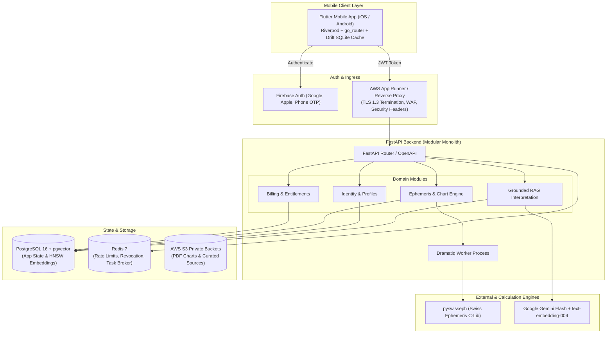

# Grahvani 🪐✨

**Production-grade, cross-platform Vedic astrology SaaS application** combining sub-arcsecond deterministic Swiss Ephemeris calculation accuracy with an evidence-grounded RAG (Retrieval-Augmented Generation) AI interpretation layer.

---

## 🌟 Key Features

- **🎯 Sub-Arcsecond Ephemeris Engine**: High-precision astronomical calculations powered by `pyswisseph` (C-library bindings for Swiss Ephemeris), supporting Lahiri (Chitra Paksha) and custom Ayanamsas, Placidus/Equal house systems, D1 (Rasi), D9 (Navamsha), D10, D12, and D60 divisional charts.
- **📜 Complete Vimshottari Dasha System**: Multi-level dasha calculations (Maha Dasha, Antar Dasha, Pratyantar Dasha) with automated current dasha highlighting and timeline tracking.
- **🧠 Grounded RAG AI Interpretation Layer**: Token-by-token Server-Sent Events (SSE) streaming answers powered by Google Gemini Flash, backed by hybrid search (BM25 full-text + `pgvector` HNSW cosine vector similarity with Reciprocal Rank Fusion).
- **📖 Classical Literature Citations**: Interactive inline citation chips (`[BPHS Ch 12]`) linking directly to authentic source shlokas (Brihat Parashara Hora Shastra, Phaladeepika, Saravali).
- **📱 Cross-Platform Mobile Client**: Flutter app (Android & iOS) featuring native `CustomPainter` North Indian diamond chart rendering, offline SQLite caching (`Drift`), and interactive house detail bottom sheets.
- **💳 Multi-Provider Entitlement & Billing Engine**: Server-side entitlement limit enforcement supporting Google Play Billing, Apple App Store IAP, and Razorpay UPI/Web subscriptions.
- **🔒 Enterprise Security & Compliance**: Firebase JWT authentication, Redis token revocation blacklisting, end-to-end encryption (TLS 1.3 + AWS KMS AES-256), soft-delete data protection, and Indian DPDP Act 2023 consent logging.

---

## 🏗️ System Architecture



---

## 🛠️ Tech Stack

| Layer | Technologies & Frameworks |
| :--- | :--- |
| **Mobile Client** | Flutter 3.x (Android & iOS), Riverpod (State Management), `go_router`, Drift (SQLite) |
| **API Backend** | Python 3.12, FastAPI (Modular Monolith), Async SQLAlchemy 2.0, Pydantic v2 |
| **Astrology Engine** | Swiss Ephemeris via `pyswisseph` (Lahiri Ayanamsa default, NASA JPL precision) |
| **AI & Vector RAG** | Google Gemini Flash, `text-embedding-004`, `pgvector` (HNSW Cosine Vector Search + BM25 GIN Full-Text RRF Fusion) |
| **Task Queue** | Dramatiq + Redis 7 Message Broker |
| **Database & Cache** | PostgreSQL 16 + `pgvector` 0.6+, Redis 7 (Rate Limiting & Token Revocation) |
| **PDF Generation** | WeasyPrint + Jinja2 HTML/CSS templates |
| **DevOps & Cloud** | Docker & Docker Compose, AWS App Runner, RDS Aurora PostgreSQL Multi-AZ, S3, GitHub Actions CI/CD |

---

## 📁 Workspace Layout

```
Grahvani/
├── apps/
│   └── mobile/           # Flutter cross-platform mobile application (Android + iOS)
│       ├── lib/          # App source (features, models, services, providers, UI widgets)
│       └── test/         # Flutter unit and widget test suites
├── services/
│   └── api/              # FastAPI modular monolith backend
│       ├── app/
│       │   ├── main.py   # ASGI entry point & lifecycle hooks
│       │   ├── config.py # Centralized Pydantic v2 environment settings
│       │   ├── core/     # Security, JWT middleware, rate limiting, exception handling
│       │   ├── modules/  # Domain modules (identity, birth_chart, interpretation, billing)
│       │   └── tasks/    # Dramatiq background task workers (ephemeris, PDF, retention)
│       ├── alembic/      # Database schema migrations
│       └── tests/        # Pytest backend test suite (unit, integration, ephemeris precision)
├── docs/                 # Enterprise documentation suite (84+ Markdown files)
├── FeatTracking/         # Master feature backlog & project governance rules
├── infrastructure/       # Docker, AWS, and deployment configurations
├── docker-compose.yml    # Development environment infrastructure stack
├── run.ps1 / run.sh      # One-click startup scripts (Windows / Linux)
├── .env.example          # Environment variable template
└── README.md
```

---

## 🚀 Quickstart & Local Setup

### Prerequisites

- **Docker Desktop** (version 24.0+)
- **Python 3.12+** & **[Poetry](https://python-poetry.org/)**
- **Flutter SDK 3.x** & Android Studio / Xcode
- **Git**

---

### ⚡ Option A: One-Click Containerized Startup (Recommended)

Run the automated environment setup script from the root directory:

**Windows (PowerShell):**
```powershell
.\run.ps1
```

**Linux / macOS:**
```bash
chmod +x run.sh
./run.sh
```

This builds and starts PostgreSQL (`pgvector`), Redis, FastAPI backend (`api`), and the Dramatiq background worker (`worker`), applies Alembic DB migrations automatically, and health-checks services.

---

### 🛠️ Option B: Manual Local Setup

#### 1. Environment Configuration

```bash
cp .env.example .env
# Edit .env with your environment credentials (GEMINI_API_KEY, FIREBASE_*, RAZORPAY_*, etc.)
```

#### 2. Start Infrastructure Services

```bash
docker compose up db redis -d
```

#### 3. Backend API Setup

```bash
cd services/api
poetry install
poetry run alembic upgrade head          # Apply database migrations
poetry run uvicorn app.main:app --reload # Start FastAPI server with hot-reload
```

- **API Base URL**: `http://localhost:8000`
- **Interactive Swagger Docs**: `http://localhost:8000/docs`
- **ReDoc Documentation**: `http://localhost:8000/redoc`

#### 4. Start Background Task Worker

```bash
cd services/api
poetry run dramatiq app.tasks.worker --processes 2 --threads 4
```

#### 5. Launch Flutter Mobile App

```bash
cd apps/mobile
flutter pub get
flutter run
```

---

## 🧪 Running Tests & Verification

### Backend & Ephemeris Test Suite

```bash
cd services/api

# Run all backend unit & integration tests with coverage report
poetry run pytest --cov=app --cov-report=term-missing

# Run NASA JPL Ephemeris astronomical precision benchmarks (Sub-arcsecond validation)
poetry run pytest tests/astro/
```

### Flutter Mobile Test Suite

```bash
cd apps/mobile

# Run Flutter unit & widget tests
flutter test
```

---

## 📊 Feature Tracking & Progress

The project tracks **70 comprehensive features** across the product lifecycle:
- ✅ **45 Implemented**: Core ephemeris engine, FastAPI modular monolith, RAG streaming pipeline, native Flutter UI, billing entitlement interceptors.
- 🚧 **3 In Progress**: AWS cloud deployment, PDF export, Langfuse observability integration.
- 🎯 **16 Planned**: Phase 2/3 extensions (Sade Sati tracker, FCM notifications, multi-language Hindi/Tamil support, Synastry compatibility).

Detailed tracking matrix: [FeatTracking/Master Feature Tracking.md](file:///e:/AI-WorkSpace/Projects/Active/Grahvani/FeatTracking/Master%20Feature%20Tracking.md)

---

## 📚 Technical Documentation

Explore the complete 84+ document technical specification library in [`docs/`](file:///e:/AI-WorkSpace/Projects/Active/Grahvani/docs/README.md):

- 📖 [Project Overview](docs/PROJECT_OVERVIEW.md)
- 📐 [System Architecture](docs/SYSTEM_ARCHITECTURE.md)
- 🧩 [Technology Stack](docs/TECH_STACK.md)
- 🔌 [API Endpoints Reference](docs/api/ENDPOINTS.md)
- 🤖 [AI & Grounded RAG Architecture](docs/ai/RAG.md)
- 🪐 [Swiss Ephemeris Integration](docs/astrology/SWISS_EPHEMERIS.md)
- 🛡️ [Security & Compliance](docs/security/SECURITY.md)
- 📋 [Master Feature Tracking](FeatTracking/Master%20Feature%20Tracking.md)
- 📏 [Project Rules & Guidelines](FeatTracking/PROJECT_RULES.md)

---

## 📄 License

This project contains proprietary software. Swiss Ephemeris C-library components are subject to Astrodienst AG licensing guidelines. See [docs/astrology/LICENSING.md](docs/astrology/LICENSING.md) for details.
