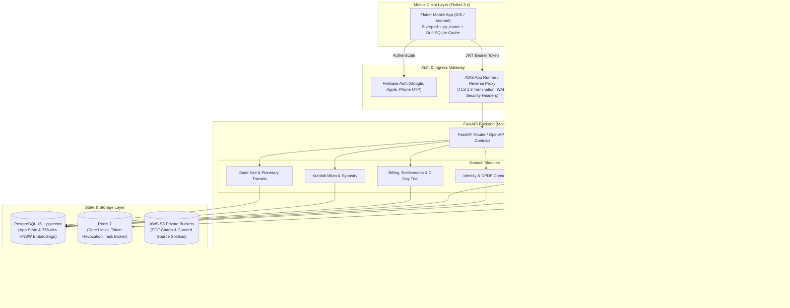

# Grahvani 🪐✨

[](https://python.org)
[](https://fastapi.tiangolo.com)
[](https://flutter.dev)
[](https://www.postgresql.org)
[](https://redis.io)
[-purple.svg)](https://www.astro.com/swisseph/)
[](docs/astrology/LICENSING.md)

**Production-grade, cross-platform Vedic astrology SaaS application** combining sub-arcsecond deterministic Swiss Ephemeris astronomical calculation accuracy with an evidence-grounded RAG (Retrieval-Augmented Generation) AI interpretation layer.

---

## 🌟 Key Features

* **🎯 Sub-Arcsecond Ephemeris Engine:** Delivers high-precision astronomical calculations using `pyswisseph` (C-library bindings for Swiss Ephemeris), with support for Lahiri (Chitra Paksha) and custom Ayanamsas (Raman, KP, Fagan-Bradley), Placidus and Equal house systems, Ashtakvarga, planetary dignity scoring, along with D1 (Rasi), D9 (Navamsha), D10 (Dasamsa), D12 (Dwadasamsa), and D60 (Shashtiamsa) divisional charts.

* **📜 Complete Vimshottari Dasha System:** Provides comprehensive multi-level dasha calculations, including Maha Dasha, Antar Dasha, and Pratyantar Dasha, with automatic highlighting of the current dasha and detailed interactive timeline tracking.

* **🧠 Grounded RAG AI Interpretation Layer & BGE Reranker:** Enables token-by-token Server-Sent Events (SSE) streaming responses powered by Google Gemini Flash, utilizing 3-stage hybrid retrieval (BM25 full-text search + `pgvector` HNSW cosine vector similarity with RRF fusion) enhanced by post-retrieval cross-encoder reranking (`BAAI/bge-reranker-large`).

* **📖 Classical Literature Citations & Shloka Modal:** Displays interactive inline citation chips (e.g., `[BPHS Ch 12]`) that directly reference authentic source shlokas from *Brihat Parashara Hora Shastra*, *Phaladeepika*, and *Saravali*.

* **📱 Cross-Platform Mobile Client:** Built with Flutter 3.x for Android and iOS, featuring native `CustomPainter`-based North Indian diamond chart rendering, South Indian chart rendering, offline SQLite caching using `Drift`, interactive house-detail bottom sheets, Synastry dual-chart comparison, Kundali Milan (Ashta Koota 36-point matchmaking), and Varshaphal annual solar return analysis.

* **🌐 Multi-Language Localization:** Native localized strings and UI support across English (`en`), Hindi (`hi`), and Gujarati (`gu`) using Flutter's `l10n` localization engine.

* **🪐 Transits, Sade Sati & Push Notifications:** Complete Sade Sati Saturn transit calculation and multi-phase tracker (`/transits/sade-sati/{id}`), planetary transit timeline, and Firebase Cloud Messaging (FCM) push notifications for planetary transitions and dasha shifts.

* **💳 Multi-Provider Entitlement, Billing & 7-Day Free Trial:** Implements server-side entitlement enforcement with support for Google Play Billing (RTDN), Apple App Store In-App Purchases (Server Notifications v2), Razorpay UPI/Web subscription checkout, and 7-Day Free Premium Trial activation (`/billing/trial/activate`).

* **🔒 Enterprise Security & DPDP Compliance:** Ensures robust security through Firebase JWT authentication, Redis-based token revocation blacklisting, end-to-end encryption (TLS 1.3 with AWS KMS AES-256), soft-delete and hard-purge protection (`DELETE /api/v1/users/me`), and consent logging compliant with the Indian DPDP Act 2023.

* **🧪 Comprehensive Testing Infrastructure:** Includes 50-vector NASA JPL ephemeris benchmarks, backend pytest integration test suite with coverage, Locust multi-tier load testing scripts, and Maestro mobile UI cross-platform E2E test flows.

---

## 🏗️ System Architecture



---

## 🛠️ Tech Stack

| Layer | Technologies & Frameworks |
| :--- | :--- |
| **Mobile Client** | Flutter 3.x (Android & iOS), Riverpod (State Management), `go_router`, Drift (SQLite Offline Cache), `CustomPainter` |
| **API Backend** | Python 3.12, FastAPI (Modular Monolith), Async SQLAlchemy 2.0, Pydantic v2, Alembic |
| **Astrology Engine** | Swiss Ephemeris via `pyswisseph` (Lahiri Ayanamsa default, NASA JPL sub-arcsecond precision) |
| **AI & Vector RAG** | Google Gemini Flash, `text-embedding-004`, `BAAI/bge-reranker-large`, `pgvector` (HNSW Cosine Vector Search + BM25 GIN Full-Text RRF Fusion) |
| **Task Queue** | Dramatiq + Redis 7 Message Broker |
| **Database & Cache** | PostgreSQL 16 + `pgvector` 0.6+, Redis 7 (Rate Limiting & Token Revocation) |
| **PDF Generation** | WeasyPrint + Jinja2 HTML/CSS templates |
| **QA & Testing** | Pytest, Testcontainers, Locust (Load Testing), Maestro (Mobile Cross-Platform E2E Testing) |
| **DevOps & Cloud** | Docker & Docker Compose, AWS App Runner, RDS Aurora PostgreSQL Multi-AZ, S3, GitHub Actions CI/CD |

---

## 📁 Workspace Layout

```
Grahvani/
├── apps/
│   └── mobile/           # Flutter cross-platform mobile application (Android + iOS)
│       ├── lib/          # App source (features, models, services, providers, UI widgets, l10n)
│       └── test/         # Flutter unit and widget test suites
├── services/
│   └── api/              # FastAPI modular monolith backend
│       ├── app/
│       │   ├── main.py   # ASGI entry point & lifecycle hooks
│       │   ├── config.py # Centralized Pydantic v2 environment settings
│       │   ├── core/     # Security, JWT middleware, rate limiting, exception handling, tracing
│       │   ├── modules/  # Domain modules (identity, birth_chart, interpretation, billing, matchmaking, transits, notifications)
│       │   └── tasks/    # Dramatiq background task workers (ephemeris, PDF, retention)
│       ├── alembic/      # Database schema migrations
│       └── tests/        # Pytest backend test suite (unit, integration, ephemeris precision, reranker, trial, load)
├── tests/
│   └── e2e/flows/        # Maestro mobile UI cross-platform E2E test flows
├── .maestro/flows/       # Maestro CLI test flow definitions
├── docs/                 # Enterprise documentation suite (84+ Markdown files)
├── FeatTracking/         # Master feature backlog & project governance rules
├── infrastructure/       # Docker, AWS, and deployment configurations
├── docker-compose.yml    # Development environment infrastructure stack
├── run.ps1 / run.sh      # One-click startup scripts (Windows / Linux)
├── .env.example          # Environment variable template
└── README.md
```

---

## 🚀 Quickstart & Local Setup

### Prerequisites

- **Docker Desktop** (version 24.0+)
- **Python 3.12+** & **[Poetry](https://python-poetry.org/)**
- **Flutter SDK 3.x** & Android Studio / Xcode
- **Git**

---

### ⚡ Option A: One-Click Containerized Startup (Recommended)

Run the automated environment setup script from the root directory:

**Windows (PowerShell):**
```powershell
.\run.ps1
```

**Linux / macOS:**
```bash
chmod +x run.sh
./run.sh
```

This builds and starts PostgreSQL (`pgvector`), Redis, FastAPI backend (`api`), and the Dramatiq background worker (`worker`), applies Alembic DB migrations automatically, and health-checks services.

---

### 🛠️ Option B: Manual Local Setup

#### 1. Environment Configuration

```bash
cp .env.example .env
# Edit .env with your environment credentials (GEMINI_API_KEY, FIREBASE_*, RAZORPAY_*, etc.)
```

#### 2. Start Infrastructure Services

```bash
docker compose up db redis -d
```

#### 3. Backend API Setup

```bash
cd services/api
poetry install
poetry run alembic upgrade head          # Apply database migrations
poetry run uvicorn app.main:app --reload # Start FastAPI server with hot-reload
```

- **API Base URL**: `http://localhost:8000`
- **Interactive Swagger Docs**: `http://localhost:8000/docs`
- **ReDoc Documentation**: `http://localhost:8000/redoc`

#### 4. Start Background Task Worker

```bash
cd services/api
poetry run dramatiq app.tasks.worker --processes 2 --threads 4
```

#### 5. Launch Flutter Mobile App

```bash
cd apps/mobile
flutter pub get
flutter run
```

---

## 🧪 Running Tests & Verification

### Backend, Ephemeris & Reranker Test Suite

```bash
cd services/api

# Run all backend unit & integration tests (including BGE reranker & 7-Day trial) with coverage
poetry run pytest --cov=app --cov-report=term-missing

# Run NASA JPL Ephemeris astronomical precision benchmarks (Sub-arcsecond validation)
poetry run pytest tests/astro/
```

### Performance & Load Testing (Locust)

```bash
cd services/api

# Run headless load test (500 users, 50 spawn rate)
poetry run locust -f tests/load/locustfile.py --headless -u 500 -r 50 --run-time 1m --host http://localhost:8000

# Run interactive Locust Web UI (access at http://localhost:8089)
poetry run locust -f tests/load/locustfile.py --host http://localhost:8000 --web-port 8089
```

### Flutter Mobile & Maestro E2E Test Suite

```bash
# Run Flutter unit and widget tests
cd apps/mobile
flutter test

# Run Maestro mobile UI E2E test flows (requires Android emulator or iOS simulator)
maestro test tests/e2e/flows/
# Or targeting specific flow:
maestro test .maestro/flows/chart_calculation_flow.yaml
```

---

## 📊 Feature Tracking & Progress

The project tracks **71 comprehensive features** across the product lifecycle:
- ✅ **54 Implemented**: Core ephemeris engine, FastAPI modular monolith, RAG streaming pipeline, BGE cross-encoder reranking, 7-Day Free Premium Trial, native Flutter UI, Synastry dual-chart comparison, Varshaphal annual solar return, Kundali Milan matchmaking, Sade Sati transit tracker, multi-language localization, Locust load testing, Maestro E2E mobile flows.
- 🛡️ **4 Implemented (Scaffold — Compliance Review Required)**: International Stripe/Paddle payment integration, Astrologer Marketplace, Family Plan subscription sharing, Lifetime license entitlement model.
- 🎯 **13 Planned**: Phase 3/4 expansion features (LangGraph admin ingestion, Swiss Ephemeris commercial license, Flutter Web, Voice AI, Multi-profile overlay, Astrologer Pro tools, Muhurta engine, B2B API, Community forums, Numerology & Tarot, Western Tropical, Horary Prashna, On-device SLM).

Detailed tracking matrix: [FeatTracking/Master Feature Tracking.md](FeatTracking/Master%20Feature%20Tracking.md)

---

## 📚 Technical Documentation

Explore the complete 84+ document technical specification library in [`docs/`](docs/README.md):

- 📖 [Project Overview](docs/PROJECT_OVERVIEW.md)
- 📐 [System Architecture](docs/SYSTEM_ARCHITECTURE.md)
- 🧩 [Technology Stack](docs/TECH_STACK.md)
- 🔌 [API Endpoints Reference](docs/api/ENDPOINTS.md)
- 🤖 [AI & Grounded RAG Architecture](docs/ai/RAG.md)
- 🪐 [Swiss Ephemeris Integration](docs/astrology/SWISS_EPHEMERIS.md)
- 💳 [Entitlements & Billing Engine](docs/billing/ENTITLEMENTS.md)
- ⚡ [Locust Performance & Load Testing](docs/testing/LOAD_TESTING.md)
- 📱 [Maestro Mobile E2E Testing](docs/testing/E2E_TESTS.md)
- 🛡️ [Security & Compliance Index](docs/security/README.md)
- 📋 [Master Feature Tracking](FeatTracking/Master%20Feature%20Tracking.md)
- 📏 [Project Rules & Guidelines](FeatTracking/PROJECT_RULES.md)

---

## 📄 License & Disclaimers

This project contains proprietary software. Swiss Ephemeris C-library components are subject to Astrodienst AG licensing guidelines. See [docs/astrology/LICENSING.md](docs/astrology/LICENSING.md) for details.
