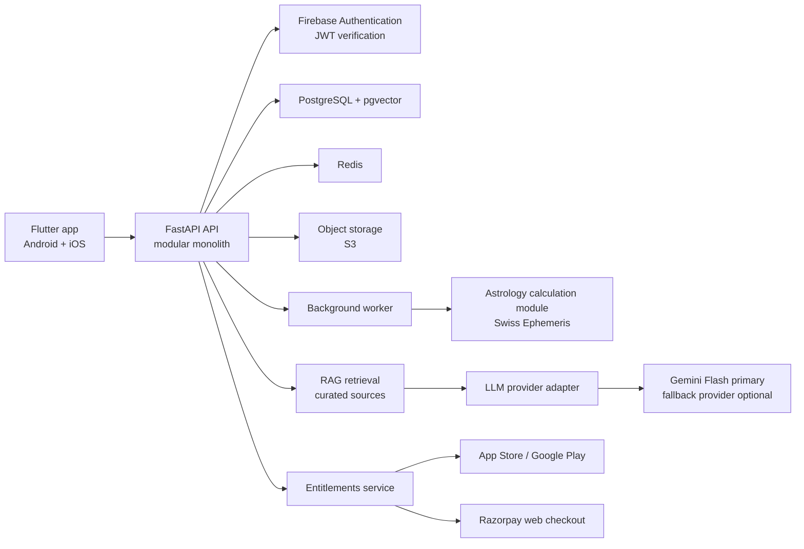

## Recommendation in one line

Build VedAI as a **Flutter mobile app + Python/FastAPI modular-monolith backend + PostgreSQL**, with a licensed/deterministic astrology-calculation service and a retrieval-grounded LLM interpretation layer. Do not use AI to calculate charts, and do not begin with microservices or autonomous agents.

This aligns strongly with your experience in Python, FastAPI, PostgreSQL, Docker, Gemini APIs, AI agents, and Flutter, while deliberately adding production skills: RAG evaluation, async jobs, observability, cloud deployment, billing, and secure AI architecture. Your resume shows particularly solid foundations for this direction. :codex-file-citation{path="C:\Users\Nevil Nandasana\Downloads\Dhirubhai_Ambani_University_Resume.pdf" purpose="source"}

I also reviewed the [VedAI repository](https://github.com/MakwanaNitin/VedAI). Its Android/Kotlin UI is a worthwhile prototype, but the current local `VedicEngine` uses hashes and fixed values, so it must be replaced before users receive results.

## Recommended architecture



Use a **modular monolith**, not microservices.

Why:

- VedAI has one team, one core domain, and an early-stage product.
- You can deploy, test, debug, and evolve it much faster.
- Modules still have clean boundaries, so the calculation worker or AI service can become independent later if load demands it.
- Microservices would add networking, deployment, observability, and data-consistency complexity before the product needs it.

Core modules:

- `identity` — users, consent, deletion requests, devices.
- `birth-chart` — location/time validation, calculations, chart snapshots.
- `astrology-content` — curated sources, citations, editorial workflow.
- `interpretation` — RAG, LLM prompts, safety, answer generation.
- `chat` — conversations, summaries, rate limits.
- `billing` — plans, webhooks, entitlement state.
- `notifications` — daily horoscope and reminders.
- `admin` — source ingestion, review, quality evaluation.

## Frontend

| Area | Recommendation | Why |
|---|---|---|
| Framework | Flutter | You already know it, and it provides one Android/iOS codebase with a well-supported mobile platform target. [Flutter platform support](https://docs.flutter.dev/reference/supported-platforms) |
| State | Riverpod | Testable, scalable, less boilerplate than BLoC for this app. |
| Navigation | `go_router` | Declarative deep links and authenticated routes. |
| UI | Material 3 + Cupertino widgets | Native-feeling Android and iOS surfaces. |
| Styling | Design tokens + reusable component library | Prevents inconsistent screens as the app grows. |
| Local cache | Drift/SQLite | Offline chart/history cache, with schema migrations. |
| Authentication | Firebase Authentication | Google, Apple, phone OTP; FastAPI verifies Firebase JWTs. |
| Notifications | Firebase Cloud Messaging | Practical cross-platform notification delivery. |

Keep the existing Kotlin prototype as a reference, but build the production client in Flutter. Rewriting the UI is justified because you want iOS without maintaining two full apps.

## Backend and API

- **Language:** Python 3.12+.
- **Framework:** FastAPI.
- **ORM/migrations:** SQLAlchemy 2.x + Alembic.
- **Validation:** Pydantic.
- **API:** REST with OpenAPI-generated client models; use server-sent events for streaming chat.
- **Async jobs:** Celery or Dramatiq with Redis. Start with Dramatiq for a smaller learning curve.
- **Authorization:** Firebase JWT authentication plus application roles in PostgreSQL: `user`, `editor`, `admin`.
- **Rate limiting:** Redis-backed limits by user, IP, and feature tier.

Use REST, not GraphQL or gRPC, initially. Your mobile app has predictable resource-based workflows, and FastAPI’s OpenAPI support will keep API contracts visible and testable.

## Accurate astrology engine

This is the most important engineering boundary in VedAI.

Use:

- **Swiss Ephemeris** through the Python `pyswisseph` wrapper.
- A validated geocoding/time-zone layer.
- Explicit calculation settings stored with every chart: ayanamsa, zodiac type, house system, ephemeris version, location coordinates, and calculation timestamp.
- Immutable chart snapshots: never silently recalculate a saved chart after a library/settings update.

For a closed-source commercial app, do not casually bundle Swiss Ephemeris: it is available under AGPL or a professional license, so obtain the appropriate commercial license or use a properly licensed provider. [Swiss Ephemeris licensing](https://www.astro.com/swisseph-download/doc/swisseph.pdf)

Calculation flow:

1. Validate date, local birth time, city, latitude/longitude, and historical time zone.
2. Calculate planetary positions deterministically.
3. Save structured chart facts in PostgreSQL.
4. Pass only validated facts to the interpretation layer.
5. Require the LLM to explain those facts, never invent or alter them.

For uncertain birth times, present a clear “accuracy may vary” state rather than pretending certainty.

## AI / GenAI stack

| Capability | Recommendation | Add now? |
|---|---|---|
| Primary model | Gemini Flash-class model, called only from the backend | Yes |
| Provider abstraction | Small internal interface for Gemini plus one fallback provider | Yes |
| RAG | PostgreSQL + pgvector, metadata filters, keyword + vector hybrid retrieval | Yes |
| Reranking | Add a reranker after baseline evaluation shows retrieval weakness | Later |
| Agentic AI | No customer-facing autonomous agent | No |
| LangChain | Avoid initially; use direct SDK/API calls and your own small abstractions | No |
| LangGraph | Use only for future editorial/admin workflows | Later |
| MCP | Internal admin/research integration only, never exposed directly to users | Later |
| Prompt management | Versioned prompts in Git plus database release metadata | Yes |
| LLM evaluation | Golden-question set, groundedness and citation checks | Yes |
| AI observability | Langfuse or LangSmith; choose one | Yes |
| Guardrails | Input validation, topic policy, citation requirement, output checks | Yes |

A simple interpretation pipeline is better than an agent:

```text
Validated birth-chart facts
  + user question
  + retrieved approved sources
  + response policy
  -> structured LLM answer
  -> safety/citation validation
  -> user response
```

Use RAG only over properly licensed, curated, reviewed material. Include source references inside responses such as “Based on source X / chapter Y,” and return “I don’t have enough verified material” when retrieval confidence is weak.

LangGraph is a good future addition for a multi-step editorial process—source ingestion, expert review, citation checks, and publishing—not for ordinary chat. It is intended for controlled, long-running, stateful workflows with persistence and human oversight. [LangGraph overview](https://langchain-ai.github.io/langgraph/index.html)

## Database, search, and storage

| Need | Recommendation | Why |
|---|---|---|
| Primary data | PostgreSQL | Familiar to you; strong transactional model for users, charts, billing, consent. |
| Vector search | `pgvector` | Keeps RAG data and source metadata together early on. |
| Full-text / hybrid search | PostgreSQL full-text + `pgvector` | Enough for V1; apply reciprocal-rank fusion. |
| Cache / queues | Redis | Rate limiting, task queue, daily-content cache. |
| Files | AWS S3-compatible storage | Source PDFs, admin uploads, generated chart exports. |
| Knowledge graph | Do not add initially | No proven need; model explicit astrology relationships in relational tables first. |
| Separate NoSQL | Do not add initially | PostgreSQL covers the workload. |

Move to OpenSearch only if corpus size, filters, or search latency prove PostgreSQL insufficient.

## Payments

Use a unified internal `entitlements` table. The app should ask your backend, “Does this user have premium access?” rather than trusting the client.

- **Android digital subscriptions:** Google Play Billing.
- **iOS digital subscriptions:** Apple In-App Purchase.
- **Web checkout for India:** Razorpay subscriptions with webhook verification.
- **Cross-platform simplifier:** RevenueCat is a strong optional choice for purchase entitlement handling, but learn direct webhook verification too.

Do not put Razorpay directly inside the iOS/Android app to unlock premium digital features. Apple requires In-App Purchase for unlocking app features and subscriptions, and Google Play generally requires Play Billing for paid in-app digital features/services. [Apple payment rules](https://developer.apple.com/app-store/review/guidelines/), [Google Play payment policy](https://support.google.com/googleplay/android-developer/answer/9858738?hl=en)

Razorpay is still suitable for your web product and Indian recurring payments; it supports subscriptions and UPI Autopay. [Razorpay subscriptions](https://razorpay.com/docs/payments/subscriptions/supported-payment-methods/?preferred-country=IN)

## Infrastructure and DevOps

### Production path

- **Cloud:** AWS Mumbai region, subject to a final legal/data-residency review.
- **API:** Dockerized FastAPI on AWS App Runner first.
- **Database:** Amazon RDS PostgreSQL.
- **Files:** S3, private buckets, presigned URLs.
- **Async worker:** separate container deployment.
- **Secrets:** AWS Secrets Manager.
- **Logs/metrics:** CloudWatch + Sentry.
- **Reverse proxy:** managed platform ingress initially; Nginx only if you later self-manage ECS.
- **CI/CD:** GitHub Actions.
- **IaC:** Terraform after the first stable deployment.

Do not begin with Kubernetes. It is useful only when you have multiple independently scaled services, larger operations requirements, and real container orchestration needs.

### Local development

- Docker Compose: API, worker, PostgreSQL, Redis, MinIO/S3 emulator.
- `.env.example`, never committed real secrets.
- GitHub Actions: lint, unit tests, integration tests, Flutter tests, Docker build, security scan.

## Recommended structure

```text
vedai/
  apps/
    mobile/                         # Flutter
      lib/
        core/
        features/
          auth/
          chart/
          chat/
          subscriptions/
          profile/
  services/
    api/
      app/
        modules/
          identity/
          charts/
          astrology/
          knowledge/
          interpretation/
          billing/
          notifications/
          admin/
        core/
        db/
        api/
      tests/
    worker/
  packages/
    contracts/                      # OpenAPI-generated/shared models
  infrastructure/
    docker/
    terraform/
  docs/
    adr/
    api/
    product/
  .github/workflows/
```

Use feature-oriented organization in Flutter and domain modules in FastAPI. Apply dependency inversion at module boundaries; avoid a giant `utils` folder and avoid direct database calls from API route handlers.

## Technology decisions and alternatives

| Technology | Why it fits | Trade-off | Alternative |
|---|---|---|---|
| Flutter | Matches your skills and delivers Android/iOS quickly. | Requires a UI rewrite from Kotlin. | Kotlin Multiplatform if you want to stay Kotlin-first. |
| FastAPI | Direct match to your experience; excellent for typed APIs and AI services. | Python async discipline is required. | Django if you need a heavy admin/CMS quickly. |
| PostgreSQL + pgvector | One reliable store for product and RAG data. | May need tuning at large scale. | OpenSearch/Pinecone after measured need. |
| Firebase Auth | Fast mobile login/OTP implementation. | Managed-platform dependency. | Amazon Cognito for AWS-native enterprise needs. |
| Swiss Ephemeris | Deterministic, auditable calculation path. | Commercial licensing and domain validation. | Licensed astrology API when you prefer vendor-managed accuracy. |
| Gemini backend adapter | Builds on your Gemini API experience. | Provider dependency and changing model catalog. | OpenAI/Anthropic fallback behind the same interface. |
| Redis + Dramatiq | Simple jobs, limits, caching. | Another infrastructure component. | Celery for mature ecosystem / complex workflows. |
| AWS App Runner | Production container deployment without Kubernetes. | Less control than ECS. | ECS Fargate when operations needs grow. |

## Learning roadmap

### Phase 1 — essential MVP

1. Flutter architecture: Riverpod, `go_router`, secure storage, API client.
2. FastAPI modular monolith, SQLAlchemy, Alembic, Docker Compose.
3. Correct astrology calculations with test vectors.
4. PostgreSQL schema design and Firebase JWT verification.
5. RAG basics: source metadata, ingestion, hybrid retrieval, citations.
6. Sentry, structured logs, GitHub Actions, deployment.

### Phase 2 — production hardening

1. Background jobs, Redis, idempotency.
2. Billing webhooks and entitlement management.
3. AI evaluation datasets and observability.
4. AWS App Runner, RDS, S3, Secrets Manager.
5. Load testing and database query tuning.

### Phase 3 — optional growth

1. LangGraph for reviewed content-ingestion workflows.
2. Reranking and advanced retrieval.
3. Voice assistant.
4. Human expert consultation marketplace.
5. Separate services or ECS Fargate only after metrics justify them.

## Main risks and mitigations

| Risk | Mitigation |
|---|---|
| Incorrect astrology output | Deterministic licensed engine, golden test charts, provenance saved with every result. |
| Hallucinated interpretations | RAG-only answers for factual claims, answer citations, strict prompt policy, evaluation set. |
| Sensitive birth data | Encrypt in transit/at rest, minimize prompts, consent records, deletion/export flow, restricted admin access. |
| Harmful health/finance/legal advice | Prominent entertainment/informational disclaimer; prohibit definitive medical, financial, or legal claims. |
| API/LLM cost growth | Tier limits, response caching, concise prompts, token budgets, model routing, usage dashboards. |
| Billing entitlement bugs | Verify server webhooks/signatures; never grant access from client callback alone. |
| Store rejection | Use native store billing for in-app digital subscriptions. |
| RAG source quality | Editorial workflow, source licensing records, versioning, human review. |

## Production-readiness checklist

- Server-side keys only; remove direct Gemini calls from the app.
- End-to-end encryption in transit, encrypted backups, least-privilege roles.
- API versioning and database migrations.
- Idempotency keys for billing and chart-generation jobs.
- Unit tests for all chart calculations; test known historical charts.
- Integration tests for authentication, billing webhooks, and RAG retrieval.
- Flutter widget tests plus Maestro end-to-end mobile tests.
- Load tests for chat and daily-horoscope spikes.
- Sentry alerting, uptime checks, structured request IDs.
- Daily backups and tested restore procedure.
- Privacy policy, terms, data deletion, and meaningful consent before collecting birth data.
- Feature flags for model, prompt, source-corpus, and billing changes.

The portfolio story this creates is unusually strong: **a deterministic domain engine, an evidence-grounded AI interpretation system, cross-platform delivery, and real production concerns handled correctly.**