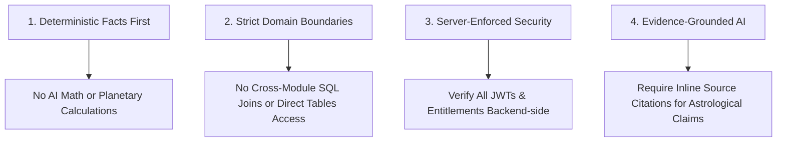

# Summary of Architecture Decision Records (ADRs)

This document provides a high-level executive summary of the foundational architectural decisions governing the **Grahvani** platform. Detailed rationale, context, consequences, and alternatives are recorded in individual ADR documents under [`docs/adr/`](adr/README.md).

---

## Architecture Decision Matrix

| ADR ID | Title | Status | Decision Summary | Primary Rationale |
| :--- | :--- | :---: | :--- | :--- |
| **[ADR-001](adr/ADR_001_ARCHITECTURE.md)** | Modular Monolith vs. Microservices | **Accepted** | Build FastAPI as a single-repository modular monolith running on AWS App Runner. | Single team, early product stage; avoids premature distributed networking complexity while preserving clean module extraction boundaries. |
| **[ADR-002](adr/ADR_002_DATABASE.md)** | Single PostgreSQL Store with `pgvector` | **Accepted** | Use PostgreSQL 16 for both relational application data and vector search embeddings. | Eliminates network latency between DBs, maintains ACID transaction boundaries for RAG metadata, and reduces cloud infrastructure costs. |
| **[ADR-003](adr/ADR_003_AI.md)** | Grounded RAG Pipeline over Heavy Frameworks | **Accepted** | Build custom backend RAG pipeline with Gemini 1.5 Flash SDK instead of heavy frameworks (LangChain). | Direct API control, faster sub-second token streaming, predictable error handling, and elimination of framework breaking changes. |
| **[ADR-004](adr/ADR_004_ASTROLOGY.md)** | Deterministic Ephemeris Engine | **Accepted** | Use Swiss Ephemeris (`pyswisseph`) C-library for all planetary calculations; forbid AI calculation. | Planetary longitudes are mathematical facts. LLMs hallucinate calculations; Swiss Ephemeris guarantees sub-arcsecond accuracy. |
| **[ADR-005](adr/ADR_005_BILLING.md)** | Native In-App Purchases + Razorpay Web | **Accepted** | Google Play Billing on Android, Apple IAP on iOS, Razorpay Subscriptions on Web. Enforce 100% server-side. | Complies with Apple and Google digital goods store policies while providing India-first UPI subscription support for web users. |

---

## Architectural Principles & Compliance Checklist

Every new pull request or architectural proposal must comply with these decisions. Any proposed deviation requires an amendment or new ADR submitted for team review.
