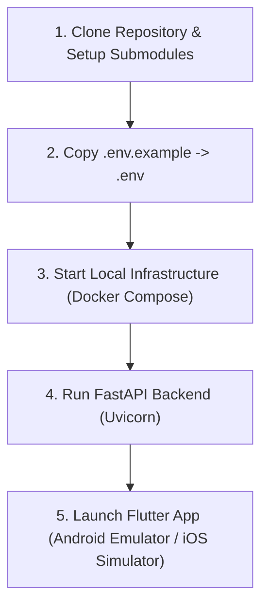

# Contributing Guide

Thank you for contributing to **Grahvani**. This document defines the development workflow, branching model, pull request standards, and quality verification steps required for all team members and open-source contributors.

---

## 1. Development Workflow & Git Standards

### 1.1 Branch Naming Conventions
Create topic branches off the `main` branch using the following naming structure:
- `feat/feature-name` — New functional feature (e.g., `feat/dasha-sub-periods`).
- `fix/bug-name` — Bug fix or error resolution (e.g., `fix/timezone-offset-parsing`).
- `docs/doc-name` — Documentation improvements (e.g., `docs/api-streaming-contract`).
- `refactor/scope` — Code refactoring without behavioral changes.
- `chore/scope` — Build system, CI/CD, or dependency updates.

### 1.2 Commit Message Format
Follow Conventional Commits specification:
```text
<type>(<scope>): <short description>

[optional body explanation]

[optional issue reference]
```
Examples:
- `feat(astrology): add Navamsa D9 chart calculation via pyswisseph`
- `fix(billing): validate Razorpay webhook cryptographic signature`
- `docs(ai): document RAG hybrid search scoring logic`

---

## 2. Pull Request (PR) Checklist

Before submitting a Pull Request, verify that your changes satisfy all of the following requirements:

- [ ] **Formatting & Linting**:
  - Backend: `ruff check .` and `ruff format --check .` return 0 errors.
  - Frontend: `flutter analyze` and `dart format --output=none --set-exit-if-changed .` pass cleanly.
- [ ] **Automated Testing**:
  - Backend unit tests: `pytest` passes with 100% success rate on calculation test vectors.
  - Frontend widget tests: `flutter test` completes cleanly.
- [ ] **No Hardcoded Secrets**: Secrets, API keys, or database credentials must be loaded via `.env` / AWS Secrets Manager.
- [ ] **Documentation**: Any updated API endpoints, schemas, or architectural boundaries must have corresponding updates in `docs/`.

---

## 3. Local Development Environment Setup



### Quick Commands
```bash
# 1. Start Local PostgreSQL, pgvector, Redis, MinIO
docker compose -f infrastructure/docker/docker-compose.yml up -d

# 2. Run Backend Migrations & Dev Server
cd services/api
poetry install
poetry run alembic upgrade head
poetry run uvicorn app.main:app --reload --port 8000

# 3. Launch Flutter App
cd apps/mobile
flutter pub get
flutter run
```
