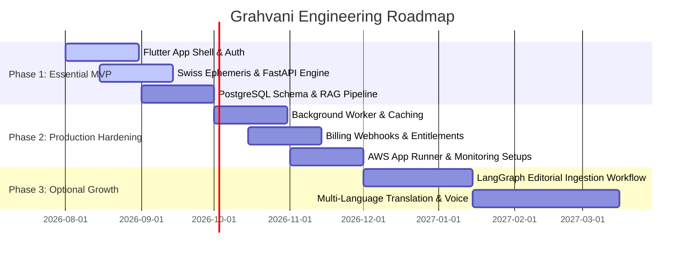

# Development Roadmap

This document outlines the phased engineering execution roadmap for **Grahvani**, moving from essential MVP features to production hardening and future growth capabilities.

---

## 🗺️ Phased Roadmap Overview

---

## Phase 1: Essential MVP (Target: Month 1 - Month 2)

Focus: Core calculation accuracy, Flutter client setup, grounded RAG AI chat, and database foundation.

### Deliverables
1. **Flutter Mobile Application Shell**:
   - Project initialization with Riverpod, `go_router`, and Material 3 theme design tokens.
   - Firebase Auth integration (Google Sign-In, Apple ID, Phone OTP).
   - Local Drift SQLite database for caching user profiles and generated chart facts offline.
2. **FastAPI Modular Monolith & Calculation Engine**:
   - Python 3.12 + FastAPI project layout with SQLAlchemy 2.0 and Alembic.
   - Swiss Ephemeris (`pyswisseph`) integration for Lahiri Ayanamsa, D1 (Rasi), D9 (Navamsa) charts, and Vimshottari Dasha calculations.
   - Validation test suite matching historical reference charts.
3. **Database & Baseline RAG Pipeline**:
   - PostgreSQL 16 schema with `pgvector` extension.
   - Document chunking and embedding pipeline for curated classical texts.
   - Hybrid vector + full-text search with strict citation enforcement and Gemini 1.5 Flash adapter.
4. **CI/CD Foundation**:
   - GitHub Actions pipeline for automated linting (`ruff`, `flutter analyze`), unit testing, and Docker image builds.

---

## Phase 2: Production Hardening (Target: Month 3 - Month 4)

Focus: Reliability, background job queues, cloud deployment, billing entitlements, and security compliance.

### Deliverables
1. **Async Job Processing & Caching**:
   - Redis 7 deployment for sliding-window API rate limiting and session caching.
   - Dramatiq task worker for long-running ingestion and push notification delivery.
2. **Entitlements & Payment Integrations**:
   - Server-side entitlement validation engine.
   - Android Google Play Billing & iOS Apple In-App Purchase integration.
   - Web Razorpay Subscription checkout with signature validation webhooks.
3. **AWS Cloud Production Infrastructure**:
   - AWS App Runner deployment for API server and Dramatiq worker.
   - Amazon RDS PostgreSQL Multi-AZ cluster setup with automated daily backups.
   - Private AWS S3 buckets for document and export storage.
   - AWS Secrets Manager integration for API key rotation.
4. **Observability & QA**:
   - Langfuse setup for AI trace logging, prompt cost accounting, and hallucination evaluation.
   - Sentry exception tracking and AWS CloudWatch metrics.
   - E2E testing flows with Maestro.

---

## Phase 3: Optional Growth & Scaling (Target: Month 5+)

Focus: Editorial workflows, advanced search features, voice interface, and multi-language support.

### Deliverables
1. **LangGraph Editorial Ingestion Workflow**:
   - Multi-step admin editorial pipeline (Source ingestion -> Automated citation check -> Human expert review -> Vector DB publishing).
2. **Advanced Search & Retrieval Enhancements**:
   - `bge-reranker-large` integration for post-retrieval reranking.
   - Expansion of astrological corpus to cover specialized divisional charts (D10, D12, D60).
3. **Voice Interface & Localization**:
   - Multi-language support (Hindi, Tamil, Telugu, Marathi).
   - Voice-to-text input and streaming text-to-speech AI answers.
4. **Scale-Triggered Architectural Adjustments**:
   - Migration of AWS App Runner to AWS ECS Fargate if traffic metrics justify dedicated container clusters.
