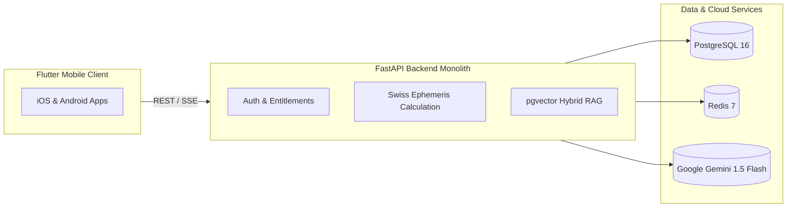

# Project Overview: Grahvani

## Purpose & Product Vision
**Grahvani** (formerly VedAI) is an enterprise-grade, cross-platform Vedic astrology platform built for India-first users and modern global audiences. It merges astronomical precision with evidence-grounded Artificial Intelligence to provide clear, actionable, and mathematically exact astrological insights.

Existing consumer astrology applications suffer from two major flaws:
1. **Pseudoscience or generic content**: Relying on unverified algorithms, random number generation, or static horoscopes.
2. **Unconstrained AI Hallucinations**: Prompting generative AI models directly to "calculate" birth charts or make unverified future predictions, leading to massive inaccuracies.

Grahvani solves this by establishing a strict architectural separation:
* **The Domain Engine (Deterministic)** computes exact planetary longitudes, house cusps, dashas, and transits using the high-precision **Swiss Ephemeris (`pyswisseph`)**.
* **The AI Interpretation Layer (Grounding)** uses **Retrieval-Augmented Generation (RAG)** over curated, expert-reviewed astrological literature to explain verifiable facts, citing specific classical sources without hallucinating.

---

## Core Product Principles

### 1. Accuracy Before Engagement
Planetary positions, ascendants, and dasha periods are mathematical facts. They are calculated server-side, immutably snapshotted, versioned, and attributable to a specific ephemeris configuration.

### 2. Explain, Never Predict with False Certainty
Grahvani explicitly avoids deterministic future predictions or alarming health/financial claims. AI responses cite verified source texts and present guidance as personal insights rather than inevitable destiny.

### 3. Absolute Privacy & Consent
Birth date, time, and location are highly sensitive personal identifiers. Grahvani treats birth profile data under the strict standards of the **Indian Digital Personal Data Protection (DPDP) Act**, using end-to-end encryption in transit and at rest, minimal prompt data exposure, and one-click data deletion.

### 4. Pragmatic Enterprise Engineering (Modular Monolith)
Grahvani is architected as a **FastAPI modular monolith**. It delivers single-command local development, unified transactions, simple deployment on AWS App Runner, and zero distributed-systems overhead while preserving strict domain boundaries for future microservice extraction if operational metrics require it.

---

## Target Audience & Primary Workflows
- **India-First Users**: Require traditional Vedic astrology calculations (Lahiri Ayanamsa, D1 & D9 charts, Vimshottari Dasha, Sade Sati) with local language support and UPI subscription billing.
- **Global Astrological Enthusiasts**: Seek clean, modern iOS and Android interfaces with deep, grounded explanations rather than clickbait daily horoscopes.
- **Researchers & Power Users**: Want access to exact astronomical longitudes, chart comparison (Synastry), and citation trails for astrological rules.

---

## System Boundary & Key High-Level Specs

| Dimension | Specification |
| :--- | :--- |
| **Mobile Client** | Flutter 3.x (Dart), Riverpod 2.x, `go_router`, Drift SQLite local storage |
| **Backend API** | Python 3.12, FastAPI 0.110+, Pydantic v2, SQLAlchemy 2.0 |
| **Calculation Engine** | Swiss Ephemeris C-library via `pyswisseph` (Lahiri Ayanamsa default) |
| **Database & Vector** | PostgreSQL 16 + `pgvector` extension for embeddings & full-text search |
| **Async Tasks & Cache** | Redis 7 + Dramatiq for background jobs (chart calculations, push notifications) |
| **AI LLM Adapter** | Backend-only calls to Google Gemini 1.5 Flash with structured Pydantic outputs |
| **Auth & Identity** | Firebase Authentication (Google, Apple, Phone OTP) + FastAPI JWT Verification |
| **Deployment** | AWS Mumbai (`ap-south-1`) App Runner, RDS PostgreSQL, S3, Secrets Manager |
