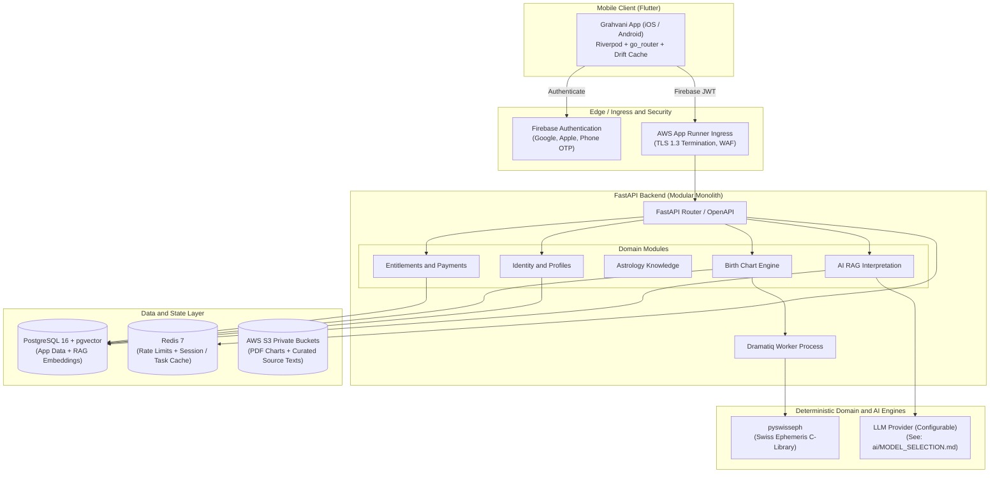

# Grahvani Documentation System

Welcome to the official engineering and product documentation for **Grahvani** (formerly VedAI) -- a production-grade, cross-platform Vedic astrology SaaS application tailored for India-first users and modern global audiences.

Grahvani combines a **deterministic Swiss Ephemeris calculation engine**, a **FastAPI modular monolith backend**, a **PostgreSQL + pgvector storage layer**, and an **evidence-grounded RAG (Retrieval-Augmented Generation) AI interpretation layer** with a **Flutter cross-platform client**.

---

## Documentation Directory

### Core Specifications
- [Project Overview](PROJECT_OVERVIEW.md) -- Product vision, core values, architectural goals, and team principles.
- [Product Requirements](PRODUCT_REQUIREMENTS.md) -- Functional and non-functional requirements, MVP boundary, acceptance criteria.
- [System Architecture](SYSTEM_ARCHITECTURE.md) -- End-to-end topology, data flow, module boundaries, sequence diagrams.
- [Technology Stack](TECH_STACK.md) -- Core technologies, frameworks, infrastructure decisions, and trade-offs.
- [Architecture Decisions Summary](ARCHITECTURE_DECISIONS.md) -- High-level summary of ADRs and architectural rationale.
- [Development Roadmap](DEVELOPMENT_ROADMAP.md) -- Phased development execution (MVP, Production Hardening, Scaling).
- [Coding Guidelines](CODING_GUIDELINES.md) -- Code style, linting, error handling, naming conventions for Python and Dart.
- [Contributing Guide](CONTRIBUTING.md) -- Git workflow, branch naming, PR checklist, local setup instructions.
- [Assumptions](ASSUMPTIONS.md) -- Fundamental technical, business, and domain assumptions.
- [Open Decisions](OPEN_DECISIONS.md) -- Unresolved design questions, feature considerations, and future evaluation points.

---

### Domain-Specific Architecture and Specs

| Domain Area | Key Documents |
| :--- | :--- |
| **Frontend** | [Overview](frontend/README.md) -- [Flutter Architecture](frontend/FLUTTER_ARCHITECTURE.md) -- [UI Components](frontend/UI_COMPONENTS.md) -- [State Management](frontend/STATE_MANAGEMENT.md) -- [Navigation](frontend/NAVIGATION.md) -- [Offline Storage](frontend/OFFLINE_STORAGE.md) |
| **Backend** | [Overview](backend/README.md) -- [FastAPI Architecture](backend/FASTAPI_ARCHITECTURE.md) -- [Modules](backend/MODULES.md) -- [API Design](backend/API_DESIGN.md) -- [Authentication](backend/AUTHENTICATION.md) -- [Authorization](backend/AUTHORIZATION.md) -- [Background Jobs](backend/BACKGROUND_JOBS.md) -- [Error Handling](backend/ERROR_HANDLING.md) |
| **AI and GenAI** | [Overview](ai/README.md) -- [AI Architecture](ai/AI_ARCHITECTURE.md) -- [RAG Engine](ai/RAG.md) -- [Prompt Engineering](ai/PROMPT_ENGINEERING.md) -- [Model Selection](ai/MODEL_SELECTION.md) -- [Knowledge Base](ai/KNOWLEDGE_BASE.md) -- [Guardrails](ai/GUARDRAILS.md) -- [Observability](ai/OBSERVABILITY.md) -- [Evaluation](ai/EVALUATION.md) -- [Future Agentic AI](ai/FUTURE_AGENTIC_AI.md) |
| **Astrology Engine** | [Overview](astrology/README.md) -- [Calculation Engine](astrology/CALCULATION_ENGINE.md) -- [Swiss Ephemeris Integration](astrology/SWISS_EPHEMERIS.md) -- [Data Validation](astrology/DATA_VALIDATION.md) -- [Chart Generation](astrology/CHART_GENERATION.md) -- [Astrology Workflow](astrology/ASTROLOGY_WORKFLOW.md) -- [Licensing](astrology/LICENSING.md) |
| **Database and Vector** | [Overview](database/README.md) -- [Database Design](database/DATABASE_DESIGN.md) -- [ER Diagram](database/ER_DIAGRAM.md) -- [Tables DDL](database/TABLES.md) -- [Indexing Strategy](database/INDEXING.md) -- [Vector Search](database/VECTOR_SEARCH.md) -- [Migrations](database/MIGRATIONS.md) |
| **API Contracts** | [Overview](api/README.md) -- [Endpoints List](api/ENDPOINTS.md) -- [Request/Response Envelopes](api/REQUEST_RESPONSE.md) -- [Auth Flow](api/AUTH_FLOW.md) -- [SSE Streaming](api/STREAMING.md) -- [Rate Limiting](api/RATE_LIMITING.md) |
| **Infrastructure and DevOps** | [Overview](infrastructure/README.md) -- [Deployment Strategy](infrastructure/DEPLOYMENT.md) -- [Docker Setup](infrastructure/DOCKER.md) -- [AWS Deployment](infrastructure/AWS.md) -- [CI/CD Pipeline](infrastructure/CI_CD.md) -- [Monitoring and Logging](infrastructure/MONITORING.md) -- [Security Setup](infrastructure/SECURITY.md) -- [Environment Variables](infrastructure/ENVIRONMENT_VARIABLES.md) -- [Backup and Recovery](infrastructure/BACKUP_AND_RECOVERY.md) |
| **Billing and Entitlements** | [Overview](billing/README.md) -- [Subscriptions Lifecycle](billing/SUBSCRIPTIONS.md) -- [Entitlement Engine](billing/ENTITLEMENTS.md) -- [Google Play Billing](billing/GOOGLE_PLAY.md) -- [Apple In-App Purchases](billing/APP_STORE.md) -- [Razorpay Integration](billing/RAZORPAY.md) |
| **Testing and QA** | [Overview](testing/README.md) -- [Testing Strategy](testing/TESTING_STRATEGY.md) -- [Unit Tests](testing/UNIT_TESTS.md) -- [Integration Tests](testing/INTEGRATION_TESTS.md) -- [E2E Testing](testing/E2E_TESTS.md) -- [Load Testing](testing/LOAD_TESTING.md) |
| **Security and Compliance** | [Overview](security/README.md) -- [Threat Model](security/THREAT_MODEL.md) -- [Data Privacy and DPDP](security/DATA_PRIVACY.md) -- [Encryption Specs](security/ENCRYPTION.md) -- [Secrets Management](security/SECRETS.md) -- [Compliance and Disclaimers](security/COMPLIANCE.md) |
| **Product Specs** | [Overview](product/README.md) -- [User Flows](product/USER_FLOWS.md) -- [Feature Specifications](product/FEATURE_SPECIFICATIONS.md) -- [MVP Scope](product/MVP.md) -- [Premium Features](product/PREMIUM_FEATURES.md) -- [Future Roadmap](product/FUTURE_ROADMAP.md) |
| **ADR Records** | [Overview](adr/README.md) -- [ADR-001 Architecture](adr/ADR_001_ARCHITECTURE.md) -- [ADR-002 Database](adr/ADR_002_DATABASE.md) -- [ADR-003 AI Strategy](adr/ADR_003_AI.md) -- [ADR-004 Astrology Engine](adr/ADR_004_ASTROLOGY.md) -- [ADR-005 Billing System](adr/ADR_005_BILLING.md) |

---

## Key System Architecture Diagram

> **Note on LLM Provider**: The specific LLM model (e.g., Gemini 1.5 Flash, Gemini 2.0 Flash, or alternative providers) is treated as a configurable deployment parameter, not a hardcoded constant. See [ai/MODEL_SELECTION.md](ai/MODEL_SELECTION.md) and [OPEN_DECISIONS.md](OPEN_DECISIONS.md) for the current provider evaluation status.
