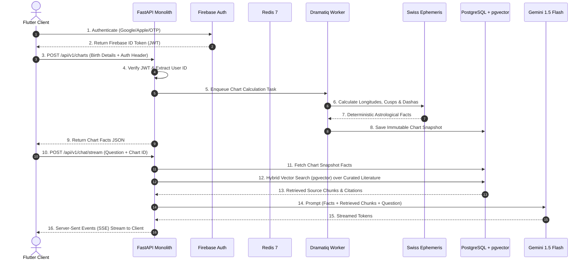
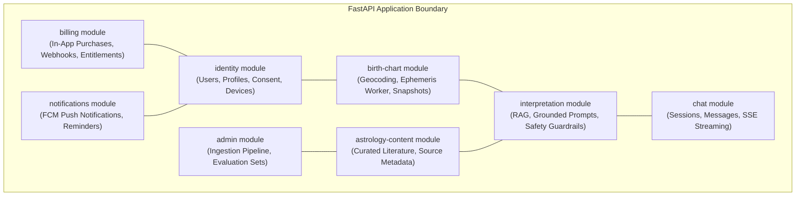

# System Architecture Specification

## 1. Architectural Style: Modular Monolith
Grahvani is built as a **modular monolith** running Python 3.12 and FastAPI. A single deployable container image hosts the REST API and background worker tasks, organized strictly into domain-driven software modules.

### Why Modular Monolith?
- **Speed of Iteration**: Single codebase, single repository, unified refactoring and local debugging.
- **Operational Simplicity**: Single deployment target on AWS App Runner without Kubernetes overhead.
- **Strict Module Isolation**: Internal domain modules communicate only via explicit service interfaces. No cross-module SQL joins or direct internal table mutations.
- **Future Extraction Path**: If a module (e.g., `astrology` or `interpretation`) experiences extreme load, its service interface allows it to be extracted into a standalone service without breaking callers.

---

## 2. System Topology & Data Flow

---

## 3. Domain Module Breakdown

| Module | Core Responsibility | Database Schema Scope |
| :--- | :--- | :--- |
| `identity` | User profiles, birth details, consent tracking, device tokens | `users`, `birth_profiles`, `user_consents` |
| `birth-chart` | Location geocoding, timezone lookup, Ephemeris calls, chart snapshots | `birth_charts`, `planetary_positions`, `dashas` |
| `astrology-content` | Ingestion of approved texts, citation mapping, category metadata | `source_documents`, `document_chunks` |
| `interpretation` | RAG vector search, prompt assembly, safety checks, LLM execution | `rag_embeddings`, `ai_evaluations` |
| `chat` | Chat session persistence, message history, SSE token delivery | `chat_sessions`, `chat_messages` |
| `billing` | Webhook verification, subscription status, entitlement engine | `subscriptions`, `entitlements`, `webhook_events` |
| `notifications` | FCM push triggers, daily horoscope scheduling | `notification_schedules`, `push_tokens` |
| `admin` | Literature upload, document chunking, prompt version management | `prompt_templates`, `admin_audit_logs` |

---

## 4. Operational & Deployment Boundaries

- **Single Container Deployment**: FastAPI application runs via `uvicorn` (4 worker processes per App Runner instance).
- **Background Worker Process**: Dramatiq task worker runs in a separate container executing long-running calculation and ingestion jobs.
- **Cache & Rate Limiter**: Shared Redis 7 cluster handles sliding-window API rate limits, temporary token sessions, and task queues.
- **Primary Data Store**: Amazon RDS PostgreSQL 16 instance configured with Multi-AZ replication, storing relational records and 768-dimensional vector embeddings via `pgvector`.
