# Technology Stack Specification

Grahvani is built using a curated set of modern, production-tested technologies chosen for performance, type safety, operational cost-efficiency, and developer velocity.

---

## 1. Technology Matrix

| Layer / Domain | Technology | Version | Rationale & Justification |
| :--- | :--- | :--- | :--- |
| **Mobile Client** | Flutter / Dart | 3.19+ / 3.3+ | Single codebase for iOS and Android; high performance 60fps UI rendering; native-feeling Material 3 & Cupertino controls. |
| **Client State** | Riverpod | 2.5+ | Compile-safe dependency injection, testable provider lifecycle, native async state management (`AsyncValue`). |
| **Client Routing** | `go_router` | 13.x+ | Declarative routing, URL parameter mapping, authenticated route guards, deep linking support. |
| **Client Storage** | Drift / SQLite | 2.16+ | Strongly-typed SQL database for offline birth chart facts and chat history with zero native setup overhead. |
| **Backend Language** | Python | 3.12 | Modern type hints (`type`, `Self`), high performance async event loop, direct access to AI/ML ecosystem. |
| **Backend Framework**| FastAPI | 0.110+ | High performance, automatic OpenAPI documentation, native Pydantic v2 validation, native SSE streaming support. |
| **ORM & Migrations** | SQLAlchemy / Alembic | 2.0+ / 1.13+ | Async ORM support, type-safe queries, robust migration tooling for PostgreSQL schema evolution. |
| **Database** | PostgreSQL | 16.x | ACID compliance, JSONB support for immutable chart snapshots, robust locking and transaction control. |
| **Vector Engine** | `pgvector` | 0.6+ | Native vector similarity search (HNSW / IVFFlat indexes) directly inside PostgreSQL, eliminating separate vector DB costs. |
| **Async Jobs / Cache**| Redis / Dramatiq | 7.2 / 1.15+ | Low-latency caching, atomic sliding-window rate limiting, reliable task queue for background calculations. |
| **Astrology Engine** | Swiss Ephemeris (`pyswisseph`) | 2.10+ | C-library wrapper providing sub-arcsecond accuracy for planetary longitudes, houses, and dashas. |
| **Primary LLM** | Google Gemini 1.5 Flash | API | Fast inference ($< 800\text{ ms}$ TTFT), 1M token context window, low cost, strong structured JSON output support. |
| **AI Observability** | Langfuse | 2.x | Self-hostable trace logging, latency tracking, prompt evaluation datasets, token cost accounting. |
| **Cloud Hosting** | AWS App Runner | Cloud | Managed container execution, automatic TLS, seamless scaling, zero Kubernetes cluster maintenance. |
| **Cloud Database** | AWS RDS PostgreSQL | Cloud | Multi-AZ high availability, automated daily snapshots, managed security patching. |
| **File Storage** | AWS S3 | Cloud | Private S3 buckets for storing raw source literature PDFs, generated chart PDFs, and asset exports. |
| **Auth Provider** | Firebase Auth | SDK | Managed mobile identity platform (Google, Apple, Phone OTP); backend verifies JWT signatures locally. |

---

## 2. Component Trade-Offs & Alternatives Evaluated

```mermaid
graph TD
    subgraph Choice1["Database & Vector Storage"]
        Selected1["PostgreSQL + pgvector"]
        Alt1["Pinecone / Qdrant + Postgres"]
        Selected1 -.->|Why: Zero extra DB infrastructure,<br/>unified transactional consistency| Alt1
    end

    subgraph Choice2["Backend Architecture"]
        Selected2["FastAPI Modular Monolith"]
        Alt2["Microservices on EKS/Kubernetes"]
        Selected2 -.->|Why: Faster build velocity,<br/>zero distributed network latency| Alt2
    end

    subgraph Choice3["Domain Calculations"]
        Selected3["Swiss Ephemeris C-Library"]
        Alt3["LLM Prompts for Chart Calculation"]
        Selected3 -.->|Why: 100% deterministic accuracy,<br/>zero AI math hallucination| Alt3
    end
```

---

## 3. Technology Evolution & Scale Triggers

- **Reranking Engine**: If baseline vector search recall falls below $85\%$, add `bge-reranker-large` as a lightweight post-retrieval filter.
- **Search Cluster**: If PostgreSQL vector dataset exceeds 10,000,000 embeddings or full-text query latency exceeds $150\text{ ms}$, evaluate OpenSearch.
- **Container Orchestration**: If operational requirements demand custom TCP networking or 10+ independent service deployments, migrate AWS App Runner to AWS ECS Fargate.
