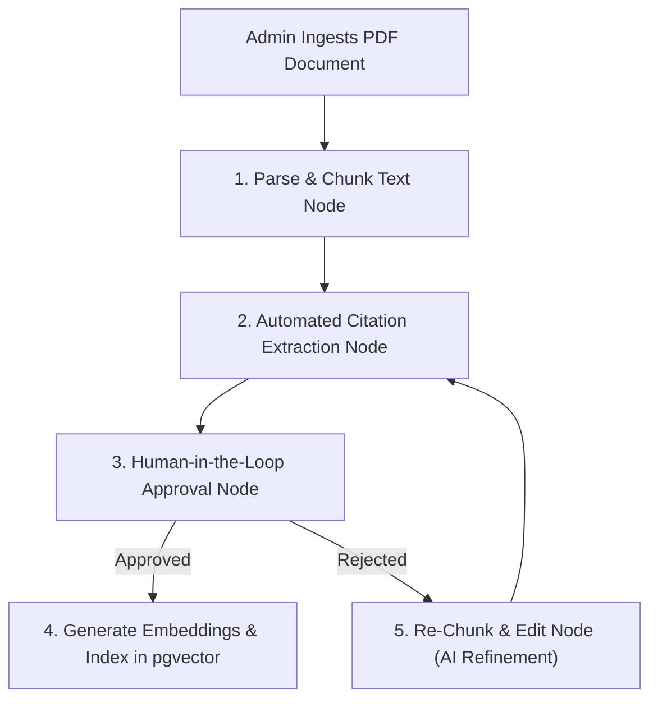

# Future Agentic AI Specification (LangGraph Workflow)

## Purpose
This document specifies the planned use of agentic workflows (via LangGraph) for offline, asynchronous administrative processes. It defines the boundary between real-time RAG (which must remain fast and non-agentic) and offline editorial pipelines (which benefit from multi-step reasoning).

## Scope
Applies to the Phase 3 feature: **Automated Knowledge Base Ingestion**. Does not apply to the user-facing chat API.

---

## 1. Architectural Boundary: No Agents on the Critical Path

Customer-facing real-time chat in Grahvani intentionally avoids autonomous agents (e.g., ReAct, Tool-calling agents) for the following reasons:
1. **Latency**: Agent loops require multiple sequential LLM calls, driving Time-To-First-Token (TTFT) from ~800ms up to 5-10 seconds, creating an unacceptable UX.
2. **Predictability**: Unconstrained agents can loop infinitely, hallucinate tool calls, or veer off-topic, which violates our strict safety guardrails.
3. **Cost**: Multi-turn agent reasoning drastically multiplies token consumption per query.

**Decision**: The user-facing `/api/v1/chat/stream` endpoint uses a strict, single-pass **Retrieval-Augmented Generation (RAG)** pipeline.

---

## 2. Offline Editorial Workflow (LangGraph)

For Phase 3 growth, **LangGraph** is specified to automate the ingestion of new astrological texts into the `pgvector` knowledge base. This is an offline, stateful, multi-step process run by admins.

### 2.1 Workflow Topology



### 2.2 LangGraph Implementation Details

The ingestion pipeline is modelled as a state graph where the state contains the current document, chunk list, extracted citations, and human feedback.

```python
# Prototype for Phase 3
from typing import TypedDict, List
from langgraph.graph import StateGraph, END

class IngestionState(TypedDict):
    document_name: str
    raw_text: str
    chunks: List[dict]
    needs_human_review: bool
    human_feedback: str

def parse_and_chunk(state: IngestionState):
    """Uses LLM to smartly chunk text at logical semantic boundaries (e.g. per Shloka)."""
    # LLM call to boundary detector...
    return {"chunks": [...]}

def extract_citations(state: IngestionState):
    """Uses LLM to extract classical references from each chunk."""
    # LLM call to entity extractor...
    return {"chunks": [...]}

def human_approval(state: IngestionState):
    """Pauses graph execution waiting for admin API input."""
    # Return state; execution is suspended until admin calls resume endpoint
    pass

def embed_and_index(state: IngestionState):
    """Generates Voyage/OpenAI embeddings and writes to pgvector."""
    # Write to DB...
    pass

# Graph Construction
workflow = StateGraph(IngestionState)
workflow.add_node("chunker", parse_and_chunk)
workflow.add_node("extractor", extract_citations)
workflow.add_node("human", human_approval)
workflow.add_node("indexer", embed_and_index)

workflow.set_entry_point("chunker")
workflow.add_edge("chunker", "extractor")
workflow.add_edge("extractor", "human")
# Conditional edges based on human review...
```

---

## 3. Rationale

Using LangGraph for offline ingestion solves the biggest bottleneck in building an authoritative astrology knowledge base: manual chunking and metadata tagging. By putting a human-in-the-loop, we get AI acceleration (LLM does the tedious chunking/tagging) without compromising the "verified expert source" guarantee. Because it runs offline in a Dramatiq worker task, latency is irrelevant.

---

## 4. Trade-offs

| Pro | Con |
| :--- | :--- |
| Radically speeds up new textbook ingestion | LangGraph introduces complex state management requirements |
| Maintains strict human quality control | Requires building an admin UI for the human-in-the-loop step |
| Keeps user-facing API fast and deterministic | High token cost for ingestion (acceptable since it's infrequent) |

---

## 5. Related Documents

- [KNOWLEDGE_BASE.md](KNOWLEDGE_BASE.md) -- Current manual editorial workflow for the knowledge base
- [RAG.md](RAG.md) -- User-facing RAG pipeline
- [backend/BACKGROUND_JOBS.md](../backend/BACKGROUND_JOBS.md) -- Where the LangGraph agent will run (Dramatiq)
