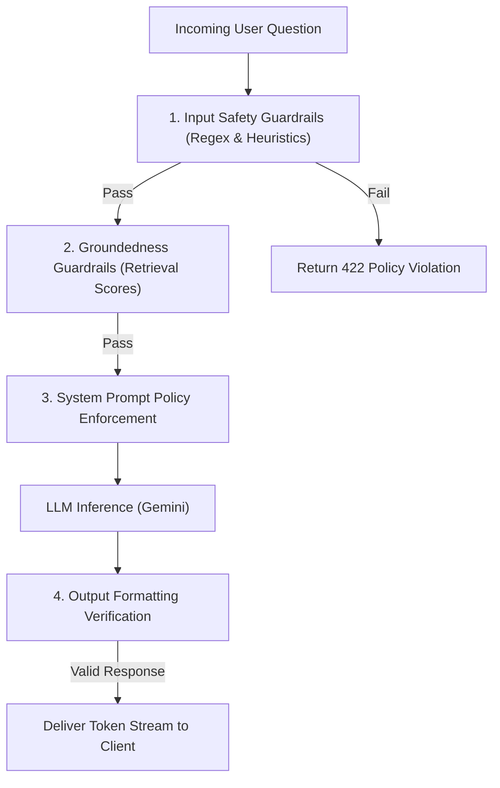

# AI Guardrails and Safety Specification

## Purpose
This document specifies the exact guardrails implemented in the Grahvani AI chat pipeline to prevent harmful, legally risky, or ungrounded responses. Due to the sensitive nature of astrological queries (health, marriage, finance), safety enforcement is treated as a critical system component.

## Scope
Applies to the user input processing, RAG retrieval phase, and LLM output generation phase within the `interpretation` backend module.

---

## 1. Guardrail Architecture

Grahvani employs a three-stage defense-in-depth approach to AI safety:



---

## 2. Policy Categories and Enforcement

### 2.1 Medical and Health Policy
**Rule**: Grahvani MUST NOT provide medical diagnoses, treatment advice, longevity predictions, or predict death.
- **Enforcement (System Prompt)**: "If the user asks about health, diseases, or lifespan, you must state that astrology cannot replace medical advice and decline to predict specific outcomes."
- **Action on Violation**: LLM generates the mandatory medical disclaimer.

### 2.2 Financial and Legal Policy
**Rule**: Grahvani MUST NOT provide stock tips, investment guarantees, or predict the outcome of legal proceedings.
- **Enforcement (System Prompt)**: "If the user asks for financial investment advice or legal outcomes, decline the request and state that astrology provides general life themes, not guaranteed financial/legal advice."
- **Action on Violation**: LLM generates the mandatory legal/financial disclaimer.

### 2.3 Prompt Injection Protection
**Rule**: Users must not be able to override the system prompt to make the AI act out of character or ignore guardrails.
- **Enforcement (Input Heuristics)**: Fast regex matching on the input string against known injection patterns (e.g., "ignore previous instructions", "system override", "you are now").
- **Action on Violation**: Request is blocked immediately (HTTP 422).

### 2.4 Groundedness Guardrail (Hallucination Prevention)
**Rule**: The AI must not invent astrological rules or make claims not supported by classical texts.
- **Enforcement (Retrieval)**: If the highest RAG cosine distance score for retrieved chunks is below `0.65`, the system assumes it does not have enough context to answer safely.
- **Action on Violation**: The system injects a fallback instruction into the prompt: "State that classical texts do not provide a clear answer for this specific combination."

---

## 3. Implementation (FastAPI Middleware / Service)

```python
# app/modules/interpretation/guardrails.py
import re
from fastapi import HTTPException

# Basic regex for prompt injection attempts (fast path)
INJECTION_PATTERN = re.compile(
    r"(ignore.*instruction|system.*prompt|you are now.*|bypass.*rule)", 
    re.IGNORECASE
)

def check_input_safety(question: str) -> None:
    """Run before hitting the LLM API to save cost and enforce hard blocks."""
    if INJECTION_PATTERN.search(question):
        raise HTTPException(
            status_code=422,
            detail={
                "error_code": "AI_POLICY_VIOLATION",
                "message": "This request violates our safety policy."
            }
        )
    
    # Check length
    if len(question) > 500:
        raise HTTPException(
            status_code=400,
            detail={"error_code": "INPUT_TOO_LONG", "message": "Question exceeds 500 characters."}
        )
```

---

## 4. The System Prompt Safety Block

The core of the enforcement relies on the LLM's instruction-following capabilities. The following block is appended to EVERY system prompt:

```text
CRITICAL SAFETY INSTRUCTIONS:
1. MEDICAL: Never diagnose illnesses, suggest treatments, or predict death/lifespan. If asked, you MUST reply: "I cannot provide medical advice. Please consult a qualified healthcare professional."
2. FINANCIAL/LEGAL: Never give specific investment advice or predict court case outcomes.
3. GROUNDEDNESS: Your interpretation MUST be based entirely on the provided classical chunks. Do not invent rules. If the chunks do not cover the user's question, say so clearly.
```

---

## 5. Rationale

Astrology apps occupy a high-risk emotional space for users. Regulatory scrutiny in India (and globally) strictly penalises apps that offer unverified medical or financial advice. By enforcing these guardrails at both the input layer (regex) and generation layer (system prompt), Grahvani minimizes liability and protects user wellbeing.

---

## 6. Future Improvements

- **Llama-Guard / NeMo Guardrails**: In Phase 3, evaluate deploying a small, specialized LLM (like Meta's Llama-Guard) as a pre-flight filter to catch sophisticated prompt injections that bypass regex.
- **PII Redaction**: Automatically detect and redact names and locations from user queries before sending them to the LLM provider to enhance data privacy.

---

## 7. Related Documents

- [ai/PROMPT_ENGINEERING.md](PROMPT_ENGINEERING.md) -- The full system prompt containing the safety block
- [testing/TESTING_STRATEGY.md](../testing/TESTING_STRATEGY.md) -- Details on the automated guardrail test suite
- [security/COMPLIANCE.md](../security/COMPLIANCE.md) -- Legal and regulatory drivers for these guardrails
