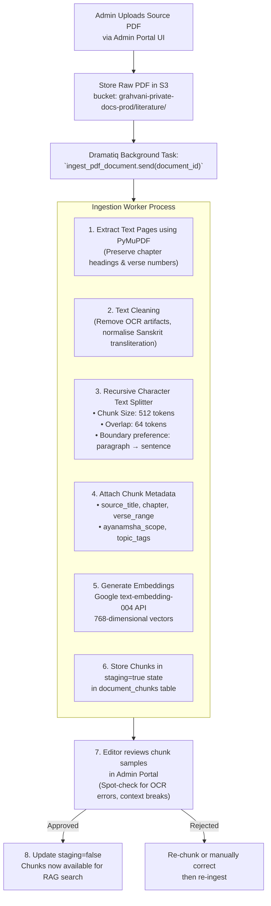

# Knowledge Base & Document Ingestion Pipeline

## 1. Overview & Purpose
Grahvani's RAG system is only as accurate as the curated literature it retrieves from. The knowledge base is a carefully managed corpus of **verified classical Vedic astrological texts** that have been legally cleared, expertly reviewed, and structured for efficient vector retrieval.

The guiding principle: **Garbage In → Hallucinated Out.** If poor-quality, unverified sources enter the knowledge base, the AI will produce inaccurate astrological explanations with false citations. Therefore, every document entering the knowledge base undergoes an editorial review process before indexing.

---

## 2. Approved Source Corpus

| Source Text | Abbreviation | Coverage | Status |
| :--- | :--- | :--- | :--- |
| *Brihat Parasara Hora Shastra* | BPHS | Foundation of Vedic astrology: planetary significations, house meanings, Dasha systems | ✅ Approved |
| *Saravali* (Kalyana Varma) | SAR | Planetary conjunctions, rasi-based predictions, yogas | ✅ Approved |
| *Phaladeepika* (Mantreswara) | PHD | House-based planetary results, Dasha interpretations | ✅ Approved |
| *Horasara* (Prithuyasas) | HSR | Planetary strengths, divisional chart analysis | ✅ Approved |
| *Jataka Parijata* | JP | Planetary dignities and shadbala system | 🔄 Under Review |
| *Uttara Kalamrita* | UK | Advanced yoga combinations | 🔄 Under Review |

> [!IMPORTANT]
> Only texts in **Approved** status are indexed and served to users. Texts under review are held in the `staging` area and never exposed in production RAG retrieval until an editor marks them `approved` in the admin portal.

---

## 3. Ingestion Pipeline Workflow



---

## 4. Text Chunking Strategy

The chunking strategy is designed for Vedic astrology literature which has a specific structure: **Chapter → Verse → Commentary**.

```python
from langchain_text_splitters import RecursiveCharacterTextSplitter

splitter = RecursiveCharacterTextSplitter(
    separators=["\n\n## ", "\n\n", "\n", ". ", " "],
    chunk_size=512,          # tokens (not characters)
    chunk_overlap=64,        # overlap to preserve cross-sentence context
    length_function=lambda text: len(text.split()),  # word-based token count
)
```

**Chunk Metadata Schema (stored as JSONB in `document_chunks`):**
```json
{
  "source_title": "Brihat Parasara Hora Shastra",
  "abbreviation": "BPHS",
  "chapter": "12",
  "chapter_title": "Results of Planetary Positions",
  "verse_range": "1-15",
  "topic_tags": ["sun", "10th-house", "career", "rajayoga"],
  "ayanamsha_scope": "sidereal",
  "language": "english_translation",
  "translator": "R. Santhanam"
}
```

---

## 5. Embedding Generation Details

| Parameter | Value |
| :--- | :--- |
| **Embedding Model** | `text-embedding-004` (Google AI) |
| **Dimensions** | 768 |
| **API Call Pattern** | Batched (20 chunks per API call to respect rate limits) |
| **Estimated Cost** | $0.000025 per 1,000 tokens embedded |
| **Storage per Chunk** | ~3 KB (768 × 4 bytes for float32 + metadata) |
| **Estimated Full Corpus** | ~50,000 chunks × 3 KB = ~150 MB vector storage |

---

## 6. Corpus Quality Controls

### 6.1 Anti-Duplication Check
Before inserting a new chunk, a similarity threshold check verifies no near-duplicate chunk already exists:
```sql
SELECT id FROM document_chunks
WHERE 1 - (embedding <=> :new_embedding) > 0.97
LIMIT 1;
-- If a match is found, skip insertion and log the duplicate
```

### 6.2 Citation Traceability
Every RAG-generated response can be traced back to a specific chunk, its parent document, chapter, and verse range. This audit trail is stored in `chat_messages.citations_json` for each AI response.

### 6.3 Knowledge Base Versioning
The `source_documents` table tracks the `ingested_version` of each document. When a newer translation or edition of a classical text is imported, old chunks are flagged as `deprecated=true` rather than deleted, preserving citation history for older chat sessions.
