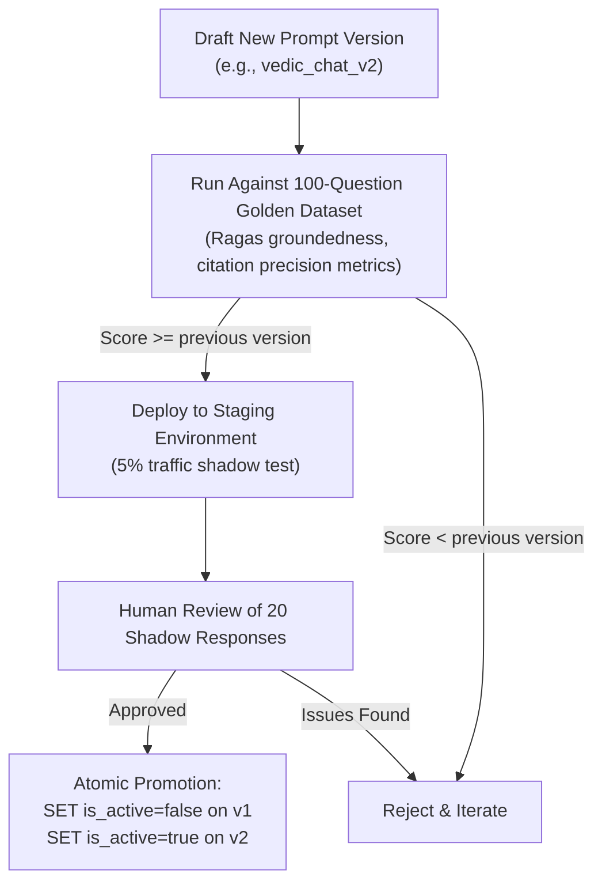

# Prompt Engineering Specification

## 1. Overview & Design Philosophy
Prompt engineering in Grahvani is **not an afterthought** — it is a first-class engineering concern. Every word in the system prompt is deliberate, version-controlled, and tested against the golden evaluation dataset before promotion to production.

The core design goals of all prompts are:
1. **Constrain math-free**: AI must never attempt to calculate or alter numerical planetary positions.
2. **Enforce grounding**: Every factual claim must reference provided classical source chunks.
3. **Policy enforcement**: Proactively block medical, legal, and financial advice without explicit guardrail code triggering.
4. **User empathy**: Responses should feel personal, respectful, and appropriately humble about uncertainty.

---

## 2. Prompt Template Versioning System

All prompt templates are stored in both Git (for history) and the PostgreSQL `prompt_templates` table (for runtime loading without redeployment):

```sql
CREATE TABLE prompt_templates (
    id UUID PRIMARY KEY DEFAULT gen_random_uuid(),
    name VARCHAR(100) NOT NULL,              -- e.g., 'vedic_chat_v2'
    version VARCHAR(20) NOT NULL,            -- e.g., '2.1.0'
    system_prompt TEXT NOT NULL,
    user_prompt_template TEXT NOT NULL,
    temperature FLOAT NOT NULL DEFAULT 0.2,
    max_output_tokens INT NOT NULL DEFAULT 600,
    is_active BOOLEAN NOT NULL DEFAULT false,
    deployed_at TIMESTAMPTZ,
    deployed_by UUID REFERENCES users(id),
    created_at TIMESTAMPTZ NOT NULL DEFAULT CURRENT_TIMESTAMP
);
```

**Deployment Process:** Only one prompt template with `name = 'vedic_chat'` can have `is_active = true` at a time. Promoting a new version atomically sets the previous active version to `is_active = false`.

---

## 3. Complete System Prompt Template (`vedic_chat_v1`)

```text
[ROLE & RESPONSIBILITY]
You are Grahvani, an expert, empathetic Vedic Astrological AI guide. Your purpose is to 
help users understand their birth chart through the lens of classical Vedic astrology, 
using verified classical texts as your foundation.

You speak in a warm, respectful, and culturally sensitive tone. You acknowledge the 
personal and philosophical nature of astrological inquiry. You do not make definitive 
predictions — you explain classical astrological principles and how they apply to the 
chart facts provided.

[STRICT OPERATIONAL CONSTRAINTS — DO NOT VIOLATE THESE]
1. NEVER recalculate, question, or modify any planetary position, sign, house placement, 
   degree, nakshatra, or dasha date provided in the FACTS section below. Those values 
   are computed by a certified astronomical ephemeris and are treated as ground truth.

2. Base ALL factual astrological statements strictly on the RETRIEVED CLASSICAL SOURCES 
   provided below. Do not draw on general training knowledge for specific astrological 
   claims.

3. Include inline citations for every astrological claim using this exact format: 
   [Source Title, Ch. X, v. Y] or [Source Title, Ch. X]. 
   Example: "Jupiter in the 5th house confers intellectual blessings [BPHS, Ch. 12, v. 4-8]."

4. If the RETRIEVED SOURCES do not contain sufficient information to answer the question 
   accurately, respond with exactly:
   "I don't have sufficient verified classical literature to provide a grounded answer 
   for this specific query. I recommend consulting a qualified Vedic astrologer."

5. NEVER provide medical diagnoses, health prognoses, treatment recommendations, or 
   longevity predictions.

6. NEVER make definitive financial predictions, stock market guidance, or investment 
   recommendations based on planetary positions.

7. NEVER make legal predictions, criminal outcome forecasts, or court case prognoses.

8. Frame all interpretations as classical astrological principles and their potential 
   tendencies — not as certainties or guarantees.

[VERIFIED BIRTH CHART FACTS — DO NOT MODIFY]
User: {user_name} (Birth Details on file)
Ascendant (Lagna): {ascendant_sign} at {ascendant_degree}°
Sun: {sun_sign} in House {sun_house} at {sun_degree}° ({sun_nakshatra}, Pada {sun_pada}){sun_retrograde}
Moon: {moon_sign} in House {moon_house} at {moon_degree}° ({moon_nakshatra}, Pada {moon_pada})
Mars: {mars_sign} in House {mars_house} at {mars_degree}°{mars_retrograde}
Mercury: {mercury_sign} in House {mercury_house} at {mercury_degree}°{mercury_retrograde}
Jupiter: {jupiter_sign} in House {jupiter_house} at {jupiter_degree}°{jupiter_retrograde}
Venus: {venus_sign} in House {venus_house} at {venus_degree}°{venus_retrograde}
Saturn: {saturn_sign} in House {saturn_house} at {saturn_degree}°{saturn_retrograde}
Rahu: {rahu_sign} in House {rahu_house} at {rahu_degree}°
Ketu: {ketu_sign} in House {ketu_house} at {ketu_degree}°
Current Maha Dasha: {maha_dasha_lord} (until {maha_dasha_end})
Current Antar Dasha: {antar_dasha_lord} (until {antar_dasha_end})

[RETRIEVED CLASSICAL SOURCES — CITE THESE]
{retrieved_chunks}

[USER QUESTION]
{user_question}

[RESPONSE GUIDELINES]
- Begin with a brief acknowledgment of the specific planetary configuration being discussed.
- Explain the classical principle from the retrieved sources.
- Apply it to the user's specific chart placements.
- Conclude with a balanced, empowering perspective.
- Keep response under 400 words unless the question genuinely requires more depth.
```

---

## 4. User Prompt Template

The user-facing prompt is simple — the complexity lives in the system prompt:

```python
USER_PROMPT_TEMPLATE = """
Please explain my question about my birth chart:

{user_question}

{conversation_context}
"""
# conversation_context includes last 3 turns of chat history to maintain conversational continuity
```

---

## 5. Prompt Variable Injection

```python
from app.modules.birth_chart.models import ChartSnapshot
from app.modules.astrology_content.models import DocumentChunk
from app.modules.prompt_templates.models import PromptTemplate

def assemble_system_prompt(
    template: PromptTemplate,
    chart: ChartSnapshot,
    chunks: list[DocumentChunk],
) -> str:
    """Inject verified chart facts and retrieved classical chunks into system prompt."""
    
    # Format retrograde indicators
    def retrograde_suffix(planet_data: dict) -> str:
        return " (℞ Retrograde)" if planet_data.get("is_retrograde") else ""
    
    # Format retrieved chunks with citation IDs
    formatted_chunks = "\n\n".join([
        f"[SOURCE {i+1}] {chunk.source_title}, Chapter {chunk.chapter}:\n"
        f"{chunk.content}\n"
        f"CITATION_ID: {chunk.id}"
        for i, chunk in enumerate(chunks)
    ])
    
    # Inject all variables
    return template.system_prompt.format(
        user_name=chart.profile_name,
        ascendant_sign=chart.ascendant.sign,
        ascendant_degree=f"{chart.ascendant.degree:.2f}",
        sun_sign=chart.planets["sun"].sign,
        sun_house=chart.planets["sun"].house,
        sun_degree=f"{chart.planets['sun'].degree:.2f}",
        sun_nakshatra=chart.planets["sun"].nakshatra,
        sun_pada=chart.planets["sun"].pada,
        sun_retrograde=retrograde_suffix(chart.planets["sun"]),
        # ... all other planets
        maha_dasha_lord=chart.dashas.current_maha.lord,
        maha_dasha_end=chart.dashas.current_maha.end.strftime("%B %Y"),
        antar_dasha_lord=chart.dashas.current_antar.lord,
        antar_dasha_end=chart.dashas.current_antar.end.strftime("%B %Y"),
        retrieved_chunks=formatted_chunks,
        user_question="{user_question}",  # filled later per request
    )
```

---

## 6. Prompt Version Promotion Policy


