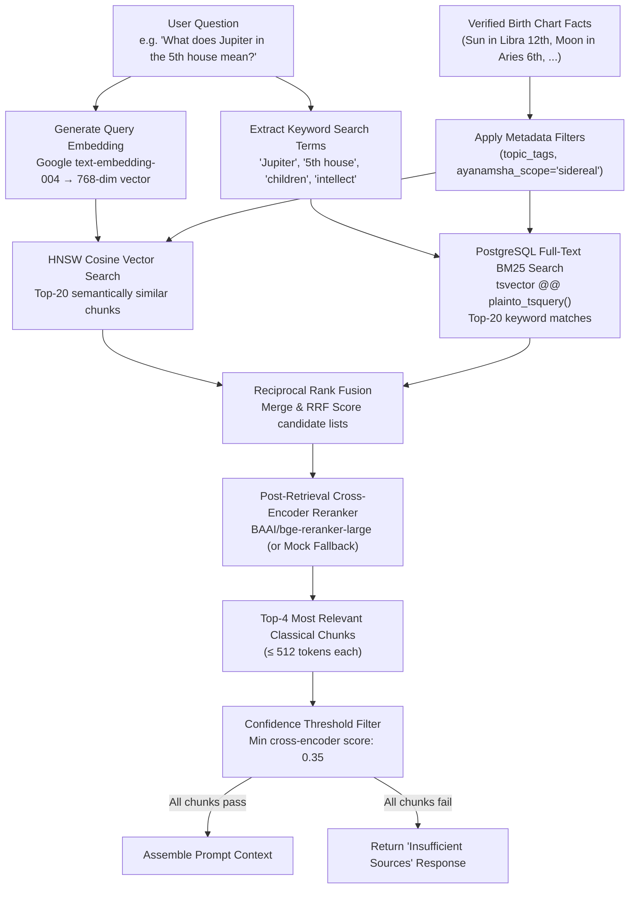

# RAG (Retrieval-Augmented Generation) Specification

## 1. Why RAG for Vedic Astrology?
**Grahvani's fundamental design decision**: AI generative models are prohibited from freely generating astrological interpretations from their training data, because:
1. Training data may contain inaccurate, inconsistent, or culturally biased astrological content.
2. LLMs cannot cite the exact source of their knowledge — critical for an accuracy-first product.
3. Different astrological traditions disagree; without grounding, the AI will blend incompatible systems.

**The RAG solution**: The AI is **strictly constrained** to explain astrological facts using only text retrieved from a curated, approved library of classical Vedic texts. Every factual statement in a response must be traceable to a specific source, chapter, and verse.

---

## 2. 3-Stage Hybrid Search & Reranking Architecture

Grahvani combines two complementary retrieval strategies, merged with **Reciprocal Rank Fusion (RRF)**, and refined via a deep cross-encoder reranking model (**`BAAI/bge-reranker-large`**):



**Why hybrid search & cross-encoder reranking?**
- **Vector search alone** misses exact keyword matches ("Sade Sati", "Vimshottari", specific planet names in Sanskrit).
- **Full-text search alone** misses semantically related content ("career" matches "professional success" and "livelihood" via vector, but not keyword).
- **Combined RRF** merges candidates from both retrieval models.
- **Cross-Encoder Reranking (`bge-reranker-large`)** evaluates deep sentence-pair cross-attention between user query and retrieved classical text chunks, sorting candidates by precise semantic relevance.


---

## 3. Reciprocal Rank Fusion (RRF) Scoring

For each candidate document chunk $d$, appearing in result lists from vector search and full-text search:

$$\text{RRF\_Score}(d) = \sum_{m \in \{\text{Vector}, \text{FTS}\}} \frac{1}{k + \text{rank}_m(d)}$$

Where:
- $k = 60$ is the standard smoothing constant (prevents top-ranked items from dominating when one method gives very strong results).
- $\text{rank}_m(d)$ is the document's rank position (1-indexed) in each retrieval method's result list.
- If a document only appears in one method's results, that method gets its contribution; the other contributes 0.

**Example RRF Calculation:**

| Chunk | Vector Rank | FTS Rank | RRF Score | Notes |
| :--- | :--- | :--- | :--- | :--- |
| BPHS Ch.12, Verse 3 | 1 | 2 | 1/61 + 1/62 = **0.0325** | Strong in both |
| Saravali Ch.8, Para 1 | 3 | 1 | 1/63 + 1/61 = **0.0323** | FTS-dominant |
| Phaladeepika Ch.5 | 2 | 15 | 1/62 + 1/75 = **0.0295** | Vector-dominant |
| Horasara Ch.3 | 10 | Not found | 1/70 + 0 = **0.0143** | Vector only |

---

## 4. Complete SQL Implementation

```sql
-- Hybrid RAG Search Query: Combines vector & FTS via Reciprocal Rank Fusion
WITH vector_matches AS (
    SELECT
        id,
        content,
        source_title,
        chapter,
        metadata_json,
        1 - (embedding <=> :query_embedding) AS cosine_similarity,
        RANK() OVER (ORDER BY embedding <=> :query_embedding) AS vector_rank
    FROM document_chunks
    WHERE staging = false  -- Only serve approved, published chunks
      AND deprecated = false
    ORDER BY embedding <=> :query_embedding
    LIMIT 20
),
fts_matches AS (
    SELECT
        id,
        content,
        source_title,
        chapter,
        metadata_json,
        ts_rank_cd(fts_vector, query) AS fts_score,
        RANK() OVER (ORDER BY ts_rank_cd(fts_vector, query) DESC) AS fts_rank
    FROM document_chunks,
         plainto_tsquery('english', :query_text) query
    WHERE staging = false
      AND deprecated = false
      AND fts_vector @@ query
    ORDER BY fts_score DESC
    LIMIT 20
),
hybrid_ranked AS (
    SELECT
        COALESCE(v.id, f.id) AS id,
        COALESCE(v.content, f.content) AS content,
        COALESCE(v.source_title, f.source_title) AS source_title,
        COALESCE(v.chapter, f.chapter) AS chapter,
        COALESCE(v.metadata_json, f.metadata_json) AS metadata_json,
        COALESCE(v.cosine_similarity, 0.0) AS cosine_similarity,
        -- RRF Score: k=60
        COALESCE(1.0 / (60 + v.vector_rank), 0.0) +
        COALESCE(1.0 / (60 + f.fts_rank), 0.0) AS rrf_score
    FROM vector_matches v
    FULL OUTER JOIN fts_matches f ON v.id = f.id
)
SELECT id, content, source_title, chapter, metadata_json, cosine_similarity, rrf_score
FROM hybrid_ranked
WHERE cosine_similarity >= 0.65  -- Confidence threshold (configurable)
ORDER BY rrf_score DESC
LIMIT 4;  -- Return Top-4 chunks for prompt assembly
```

---

## 5. Citation Formatting in Responses

Every factual astrological claim must include an inline citation. The `interpretation` module injects source metadata directly into the Gemini prompt so the model can construct citations naturally:

**Prompt Context Format:**
```text
[SOURCE 1] Brihat Parasara Hora Shastra, Chapter 12, Verses 4-8:
"When Jupiter occupies the fifth house, the native shall be endowed with
children, great intellect, and spiritual wisdom..."
CITATION_ID: chunk-8392

[SOURCE 2] Saravali, Chapter 8, Paragraph 3:
"Jupiter in the fifth house confers fine intellect, devotion to learning..."
CITATION_ID: chunk-2847
```

**Example Response with Inline Citations:**
```
Jupiter's placement in your 5th house is considered highly auspicious 
in classical Vedic texts. According to the Brihat Parasara Hora Shastra 
[BPHS, Ch.12, v.4-8], this position is associated with strong intellect, 
spiritual inclination, and blessings in matters related to children and 
creative expression. The Saravali [SAR, Ch.8, ¶3] further emphasizes 
the enhancement of learning abilities and devotion to knowledge.
```

---

## 6. Retrieval Quality Monitoring

| Metric | Tool | Alert Threshold |
| :--- | :--- | :--- |
| **Mean Retrieval Cosine Similarity** | Langfuse custom metric | Alert if < 0.68 over 100 queries |
| **Zero-Result Rate** (no chunks > 0.65 threshold) | Langfuse counter | Alert if > 5% of queries return no results |
| **Top-4 Chunk Source Diversity** | Langfuse | Monitor if all 4 chunks always come from 1 source |
| **RAG Latency (vector search)** | CloudWatch | Alert if p95 > 150ms |
