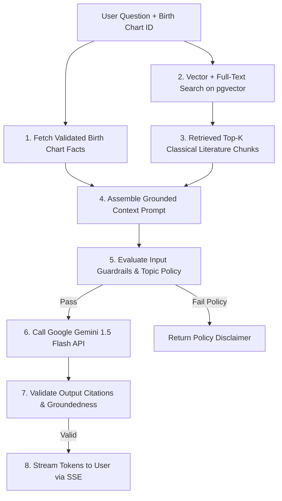

# AI & GenAI Documentation (Grounded RAG Interpretation Engine)

Welcome to the AI systems documentation for **Grahvani**. Grahvani uses an **evidence-grounded Retrieval-Augmented Generation (RAG)** architecture to explain astrological charts using verified classical texts without mathematical hallucination.

---

## 📂 AI Documents Index

- 🏗️ **[AI Architecture](AI_ARCHITECTURE.md)** — End-to-end interpretation pipeline, provider abstraction layer, zero-AI-math policy.
- 🔍 **[RAG Implementation](RAG.md)** — `pgvector` hybrid search, Reciprocal Rank Fusion (RRF), source citation engine.
- ✍️ **[Prompt Engineering](PROMPT_ENGINEERING.md)** — System prompt templates, versioning, variable context insertion.
- 🎯 **[Model Selection](MODEL_SELECTION.md)** — Primary model (Gemini 1.5 Flash), fallback strategy, token cost budgeting.
- 📚 **[Knowledge Base](KNOWLEDGE_BASE.md)** — Document ingestion pipeline, PDF parsing, text chunking, embedding generation.
- 🛡️ **[Guardrails & Safety](GUARDRAILS.md)** — Input validation, safety policies (no medical/legal advice), groundedness checks.
- 👁️ **[Observability](OBSERVABILITY.md)** — Langfuse trace logging, token accounting, latency metrics.
- 📊 **[Evaluation Framework](EVALUATION.md)** — Golden question evaluation dataset, citation accuracy metrics.
- 🤖 **[Future Agentic AI](FUTURE_AGENTIC_AI.md)** — LangGraph workflows for offline editorial content management.

---

## 🏛️ AI RAG Interpretation Architecture

