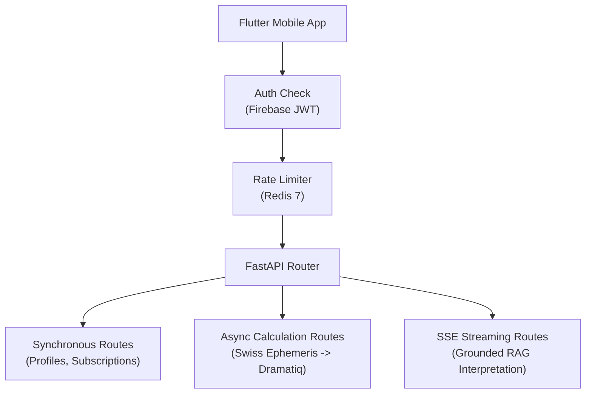

# API Architecture & Specifications Overview

Welcome to the API specification documentation for **Grahvani**. The Grahvani backend exposes a clean, developer-friendly **RESTful HTTP API** built with **FastAPI**, complemented by **Server-Sent Events (SSE)** for real-time AI answer streaming.

---

## 1. Core API Principles

- **OpenAPI Compliant**: Automatic schema generation via FastAPI available at `/docs` (Swagger UI) and `/redoc`.
- **JSON Standard Envelopes**: All standard REST responses are wrapped in consistent `{ "success": bool, "data": ..., "error": ... }` structures (see [Request/Response Envelopes](file:///e:/AI-WorkSpace/Projects/Active/Grahvani/docs/api/REQUEST_RESPONSE.md)).
- **Stateless Bearer Auth**: Authenticated via Firebase ID tokens verified on every request (see [Auth Flow](file:///e:/AI-WorkSpace/Projects/Active/Grahvani/docs/api/AUTH_FLOW.md)).
- **Asynchronous Execution**: Heavy computations (Swiss Ephemeris chart generation, PDF export) return `HTTP 202 Accepted` immediately and process via background workers.
- **Tiered Rate Limiting**: Distributed Redis bucket rate limits enforced per IP and user entitlement tier (see [Rate Limiting](file:///e:/AI-WorkSpace/Projects/Active/Grahvani/docs/api/RATE_LIMITING.md)).

---

## 2. API Document Catalog

| Document | Focus & Description |
| :--- | :--- |
| **[Endpoints Catalog](file:///e:/AI-WorkSpace/Projects/Active/Grahvani/docs/api/ENDPOINTS.md)** | Full endpoint list with HTTP methods, query params, request/response JSON payloads, and status codes. |
| **[Request / Response Envelopes](file:///e:/AI-WorkSpace/Projects/Active/Grahvani/docs/api/REQUEST_RESPONSE.md)** | Standardized JSON payload structures, metadata fields, and error object schemas. |
| **[Auth Flow](file:///e:/AI-WorkSpace/Projects/Active/Grahvani/docs/api/AUTH_FLOW.md)** | Firebase ID token verification, header formats, and session initialization sequence. |
| **[SSE Streaming](file:///e:/AI-WorkSpace/Projects/Active/Grahvani/docs/api/STREAMING.md)** | Server-Sent Events contract for streaming grounded AI chat responses with source citations. |
| **[Rate Limiting](file:///e:/AI-WorkSpace/Projects/Active/Grahvani/docs/api/RATE_LIMITING.md)** | Redis token bucket rate limiting strategy, HTTP `429` headers, and tier limits. |

---

## 3. Quick Navigation

---

## 4. Related Systems

- [FastAPI Architecture](file:///e:/AI-WorkSpace/Projects/Active/Grahvani/docs/backend/FASTAPI_ARCHITECTURE.md) — Backend implementation layout and router modularity.
- [AI Architecture](file:///e:/AI-WorkSpace/Projects/Active/Grahvani/docs/ai/AI_ARCHITECTURE.md) — Grounded LLM interpretation engine details.
