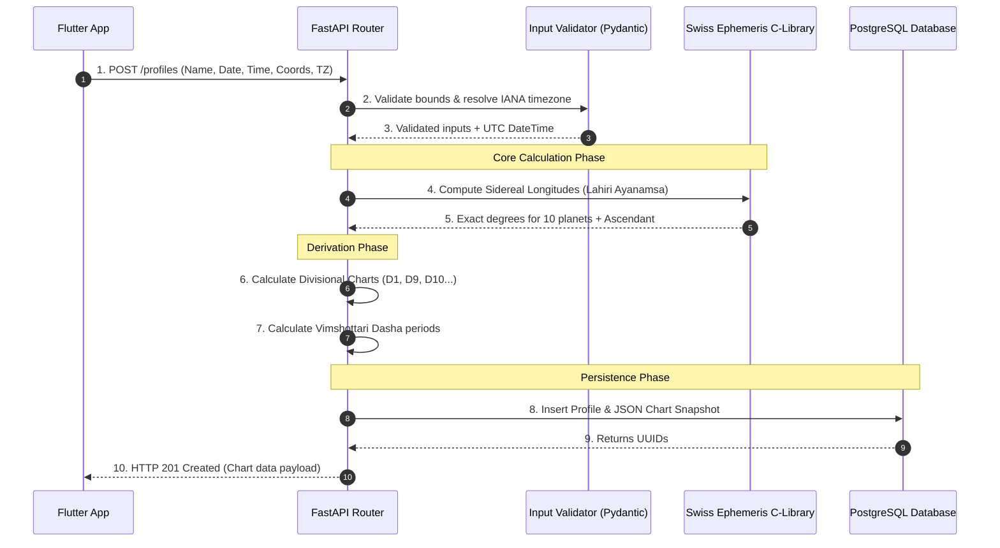
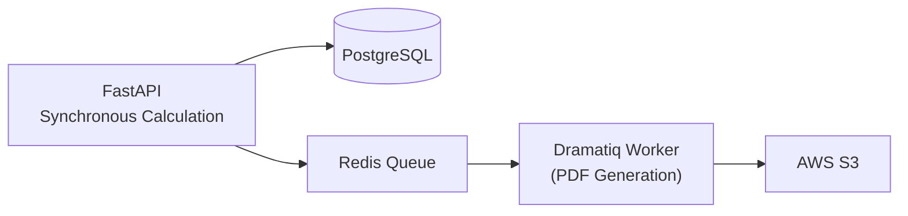

# Astrology Data Workflow Specification

## Purpose
This document maps the end-to-end data pipeline for astrological calculations in Grahvani. It defines how raw user inputs are transformed into a mathematically verified, immutable chart snapshot stored in the database.

## Scope
Applies to the backend API (`/api/v1/profiles` and `/api/v1/charts/calculate`), the calculation service, and the database persistence layer.

---

## 1. End-to-End Execution Sequence

The calculation pipeline enforces a strict separation between input validation, mathematical computation (via C library), higher-order astrological derivations, and persistence.



---

## 2. The Immutability Principle

Once calculated, a birth chart is treated as **immutable**.

### 2.1 The `chart_facts_json` Snapshot
The output of the derivation phase (Step 7) is serialized into a comprehensive JSON payload (typically ~10KB) and stored in a `JSONB` column named `chart_facts_json` in the `birth_charts` table.

**Why?**
1. **Performance**: Calculating a chart takes ~50ms of CPU time. By storing the result as JSONB, subsequent chart retrievals (which happen every time a user opens the app) are near-instantaneous `SELECT` queries without any CPU recalculation overhead.
2. **AI Stability**: The RAG pipeline relies on this JSON string to inject chart context into the LLM prompt. If the ephemeris library is updated in the future (causing minor fractional degree shifts), old charts will not magically change, preserving the consistency of past AI interpretations.

### 2.2 Re-calculation
If a user edits their birth time in the app, a completely new `birth_charts` record is created, and the old one is soft-deleted. We do not UPDATE the `chart_facts_json` in place.

---

## 3. Background Processing vs. Synchronous Calculation

**Synchronous Phase**:
The initial calculation of the D1 (Rasi), D9 (Navamsa), and Maha Dasha timeline occurs synchronously during the `POST /profiles` request to ensure the user sees their chart immediately upon registration.

**Asynchronous Phase (Phase 2 Roadmap)**:
High-resolution PDF generation and the calculation of deep divisional charts (D60) are delegated to a Dramatiq background worker.



---

## 4. Error Handling Workflow

If the `pyswisseph` library raises a calculation exception (e.g., due to an extreme edge-case Julian Day calculation failure for a date in 4000 BC), the workflow catches it at the boundary:

```python
try:
    chart_data = calculate_positions(utc_datetime, lat, lon)
except swe.Error as e:
    logger.error("Swiss Ephemeris calculation failed", exc_info=e, extra={"user_id": user_id})
    raise HTTPException(
        status_code=500,
        detail={"error_code": "CALCULATION_ERROR", "message": "Failed to compute planetary positions."}
    )
```

---

## 5. Rationale

The workflow relies heavily on the `JSONB` snapshot pattern. While a fully normalized database schema (tables for planets, houses, signs) might seem cleaner, it requires massive multi-join queries just to reconstruct a single chart for the AI prompt. The `JSONB` snapshot provides the optimal structure for both API delivery and LLM context injection.

---

## 6. Related Documents

- [astrology/CALCULATION_ENGINE.md](CALCULATION_ENGINE.md) -- The mathematical engine inside Step 4
- [astrology/DATA_VALIDATION.md](DATA_VALIDATION.md) -- The validation logic in Step 2
- [astrology/SWISS_EPHEMERIS.md](SWISS_EPHEMERIS.md) -- Details on the C-library wrapper
