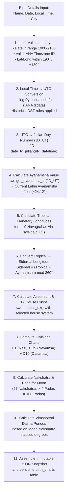

# Birth Chart Generation Pipeline Specification

## 1. Overview & What Grahvani Calculates
A **birth chart** (Janma Kundali) in Vedic astrology is a precise mathematical snapshot of the sky at the exact moment and place of a person's birth. Grahvani computes this snapshot deterministically using the Swiss Ephemeris C-library and stores it as an **immutable JSON record** that never changes even as library versions update.

The chart encompasses:
- **Planetary Longitudes**: Exact ecliptic positions of 9 Vedic celestial bodies (Navagrahas).
- **Ascendant (Lagna)**: The zodiac sign rising on the eastern horizon at birth.
- **House Cusps**: The boundaries of 12 houses using the selected house system.
- **Divisional Charts (Vargas)**: D1 Rasi, D9 Navamsa, and optionally D10 Dasamsa.
- **Nakshatra & Pada**: Each planet's lunar mansion placement.
- **Vimshottari Dasha System**: The planetary period system operating at the birth moment.

---

## 2. Step-by-Step Chart Calculation Workflow



---

## 3. The 9 Navagrahas (Celestial Bodies Calculated)

| Planet | Sanskrit Name | Swiss Ephemeris Constant | Special Handling |
| :--- | :--- | :--- | :--- |
| **Sun** | Surya | `swe.SUN` | Direct computation |
| **Moon** | Chandra | `swe.MOON` | Used for Nakshatra & Dasha calculation |
| **Mars** | Mangala / Kuja | `swe.MARS` | Retrograde check |
| **Mercury** | Budha | `swe.MERCURY` | Retrograde check |
| **Jupiter** | Guru / Brihaspati | `swe.JUPITER` | Retrograde check |
| **Venus** | Shukra | `swe.VENUS` | Retrograde check |
| **Saturn** | Shani | `swe.SATURN` | Retrograde check |
| **Rahu** | North Lunar Node | `swe.MEAN_NODE` | Always retrograde (mean position) |
| **Ketu** | South Lunar Node | Derived | `Ketu = (Rahu + 180°) mod 360°` |
| **Ascendant (Lagna)** | Lagna | `swe.HOUSE_ASC` | Computed via `swe.houses_ex()` |

---

## 4. Ayanamsha Calculation Detail

The **Ayanamsha** is the angular difference between the Tropical Zodiac (Western) and the Sidereal Zodiac (Vedic). It increases by approximately 50.3 arcseconds per year (precession of equinoxes).

```python
import swisseph as swe

def get_ayanamsha(julian_day_ut: float, ayanamsha_id: int = swe.SIDM_LAHIRI) -> float:
    """
    Returns the Ayanamsha value in decimal degrees for a given Julian Day.
    Default: Lahiri (Chitra Paksha) Ayanamsha — the standard for Indian govt. almanacs.
    """
    swe.set_sid_mode(ayanamsha_id)
    return swe.get_ayanamsa_ut(julian_day_ut)

# Supported Ayanamsha Options in Grahvani
AYANAMSHA_OPTIONS = {
    1: ("Lahiri / Chitra Paksha", swe.SIDM_LAHIRI),     # Default
    2: ("Raman",                  swe.SIDM_RAMAN),
    3: ("Krishnamurti (KP)",      swe.SIDM_KRISHNAMURTI),
}
```

---

## 5. Divisional Chart (Varga) Formulas

### 5.1 Rasi Chart (D1) — Primary Birth Chart
Each 30° arc of the zodiac is one Rasi sign. Planetary sign placement:
```
Sign Index = floor(sidereal_longitude / 30)   [0 = Aries, 11 = Pisces]
Sign Degree = sidereal_longitude mod 30°
```

### 5.2 Navamsa Chart (D9) — Soul / Marriage / Dharma Chart
Each sign is divided into 9 equal navamsas of 3°20' (200 arcminutes):
```
Navamsa Index = floor(sidereal_longitude / 3.333...) mod 12
```
Navamsa sign starting point follows the fire/earth/air/water triplicity of the Rasi sign (different for odd vs even signs).

### 5.3 Dasamsa Chart (D10) — Career & Public Life (Premium)
Each sign is divided into 10 equal parts of 3°:
```
Dasamsa Part = floor((sidereal_longitude mod 30) / 3)
Dasamsa Sign = (10 × sign_index + dasamsa_part) mod 12
```

---

## 6. Vimshottari Dasha Calculation

The **Vimshottari Dasha** system assigns planetary ruling periods based on the **Moon's Nakshatra** (lunar mansion) at birth. The system covers a complete 120-year cycle.

### 6.1 Dasha Sequence & Durations
| # | Ruling Planet | Dasha Duration (Years) | Sub-Period Ratio |
| :--- | :--- | :--- | :--- |
| 1 | **Ketu** | 7 | 7 sub-periods (Antar Dasha) |
| 2 | **Venus** | 20 | 20 sub-periods |
| 3 | **Sun** | 6 | 6 sub-periods |
| 4 | **Moon** | 10 | 10 sub-periods |
| 5 | **Mars** | 7 | 7 sub-periods |
| 6 | **Rahu** | 18 | 18 sub-periods |
| 7 | **Jupiter** | 16 | 16 sub-periods |
| 8 | **Saturn** | 19 | 19 sub-periods |
| 9 | **Mercury** | 17 | 17 sub-periods |
| **Total** | | **120 years** | |

### 6.2 Dasha Start Date Calculation
The Moon's exact position within its Nakshatra determines how much of the current Maha Dasha has already elapsed at birth:

```python
NAKSHATRA_SPAN = 360 / 27   # = 13.333... degrees per nakshatra
TOTAL_CYCLE_YEARS = 120

def calculate_dasha_start(moon_longitude: float, birth_utc: datetime) -> DashaInfo:
    """Calculate the Vimshottari Dasha start for the birth Maha Dasha."""
    nakshatra_index = int(moon_longitude / NAKSHATRA_SPAN)      # 0-26
    elapsed_fraction = (moon_longitude % NAKSHATRA_SPAN) / NAKSHATRA_SPAN

    # Dasha sequence starting from Ketu (index 0)
    DASHA_LORDS = ["Ketu", "Venus", "Sun", "Moon", "Mars", "Rahu", "Jupiter", "Saturn", "Mercury"]
    DASHA_YEARS = [7, 20, 6, 10, 7, 18, 16, 19, 17]

    lord_index = nakshatra_index % 9           # which dasha lord rules this nakshatra
    lord = DASHA_LORDS[lord_index]
    total_dasha_days = DASHA_YEARS[lord_index] * 365.25

    # Days elapsed in current dasha at birth
    elapsed_days = elapsed_fraction * total_dasha_days
    dasha_start = birth_utc - timedelta(days=elapsed_days)
    dasha_end = dasha_start + timedelta(days=total_dasha_days)

    return DashaInfo(lord=lord, start=dasha_start, end=dasha_end)
```

---

## 7. Immutable Chart Snapshot JSON Schema
The `chart_facts_json` JSONB column stores the complete chart as an immutable snapshot:

```json
{
  "snapshot_version": "1.0",
  "calculated_at": "2026-08-04T14:00:00Z",
  "ayanamsha": {
    "id": 1,
    "name": "Lahiri",
    "value_degrees": 24.12451
  },
  "ascendant": {
    "sign": "Scorpio",
    "sign_index": 7,
    "degree": 15.432,
    "navamsa_sign": "Pisces"
  },
  "planets": {
    "sun": {
      "sign": "Libra",
      "sign_index": 6,
      "house": 12,
      "degree": 7.821,
      "nakshatra": "Chitra",
      "pada": 2,
      "is_retrograde": false
    }
  },
  "dashas": {
    "current_maha": {"lord": "Mercury", "start": "2024-03-12", "end": "2041-03-12"},
    "current_antar": {"lord": "Saturn", "start": "2025-10-01", "end": "2028-04-15"},
    "current_pratyantar": {"lord": "Venus", "start": "2026-06-01", "end": "2027-01-20"}
  }
}
```
