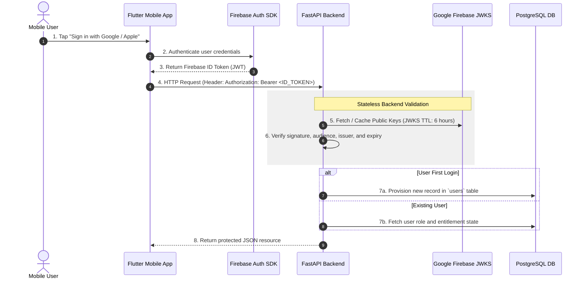

# Authentication Flow Specification

> [[Backend Index](file:///e:/AI-WorkSpace/Projects/Active/Grahvani/docs/backend/README.md) | [Authorization Specs](file:///e:/AI-WorkSpace/Projects/Active/Grahvani/docs/backend/AUTHORIZATION.md) | [API Design](file:///e:/AI-WorkSpace/Projects/Active/Grahvani/docs/backend/API_DESIGN.md) | [Auth Flow API](file:///e:/AI-WorkSpace/Projects/Active/Grahvani/docs/api/AUTH_FLOW.md)]

---

## 1. Firebase JWT Authentication Strategy

**Grahvani** uses **Firebase Authentication** on the mobile client (supporting Google Sign-In, Apple ID, and Phone OTP) to issue cryptographically signed JWT access tokens. The FastAPI backend verifies these tokens statelessly on every protected API request using Google's public JSON Web Key Sets (JWKS).

### Core Benefits
- **Zero Password Storage Risk**: Backend never handles or stores user passwords or raw auth credentials.
- **Stateless Verification**: Every API instance verifies tokens independently without database roundtrips.
- **Cross-Platform Compatibility**: Flutter SDK handles native Google/Apple sign-in prompts seamlessly.

---

## 2. Authentication Sequence Diagram



---

## 3. FastAPI Security Dependency Implementation

```python
# Location: services/api/security/auth.py
from fastapi import Request, HTTPException, Depends, status
from fastapi.security import HTTPBearer, HTTPAuthorizationCredentials
from firebase_admin import auth as firebase_auth
from typing import Dict, Any, Optional

security_scheme = HTTPBearer(auto_error=True)

async def get_current_user(
    credentials: HTTPAuthorizationCredentials = Depends(security_scheme)
) -> Dict[str, Any]:
    """
    FastAPI dependency that extracts and validates the Firebase JWT ID Token from the 
    Authorization: Bearer <token> header.
    """
    token = credentials.credentials
    try:
        # Statelessly verify the Firebase JWT token
        decoded_token = firebase_auth.verify_id_token(
            token, 
            check_revoked=True  # Checks if user logged out or password reset
        )
        return decoded_token
    except firebase_auth.RevokedIdTokenError:
        raise HTTPException(
            status_code=status.HTTP_401_UNAUTHORIZED,
            detail="Authentication token has been revoked. Please sign in again.",
            headers={"WWW-Authenticate": "Bearer"},
        )
    except firebase_auth.ExpiredIdTokenError:
        raise HTTPException(
            status_code=status.HTTP_401_UNAUTHORIZED,
            detail="Authentication token has expired. Please refresh token.",
            headers={"WWW-Authenticate": "Bearer"},
        )
    except Exception as e:
        raise HTTPException(
            status_code=status.HTTP_401_UNAUTHORIZED,
            detail=f"Invalid authentication credentials: {str(e)}",
            headers={"WWW-Authenticate": "Bearer"},
        )
```

---

## 4. Token Revocation & Redis Blacklisting

While Firebase ID tokens expire automatically after **60 minutes**, instant token revocation (e.g. user tap "Logout", account suspension) is handled via a lightweight Redis blacklist:

```python
# Check Redis blacklist during verification middleware
async def is_token_blacklisted(redis_client, jti: str) -> bool:
    is_revoked = await redis_client.get(f"revoked_token:{jti}")
    return is_revoked is not None
```

---

## 5. First-Time User Provisioning

When a valid token is presented by a new user:
1. `firebase_uid`, `email`, and optional `phone_number` are extracted from the decoded token payload.
2. Backend triggers a `GET_OR_CREATE` query on the `users` table.
3. Default role `'user'` and default tier `'free'` are assigned to the new user record.

---

## 6. Related Documents

- [Authorization Specs](file:///e:/AI-WorkSpace/Projects/Active/Grahvani/docs/backend/AUTHORIZATION.md) — Role-Based Access Control (RBAC) and entitlements.
- [API Auth Flow](file:///e:/AI-WorkSpace/Projects/Active/Grahvani/docs/api/AUTH_FLOW.md) — API request header and token refresh specification.
- [Secrets Management](file:///e:/AI-WorkSpace/Projects/Active/Grahvani/docs/security/SECRETS.md) — Firebase Service Account key storage in AWS Secrets Manager.
