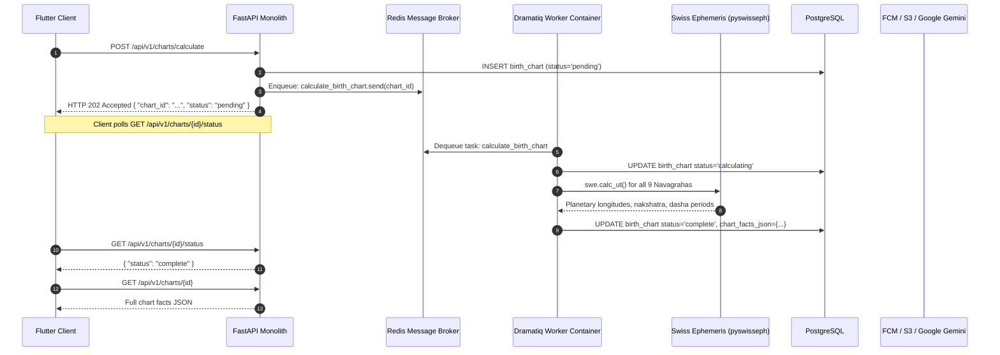
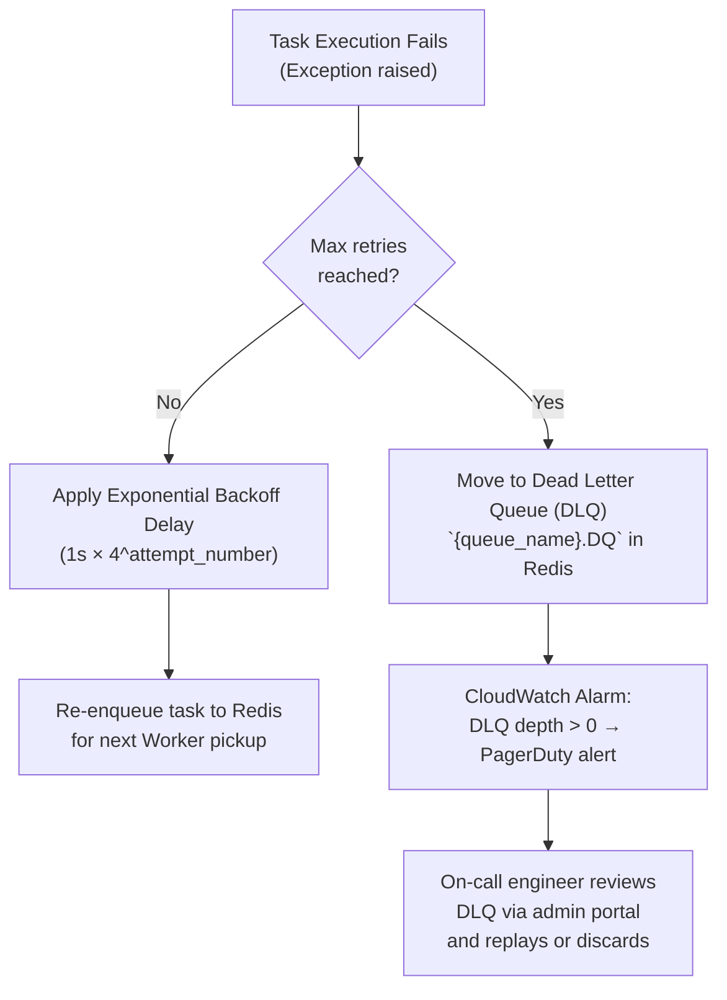

# Background Jobs & Task Queue Specification

## 1. Why Background Tasks?
Certain operations in Grahvani are deliberately moved **off the HTTP request path**. The design principle is: **API responses must return in < 300ms**. Any operation that could take longer — chart calculations, PDF generation, document ingestion, push delivery — is executed asynchronously by the Dramatiq worker.

This provides:
- **Responsive UI**: The mobile app never waits for a heavy Ephemeris calculation to complete. It receives an `HTTP 202 Accepted` immediately and polls for completion.
- **Resilience**: Failed background tasks can be retried automatically with exponential backoff without user interaction.
- **Scalability**: Worker instances can be independently scaled based on task queue depth.

---

## 2. Task Queue Architecture

**Technology Stack:**
- **Task Framework**: [Dramatiq](https://dramatiq.io/) (strongly typed, middleware-based, production-grade)
- **Message Broker**: Redis 7 (via ElastiCache)
- **Worker Process**: Separate Docker container; runs `dramatiq app.tasks --processes 4 --threads 2`



---

## 3. Queue Definitions & Priority

Dramatiq queues are organized by **business priority and resource cost**:

| Queue Name | Priority | Max Concurrency | Purpose |
| :--- | :---: | :---: | :--- |
| `charts` | **High** (1) | 8 | Birth chart calculations (user-facing, time-sensitive) |
| `notifications` | Medium (2) | 16 | FCM push delivery (time-sensitive but lightweight) |
| `exports` | Medium (3) | 4 | PDF chart export rendering (CPU-intensive) |
| `ingestion` | **Low** (4) | 2 | Classical text PDF ingestion (admin, can wait) |

---

## 4. Task Specifications

### 4.1 `calculate_birth_chart` Task
```python
import dramatiq
from uuid import UUID
from app.modules.birth_chart.service import ChartCalculationService
from app.core.database import get_sync_session

@dramatiq.actor(queue_name="charts", max_retries=3, time_limit=30_000)  # 30 second timeout
def calculate_birth_chart(chart_id: str) -> None:
    """
    Runs Swiss Ephemeris calculation for a pending birth chart.
    
    Steps:
    1. Load BirthProfile from DB
    2. Convert local birth time → Julian Day UTC
    3. Calculate all Navagraha longitudes via pyswisseph
    4. Compute D1/D9 divisional charts and Vimshottari Dasha
    5. Assemble immutable chart_facts_json snapshot
    6. UPDATE birth_charts SET status='complete', chart_facts_json=...
    
    On failure: UPDATE birth_charts SET status='failed', error_message=...
    """
    with get_sync_session() as session:
        service = ChartCalculationService(session)
        service.calculate_and_persist(UUID(chart_id))
```

**Retry Strategy**: Exponential backoff — 1s, 4s, 16s (Dramatiq default behaviour with `max_retries=3`).

---

### 4.2 `ingest_pdf_document` Task
```python
@dramatiq.actor(queue_name="ingestion", max_retries=3, time_limit=300_000)  # 5 minute timeout
def ingest_pdf_document(document_id: str) -> None:
    """
    Ingests a classical astrological text PDF into the RAG knowledge base.
    
    Steps:
    1. Download PDF from S3 (s3_key from source_documents)
    2. Extract text via PyMuPDF (preserve chapter headings)
    3. Clean OCR artifacts, normalise Sanskrit transliteration
    4. Recursive character text split (512 tokens, 64 overlap)
    5. Batch-embed chunks via Google text-embedding-004 API (20 per batch)
    6. INSERT all chunks with staging=true into document_chunks
    7. Notify admin portal: "Document ready for editorial review"
    """
```

**Retry Strategy**: Exponential backoff with 30s initial delay to handle Google API rate limiting.

---

### 4.3 `generate_chart_pdf_export` Task
```python
@dramatiq.actor(queue_name="exports", max_retries=2, time_limit=60_000)  # 60 second timeout
def generate_chart_pdf_export(chart_id: str, user_id: str) -> None:
    """
    Generates a high-quality PDF chart export for premium users.
    
    Steps:
    1. Verify user entitlement (premium required)
    2. Load chart_facts_json from birth_charts
    3. Render North Indian chart SVG via Jinja2 template
    4. Convert SVG to PDF via WeasyPrint
    5. Upload PDF to S3: exports/{user_id}/{chart_id}.pdf
    6. Generate S3 presigned URL (valid 1 hour)
    7. Send FCM push notification: "Your chart PDF is ready to download!"
    8. Store presigned URL in Redis (TTL 1 hour) for instant retrieval
    """
```

---

### 4.4 `dispatch_fcm_notification` Task
```python
@dramatiq.actor(queue_name="notifications", max_retries=5, time_limit=10_000)
def dispatch_fcm_notification(user_id: str, title: str, body: str, data: dict) -> None:
    """
    Sends a Firebase Cloud Messaging push notification to all active
    device tokens registered for the user.
    
    Handles: token_not_registered errors by deactivating stale tokens.
    """
```

---

## 5. Task Failure Handling



**Observability for Background Tasks:**
- Every task start/complete/fail is structured-logged to CloudWatch with `task_id`, `queue`, `attempt_number`, `duration_ms`.
- Langfuse tracks AI-related tasks (`calculate_birth_chart`) end-to-end for latency analysis.
- CloudWatch alarm fires if any DLQ receives a message (indicates systematic task failures).
