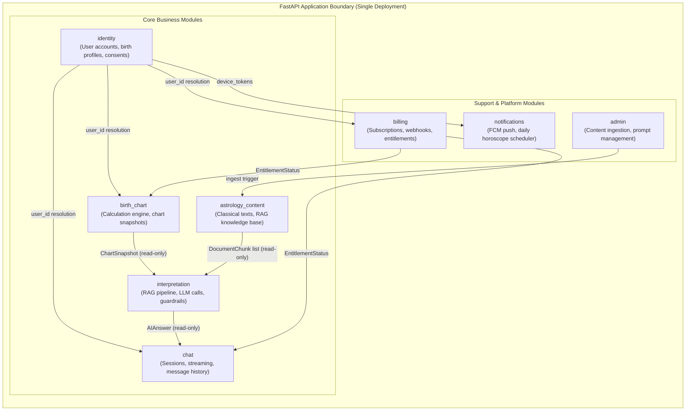

# Domain Modules Specification

## 1. Domain-Driven Design (DDD) Boundaries
The backend is structured into **8 isolated domain modules**, each representing a distinct bounded context. The architectural rules are strict:

- **No cross-module SQL joins**: Module A must not reference Module B's tables in any query.
- **No direct table imports**: Modules interact only via well-defined Python service interface methods.
- **Single responsibility**: Each module owns its database schema scope exclusively.
- **Testable in isolation**: Each module's service layer can be unit-tested with mocked repositories.



---

## 2. Module Specifications

### 2.1 `identity` Module
**What it owns**: The user's core identity within Grahvani. This is the root module that all other modules reference for user context.

**Responsibilities**:
- User account creation and synchronisation with Firebase Auth UIDs.
- Managing multiple **birth profiles** per user (Self, Spouse, Child, Parent, Friend).
- Recording explicit DPDP Act privacy consents with timestamps and IP addresses.
- Managing FCM device tokens for push notification delivery.
- Handling account deletion requests (soft-delete with 30-day purge scheduler).

**Service Interfaces**:
```python
class IdentityService:
    async def get_or_create_user(self, firebase_uid: str, email: str) -> User
    async def get_birth_profile(self, user_id: UUID, profile_id: UUID) -> BirthProfile
    async def list_birth_profiles(self, user_id: UUID) -> list[BirthProfile]
    async def create_birth_profile(self, user_id: UUID, request: CreateProfileRequest) -> BirthProfile
    async def delete_birth_profile(self, user_id: UUID, profile_id: UUID) -> None
    async def record_consent(self, user_id: UUID, consent_type: str) -> UserConsent
    async def delete_user_account(self, user_id: UUID) -> None  # Queues 30-day purge
```

**Tables Owned**: `users`, `birth_profiles`, `user_consents`, `device_tokens`.

---

### 2.2 `birth_chart` Module
**What it owns**: The mathematical heart of Grahvani — all astrological calculation logic and the immutable chart snapshot record.

**Responsibilities**:
- Validating birth time, date, and coordinates before calculation.
- Resolving city names to geocoordinates and IANA timezone IDs.
- Dispatching calculation jobs to the Dramatiq background worker.
- Calling `pyswisseph` to compute planetary longitudes, ascendant, house cusps.
- Computing divisional charts (D1, D9, D10) and Vimshottari Dasha periods.
- Storing the complete result as an **immutable** JSONB snapshot in `birth_charts`.
- Exposing a read-only snapshot object to the `interpretation` module.

**Critical Design Rule**: Once a chart is saved, it is **never updated**. If a user changes ayanamsha settings, a new chart record is created. This preserves citation integrity for all past AI chat responses.

**Service Interfaces**:
```python
class ChartService:
    async def calculate_and_save_chart(self, profile_id: UUID, ayanamsha_id: int = 1) -> ChartSnapshot
    async def get_chart_snapshot(self, profile_id: UUID, ayanamsha_id: int = 1) -> ChartSnapshot | None
    async def get_calculation_status(self, profile_id: UUID) -> CalcStatus  # PENDING | COMPLETE | FAILED
```

**Tables Owned**: `birth_charts`, `planetary_positions`, `dashas`.

---

### 2.3 `astrology_content` Module
**What it owns**: The curated classical literature corpus that powers the RAG retrieval system.

**Responsibilities**:
- Managing the lifecycle of source documents (PDF upload → ingestion → staging → approval → live).
- Storing text chunks with vector embeddings for pgvector similarity search.
- Tracking citation metadata (source title, chapter, verse range, topic tags).
- Providing the `interpretation` module with relevant document chunks given a query.
- Enforcing the editorial workflow: chunks are never live until explicitly approved.

**Service Interfaces**:
```python
class AstrologyContentService:
    async def retrieve_relevant_chunks(self, query: str, query_embedding: list[float], top_k: int = 4) -> list[DocumentChunk]
    async def get_citation_metadata(self, chunk_ids: list[UUID]) -> list[Citation]
    async def ingest_document(self, document_id: UUID) -> None  # Triggers background ingestion
```

**Tables Owned**: `source_documents`, `document_chunks`.

---

### 2.4 `interpretation` Module
**What it owns**: The AI interpretation pipeline — the bridge between verified chart facts, classical knowledge, and language.

**Responsibilities**:
- Orchestrating the full RAG pipeline: receive question + chart facts → retrieve chunks → build prompt → call Gemini → validate output.
- Enforcing all AI safety guardrails (medical/legal/financial policy blocks, prompt injection filtering).
- Assembling the grounded system prompt from the active `prompt_template`.
- Calling the `LLMProviderAdapter` (Gemini 1.5 Flash by default) for inference.
- Validating that response citations reference actual retrieved chunk IDs.
- Recording AI evaluation traces to Langfuse for observability.

**Service Interfaces**:
```python
class InterpretationService:
    async def generate_answer_stream(
        self,
        question: str,
        chart_snapshot: ChartSnapshot,
        session_history: list[ChatMessage],
    ) -> AsyncGenerator[AIStreamEvent, None]
    # Yields: AIStreamEvent(type='token'|'citation'|'done', payload=...)
```

**Tables Owned**: `rag_embeddings` (for evaluation), `ai_evaluations`.

---

### 2.5 `chat` Module
**What it owns**: The conversational interface layer — chat session management, message persistence, and SSE streaming delivery.

**Responsibilities**:
- Creating and managing chat sessions tied to a specific birth profile.
- Persisting every user question and AI response in `chat_messages` with citation metadata.
- Enforcing daily/hourly question limits by checking entitlements with the `billing` module.
- Managing the Server-Sent Events (SSE) stream: receiving tokens from `interpretation`, formatting SSE events, handling client disconnects gracefully.
- Truncating conversation history to the last N messages (N = 5 for free, 20 for premium) before including in prompts.

**Service Interfaces**:
```python
class ChatService:
    async def create_session(self, user_id: UUID, profile_id: UUID, title: str) -> ChatSession
    async def stream_response(
        self,
        session_id: UUID,
        user_question: str,
        current_user: AuthUser,
    ) -> AsyncGenerator[str, None]  # SSE formatted event strings
    async def get_session_history(self, session_id: UUID, limit: int) -> list[ChatMessage]
```

**Tables Owned**: `chat_sessions`, `chat_messages`.

---

### 2.6 `billing` Module
**What it owns**: All subscription state, entitlement logic, and payment event processing.

**Responsibilities**:
- Processing incoming webhooks from Google Play (RTDN via Pub/Sub), Apple (App Store Server Notifications v2), and Razorpay.
- Verifying cryptographic webhook signatures before processing any event.
- Maintaining idempotency: never processing the same webhook event twice.
- Keeping the `subscriptions` table as the **single source of truth** for user entitlement state.
- Providing the `check_entitlement(user_id, capability)` function to all other modules.

**Service Interfaces**:
```python
class BillingService:
    async def check_entitlement(self, user_id: UUID, capability: str) -> bool
    async def get_active_subscription(self, user_id: UUID) -> Subscription | None
    async def process_google_play_webhook(self, payload: bytes, signature: str) -> None
    async def process_apple_webhook(self, signed_payload: str) -> None
    async def process_razorpay_webhook(self, payload: bytes, signature: str) -> None
```

**Tables Owned**: `subscriptions`, `entitlements`, `webhook_events`.

---

### 2.7 `notifications` Module
**What it owns**: All outbound push notification delivery and scheduling.

**Responsibilities**:
- Scheduling daily horoscope push notifications based on user timezone and preference.
- Triggering Dasha change notifications (when a user's Maha or Antar Dasha period changes).
- Dispatching FCM push payloads via Dramatiq background tasks.
- Respecting user notification opt-out preferences from `user_consents`.

**Tables Owned**: `notification_schedules`, `push_history`.

---

### 2.8 `admin` Module
**What it owns**: Internal operational tooling for editorial and AI quality management.

**Responsibilities**:
- Providing admin-only REST endpoints for PDF source document upload and approval.
- Managing prompt template versions: upload, test, stage, promote.
- Reviewing AI evaluation traces from Langfuse via the admin portal.
- Generating AI quality reports (citation precision, groundedness scores over time).

**Tables Owned**: `prompt_templates`, `admin_audit_logs`.
