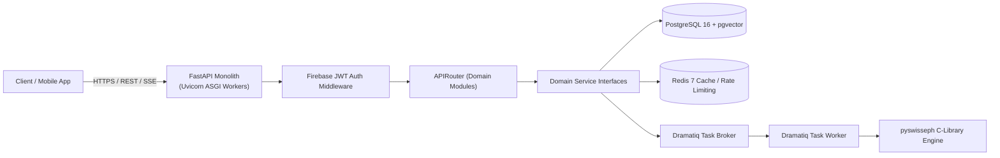

# Backend Documentation (FastAPI Monolith)

Welcome to the backend engineering documentation for **Grahvani**. The backend API is constructed as a **Python 3.12 + FastAPI modular monolith**.

---

## 📂 Backend Documents Index

- 🏗️ **[FastAPI Architecture](FASTAPI_ARCHITECTURE.md)** — Project structure, FastAPI lifecycle handlers, async concurrency model, dependency injection.
- 📦 **[Domain Modules](MODULES.md)** — Detailed domain-driven boundaries (`identity`, `birth-chart`, `astrology-content`, `interpretation`, `chat`, `billing`, `notifications`, `admin`).
- 🌐 **[API Design & Conventions](API_DESIGN.md)** — REST design principles, Pydantic v2 schemas, OpenAPI specs, SSE streaming contracts.
- 🔑 **[Authentication Flow](AUTHENTICATION.md)** — Firebase ID Token (JWT) verification, bearer token middleware, public vs protected endpoints.
- 🛡️ **[Authorization & RBAC](AUTHORIZATION.md)** — Role-based permissions (`user`, `editor`, `admin`), entitlement checks, ownership validation.
- ⚡ **[Background Jobs Queue](BACKGROUND_JOBS.md)** — Dramatiq + Redis async task processing, worker lifecycle, retry logic, scheduled jobs.
- 🚨 **[Error Handling](ERROR_HANDLING.md)** — Custom domain exceptions, RFC 7807 Problem Details responses, global exception handlers.

---

## 🏛️ Backend Infrastructure Topology

