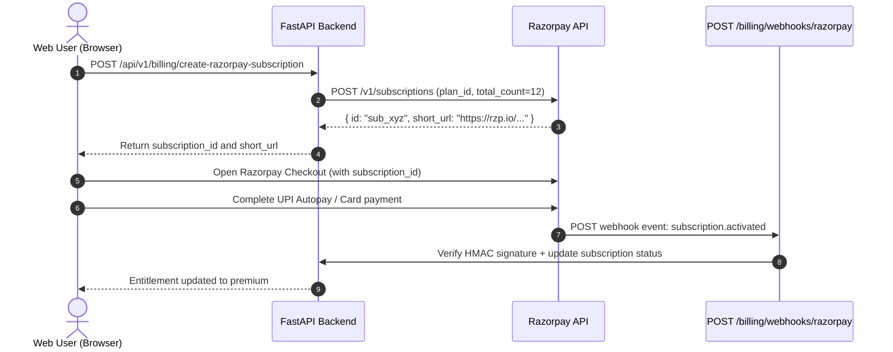

# Razorpay Subscriptions and Webhooks Integration Specification

## Purpose
This document specifies the Razorpay integration for Grahvani's web-based subscription flow, targeting Indian users who prefer domestic payment methods (UPI Autopay, Credit/Debit Cards, Net Banking). It covers subscription creation, HMAC webhook signature verification, supported events, and entitlement update flow.

## Scope
Applies to the web checkout path. Does not apply to Android (see [GOOGLE_PLAY.md](GOOGLE_PLAY.md)) or iOS (see [APP_STORE.md](APP_STORE.md)).

---

## 1. Razorpay Subscription Creation Flow



---

## 2. HMAC Webhook Signature Verification

All Razorpay webhook events include an `X-Razorpay-Signature` header containing an HMAC SHA-256 signature computed over the raw request body using the webhook secret.

```python
import hmac
import hashlib

def verify_razorpay_signature(
    payload_body: bytes,
    received_signature: str,
    webhook_secret: str,
) -> bool:
    """
    Verifies the HMAC SHA-256 signature on an incoming Razorpay webhook event.
    Uses hmac.compare_digest for constant-time comparison (prevents timing attacks).

    Args:
        payload_body: Raw HTTP request body bytes (MUST NOT be parsed before this call).
        received_signature: Value from X-Razorpay-Signature header.
        webhook_secret: Razorpay webhook secret from AWS Secrets Manager.

    Returns:
        True if signature is valid, False otherwise.
    """
    expected_signature = hmac.new(
        webhook_secret.encode("utf-8"),
        payload_body,
        hashlib.sha256,
    ).hexdigest()
    return hmac.compare_digest(expected_signature, received_signature)
```

> **Important**: The `payload_body` must be the raw bytes from the request body **before** any JSON parsing. Parsing and re-serialising the JSON can reorder keys and invalidate the signature.

---

## 3. Supported Webhook Events

| Event | Trigger | Action Required |
| :--- | :--- | :--- |
| `subscription.activated` | First successful payment, subscription starts | Set `status='active'`, `tier='premium'`, set `current_period_end` |
| `subscription.charged` | Successful renewal charge | Extend `current_period_end` to next cycle |
| `subscription.halted` | Payment failure, max retries exceeded | Set `status='canceled'` |
| `subscription.cancelled` | User manually cancelled subscription | Set `status='canceled'` (access until period end) |
| `subscription.completed` | Subscription reached its total count | Set `status='canceled'` |
| `payment.failed` | Individual payment failure (before halted) | Set `status='grace_period'` if within retry window |

---

## 4. Webhook Handler Implementation

```python
from fastapi import APIRouter, Request, Header, HTTPException

router = APIRouter()

@router.post("/api/v1/billing/webhooks/razorpay", status_code=200)
async def razorpay_webhook(
    request: Request,
    x_razorpay_signature: str = Header(None),
    billing_service: BillingService = Depends(),
):
    """
    Receives and processes Razorpay subscription lifecycle webhook events.
    Always returns 200 after signature verification; Razorpay retries on non-200.
    """
    raw_body = await request.body()

    # 1. Verify HMAC signature
    if not verify_razorpay_signature(raw_body, x_razorpay_signature, settings.RAZORPAY_WEBHOOK_SECRET):
        # Log the attempt for security monitoring, do NOT retry
        raise HTTPException(status_code=400, detail="Invalid webhook signature")

    payload = await request.json()
    event_type = payload.get("event")
    subscription_data = payload.get("payload", {}).get("subscription", {}).get("entity", {})
    subscription_id = subscription_data.get("id")

    # 2. Idempotency check using Razorpay event ID
    event_id = payload.get("id")
    if await billing_service.is_webhook_processed(event_id):
        return {"status": "already_processed"}

    # 3. Process the event
    await billing_service.process_razorpay_event(
        event_type=event_type,
        subscription_id=subscription_id,
        subscription_data=subscription_data,
        event_id=event_id,
    )
    return {"status": "processed"}
```

---

## 5. Razorpay Plan Configuration

Plans are created once in the Razorpay Dashboard and referenced by `plan_id` in the backend configuration:

| Plan | Razorpay Plan ID | Amount | Interval | Notes |
| :--- | :--- | :--- | :--- | :--- |
| Monthly Premium | `plan_monthly_prod` | INR 299 | Monthly | Recurring auto-debit |
| Annual Premium | `plan_annual_prod` | INR 2,499 | Yearly | One-time or EMI option |

---

## 6. Rationale

Razorpay is selected for the web/India path because:
- It is the market leader for Indian digital payments with native UPI Autopay support (critical for India-first strategy).
- Its webhook model is simpler than Apple's JWS chain verification.
- It supports both subscription billing and one-time payments via a single SDK.

---

## 7. Trade-offs

| Pro | Con |
| :--- | :--- |
| Best-in-class UPI Autopay support for India | Not available for international users (requires Stripe or Paddle for global expansion) |
| Simpler HMAC webhook vs. Apple JWS chain | Requires Razorpay KYC/business account setup |
| Subscription management dashboard included | Webhook retry behaviour differs slightly from Google/Apple |

---

## 8. Related Documents

- [SUBSCRIPTIONS.md](SUBSCRIPTIONS.md) -- Full subscription lifecycle and state machine
- [ENTITLEMENTS.md](ENTITLEMENTS.md) -- Server-side entitlement enforcement
- [APP_STORE.md](APP_STORE.md) -- Apple IAP integration
- [GOOGLE_PLAY.md](GOOGLE_PLAY.md) -- Google Play Billing integration
