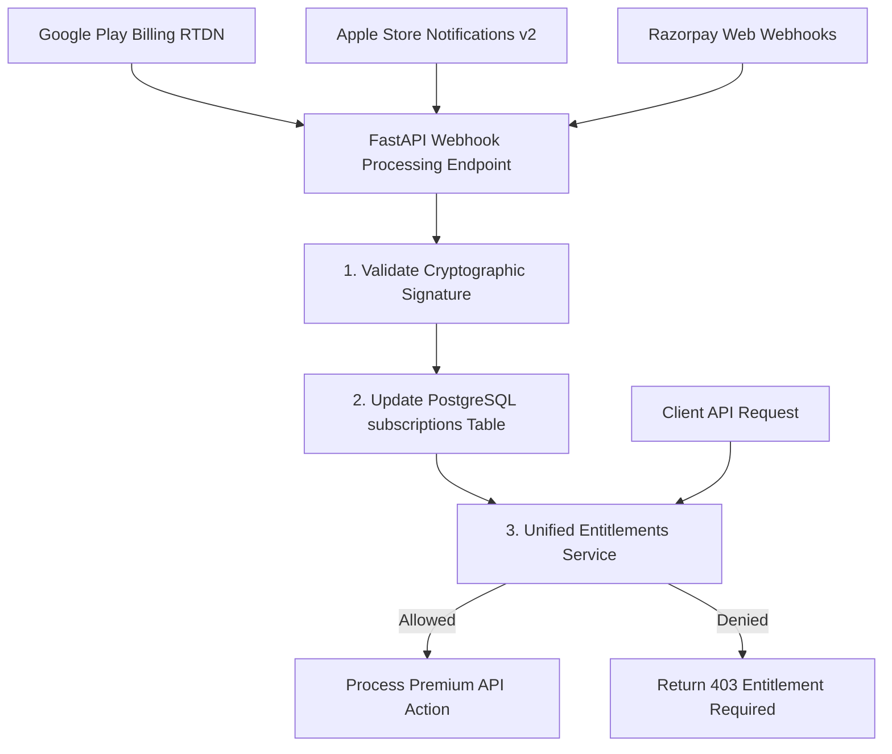

# Billing & Entitlements Documentation

Welcome to the billing and payment processing documentation for **Grahvani**.

---

## 📂 Billing Documents Index

- 💳 **[Subscriptions Lifecycle](SUBSCRIPTIONS.md)** — Free vs. Premium tiers, state transitions, renewal & cancellation handling.
- 🛡️ **[Entitlements Engine](ENTITLEMENTS.md)** — Unified backend entitlement checking, feature flags, access rules.
- 🤖 **[Google Play Billing](GOOGLE_PLAY.md)** — Android Real-Time Developer Notifications (RTDN) integration.
- 🍎 **[Apple In-App Purchases](APP_STORE.md)** — iOS App Store Server Notifications v2 integration.
- 🇮🇳 **[Razorpay Subscriptions](RAZORPAY.md)** — Web checkout, UPI Autopay, webhook signature verification.

---

## 🏛️ Unified Entitlement Architecture

