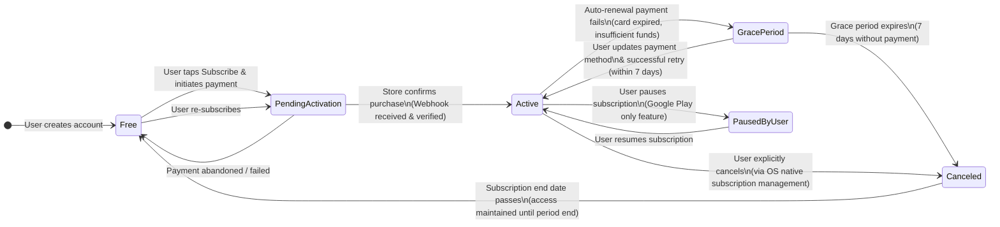
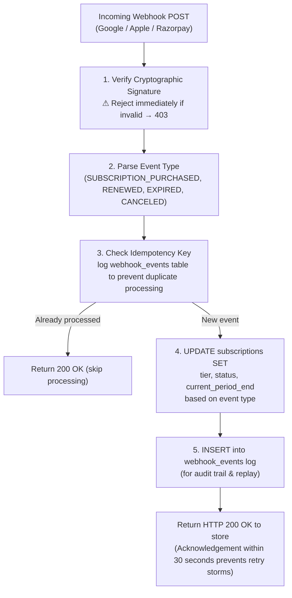

# Subscriptions & Billing Lifecycle Specification

## 1. Overview & Billing Architecture
Grahvani's billing system is built around a **server-authoritative entitlement model**. The mobile app never grants or revokes premium access based on client-side callbacks. All entitlement state lives in the backend PostgreSQL `subscriptions` table, updated exclusively via cryptographically verified server-to-server webhook callbacks from Google, Apple, and Razorpay.

This architecture protects against common billing fraud vectors: receipt replay attacks, client-side SSL pinning bypass, and fake purchase completions.

---

## 2. Subscription Tiers & Feature Access Matrix

| Feature / Capability | 🆓 Free Tier | 💎 Premium Monthly | 💎 Premium Annual |
| :--- | :---: | :---: | :---: |
| **Birth Profiles** | Max 1 | Unlimited | Unlimited |
| **D1 Rasi Chart** | ✅ | ✅ | ✅ |
| **D9 Navamsa Chart** | ✅ | ✅ | ✅ |
| **D10, D12, D60 Charts** | ❌ | ✅ | ✅ |
| **Vimshottari Maha Dasha** | ✅ Overview only | ✅ | ✅ |
| **Antar & Pratyantar Dasha** | ❌ | ✅ | ✅ |
| **Grounded AI Chat Questions** | 3 per day | 60 per hour | 60 per hour |
| **AI Chat Context (History)** | Last 5 messages | Last 20 messages | Last 20 messages |
| **PDF Chart Export** | ❌ | ✅ | ✅ |
| **Priority AI Queue** | ❌ | ✅ | ✅ |
| **Price (India)** | ₹0 | ₹299/month | ₹2,499/year (~₹208/mo) |

---

## 3. Subscription State Machine



**Grace Period Behaviour:** During the 7-day grace period, the user retains **full premium access** while the store retries payment. If payment is recovered, the subscription continues without interruption. If not, access reverts to free tier at grace period expiry.

---

## 4. Multi-Platform Billing Provider Matrix

| Platform | Billing Provider | Webhook Endpoint | Signature Verification |
| :--- | :--- | :--- | :--- |
| **Android** | Google Play Billing v7 | `POST /api/v1/billing/webhooks/google` | Google Cloud Pub/Sub JWT verification |
| **iOS** | Apple In-App Purchase v2 | `POST /api/v1/billing/webhooks/apple` | JWS (JES Signature) via Apple Root Certificate |
| **Web** | Razorpay Subscriptions | `POST /api/v1/billing/webhooks/razorpay` | HMAC SHA-256 with `X-Razorpay-Signature` header |

---

## 5. Server-Side Entitlement Check Implementation

```python
from uuid import UUID
from enum import Enum
from app.modules.billing.models import Subscription

class SubscriptionTier(str, Enum):
    FREE = "free"
    PREMIUM = "premium"

# Feature capability sets — single source of truth for entitlement logic
FREE_TIER_CAPABILITIES: set[str] = {
    "chart:d1_rasi",
    "chart:d9_navamsa",
    "chat:questions_daily_3",
    "dasha:maha_overview",
}

PREMIUM_TIER_CAPABILITIES: set[str] = {
    *FREE_TIER_CAPABILITIES,
    "chart:d10_dasamsa",
    "chart:d12_dwadasamsa",
    "chart:d60_shashtiamsa",
    "chat:questions_hourly_60",
    "chat:history_20_messages",
    "dasha:antar_pratyantar",
    "export:pdf_chart",
    "queue:priority_ai",
    "profiles:unlimited",
}

async def check_entitlement(
    user_id: UUID,
    capability: str,
    session: AsyncSession,
) -> bool:
    """
    Server-side entitlement check. Called on every API request requiring
    tier-gated features. NEVER trusts client-provided entitlement state.
    """
    subscription = await session.execute(
        select(Subscription)
        .where(Subscription.user_id == user_id)
        .where(Subscription.status.in_(["active", "grace_period"]))  # grace period retains access
        .order_by(Subscription.current_period_end.desc())
        .limit(1)
    )
    active_sub = subscription.scalar_one_or_none()

    if active_sub and active_sub.tier == SubscriptionTier.PREMIUM:
        return capability in PREMIUM_TIER_CAPABILITIES
    return capability in FREE_TIER_CAPABILITIES
```

---

## 6. Webhook Processing Flow



> [!CAUTION]
> All three store providers implement retry logic. If your webhook endpoint returns anything other than HTTP 200, the store will retry the webhook multiple times. Always return 200 after logging the event, even if downstream processing encounters a non-critical error. Idempotency keys prevent double-processing.
