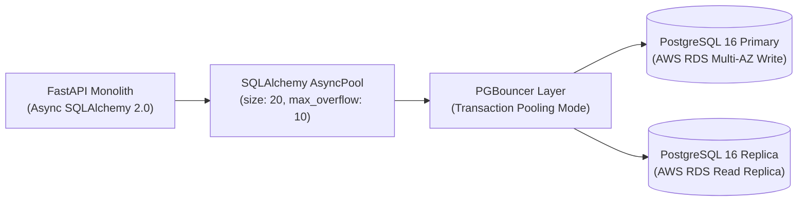

# Database Design Specification

> [[README.md](file:///e:/AI-WorkSpace/Projects/Active/Grahvani/docs/database/README.md) | [ER Diagram](file:///e:/AI-WorkSpace/Projects/Active/Grahvani/docs/database/ER_DIAGRAM.md) | [Tables DDL](file:///e:/AI-WorkSpace/Projects/Active/Grahvani/docs/database/TABLES.md) | [Indexing](file:///e:/AI-WorkSpace/Projects/Active/Grahvani/docs/database/INDEXING.md) | [Vector Search](file:///e:/AI-WorkSpace/Projects/Active/Grahvani/docs/database/VECTOR_SEARCH.md) | [Migrations](file:///e:/AI-WorkSpace/Projects/Active/Grahvani/docs/database/MIGRATIONS.md)]

---

## 1. Engine & Core Principles

**Grahvani** uses **PostgreSQL 16.x** paired with the **`pgvector` 0.6+ extension** as its primary single-source relational and vector data store. The database layer is designed for high concurrency, strict ACID safety, fast planetary fact retrieval, and efficient similarity search over vector embeddings.

### Core Standards
- **Database Engine**: PostgreSQL 16.x (AWS RDS Aurora PostgreSQL or managed RDS Multi-AZ).
- **Vector Search Extension**: `pgvector` v0.6+ for storing 768-dimensional float embeddings.
- **Primary Keys**: UUID v4 generated via `gen_random_uuid()` at the database layer or using Python's `uuid.uuid4()`.
- **Timestamp Fields**: All timestamps are declared as `TIMESTAMPTZ` (Timestamp with Time Zone) and MUST strictly be stored in UTC format.
- **Naming Conventions**: Strict `snake_case` for all database identifiers (tables, columns, indexes, foreign key constraints, sequences, and enums).
- **Soft Deletion**: Sensitive entities (e.g., `birth_profiles`, `users`) employ `deleted_at TIMESTAMPTZ DEFAULT NULL` to support compliance with the Indian **Digital Personal Data Protection (DPDP) Act 2023**.

---

## 2. Technical Standards & Data Types

| Data Category | Recommended Data Type | Purpose & Constraint Rationale |
| :--- | :--- | :--- |
| **Primary Keys** | `UUID` | Universally unique, unguessable across API endpoints, prevents enumeration attacks. |
| **Timestamps** | `TIMESTAMPTZ` | Always stored in UTC (`AT TIME ZONE 'UTC'`). Prevents timezone conversion bugs. |
| **Astronomical Degrees** | `NUMERIC(9, 6)` | Exact precision for planetary longitudes (e.g., `359.123456°`). Never use `FLOAT`. |
| **Latitude / Longitude** | `NUMERIC(8, 5)` | Coordinates for geocoding birth locations. |
| **Embeddings** | `VECTOR(768)` | Dense floating-point vectors generated by Google's `text-embedding-004` model. |
| **Structured Facts** | `JSONB` | Used for immutable planetary positions, Ashtakvarga scores, and divisional charts. |
| **User Role / Status** | `VARCHAR(32)` or `ENUM` | Restricted domain values (e.g., `'free'`, `'premium'`, `'astrologer'`). |

---

## 3. Transaction Isolation & Concurrency Control

- **Default Isolation Level**: `READ COMMITTED`. This provides optimal balance between high read throughput and prevention of dirty reads.
- **Optimistic Locking**: Applied to transactional records (such as credit balances and entitlement states) using a `version INT DEFAULT 1` increment strategy.
- **Pessimistic Row Locking**: Used for background worker task claiming:
  ```sql
  SELECT id, payload FROM background_tasks
  WHERE status = 'pending'
  ORDER BY created_at ASC
  FOR UPDATE SKIP LOCKED
  LIMIT 1;
  ```

---

## 4. Connection Pooling & Resource Architecture

Grahvani manages database connections using a two-tier pooling architecture:



### SQLAlchemy Pool Settings
```python
# Core AsyncEngine configuration in services/api/database.py
engine = create_async_engine(
    DATABASE_URL,
    pool_size=20,
    max_overflow=10,
    pool_timeout=30,
    pool_recycle=1800,       # Recycle connections every 30 minutes
    pool_pre_ping=True,      # Validate connection liveness before execution
    echo=False
)
```

---

## 5. Vacuum & Autovacuum Optimization

Because Grahvani handles high update volumes for chat sessions and background task statuses, default autovacuum thresholds are tuned per table to prevent table bloat and index degradation:

```sql
-- Tune autovacuum for high-churn task and chat tables
ALTER TABLE background_tasks SET (
    autovacuum_vacuum_scale_factor = 0.05,
    autovacuum_analyze_scale_factor = 0.02
);

ALTER TABLE chat_messages SET (
    autovacuum_vacuum_scale_factor = 0.10,
    autovacuum_analyze_scale_factor = 0.05
);
```

---

## 6. Data Retention & DPDP Soft Deletion Policy

Under the Indian DPDP Act 2023, user profile deletion requests must permanently purge or anonymize personal data within 30 days:

1. **Soft Delete Phase**: When a user clicks "Delete Account", `deleted_at` is set to current UTC timestamp. Soft-deleted records are filtered out from all standard API queries (`WHERE deleted_at IS NULL`).
2. **Hard Delete Batch Worker**: A Dramatiq cron task executes nightly to purge soft-deleted records older than 30 days:
   ```sql
   DELETE FROM birth_profiles
   WHERE deleted_at IS NOT NULL
     AND deleted_at < NOW() - INTERVAL '30 days';
   ```

---

## 7. Related Documents

- [ER Diagram](file:///e:/AI-WorkSpace/Projects/Active/Grahvani/docs/database/ER_DIAGRAM.md) — Comprehensive visual entity-relationship diagram.
- [Tables DDL](file:///e:/AI-WorkSpace/Projects/Active/Grahvani/docs/database/TABLES.md) — Full SQL schema DDL definitions.
- [Indexing Strategy](file:///e:/AI-WorkSpace/Projects/Active/Grahvani/docs/database/INDEXING.md) — B-Tree, GIN, and HNSW vector index specifications.
- [Vector Search](file:///e:/AI-WorkSpace/Projects/Active/Grahvani/docs/database/VECTOR_SEARCH.md) — `pgvector` RAG search and hybrid retrieval algorithms.
