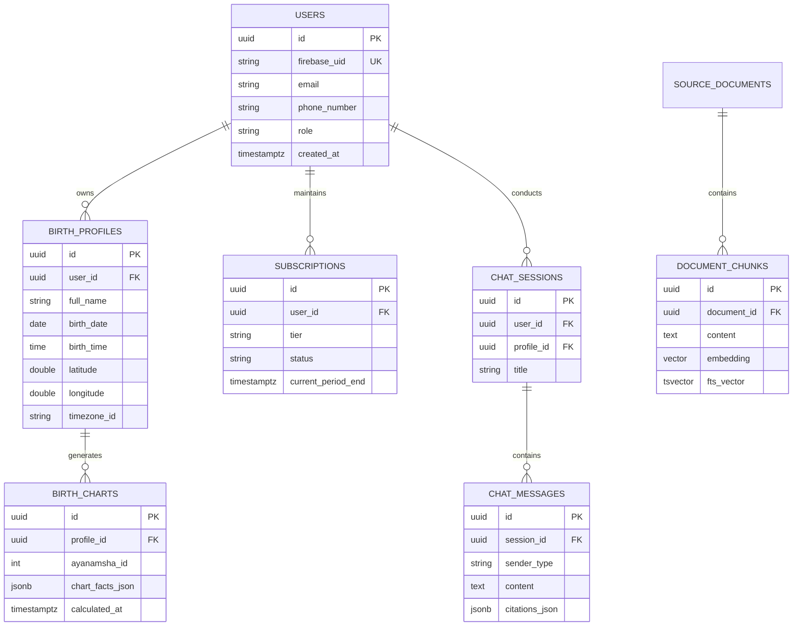

# Entity-Relationship (ER) Diagram

```mermaid
erDiagram
    USERS ||--o{ BIRTH_PROFILES : owns
    USERS ||--o{ SUBSCRIPTIONS : maintains
    USERS ||--o{ CHAT_SESSIONS : conducts
    
    BIRTH_PROFILES ||--o{ BIRTH_CHARTS : generates
    
    SOURCE_DOCUMENTS ||--o{ DOCUMENT_CHUNKS : contains
    
    CHAT_SESSIONS ||--o{ CHAT_MESSAGES : contains

    USERS {
        uuid id PK
        string firebase_uid UK
        string email
        string phone_number
        string role
        timestamptz created_at
    }

    BIRTH_PROFILES {
        uuid id PK
        uuid user_id FK
        string full_name
        date birth_date
        time birth_time
        double latitude
        double longitude
        string timezone_id
    }

    BIRTH_CHARTS {
        uuid id PK
        uuid profile_id FK
        int ayanamsha_id
        jsonb chart_facts_json
        timestamptz calculated_at
    }

    DOCUMENT_CHUNKS {
        uuid id PK
        uuid document_id FK
        text content
        vector embedding
        tsvector fts_vector
    }

    SUBSCRIPTIONS {
        uuid id PK
        uuid user_id FK
        string tier
        string status
        timestamptz current_period_end
    }

    CHAT_SESSIONS {
        uuid id PK
        uuid user_id FK
        uuid profile_id FK
        string title
    }

    CHAT_MESSAGES {
        uuid id PK
        uuid session_id FK
        string sender_type
        text content
        jsonb citations_json
    }
```
