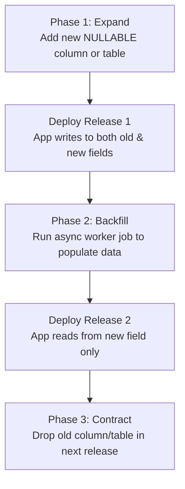

# Database Migrations Workflow (Alembic)

> [[README.md](file:///e:/AI-WorkSpace/Projects/Active/Grahvani/docs/database/README.md) | [Database Design](file:///e:/AI-WorkSpace/Projects/Active/Grahvani/docs/database/DATABASE_DESIGN.md) | [Tables DDL](file:///e:/AI-WorkSpace/Projects/Active/Grahvani/docs/database/TABLES.md) | [Indexing Strategy](file:///e:/AI-WorkSpace/Projects/Active/Grahvani/docs/database/INDEXING.md)]

---

## 1. Migration Architecture & Tooling

All schema evolution for **Grahvani** is managed via **Alembic** fully integrated with **SQLAlchemy 2.0**. Schema changes are expressed as versioned, deterministic Python scripts stored under `services/api/alembic/versions/`. Every migration script MUST define both an `upgrade()` and a `downgrade()` function to guarantee reversibility.

---

## 2. Developer Migration Workflow

### Standard Step-by-Step Command Execution

```bash
# 1. Ensure local PostgreSQL database container is running
docker compose up db -d

# 2. Generate new revision script automatically by comparing SQLAlchemy models to DB schema
poetry run alembic revision --autogenerate -m "add_user_notification_preferences"

# 3. Inspect generated migration script in services/api/alembic/versions/
# IMPORTANT: Always manually verify autogenerated SQL statements before applying!

# 4. Apply pending migrations to local development database
poetry run alembic upgrade head

# 5. Verify current migration head state
poetry run alembic current

# 6. Test reversibility by executing a single downgrade step
poetry run alembic downgrade -1

# 7. Re-apply upgrade to head
poetry run alembic upgrade head
```

---

## 3. Zero-Downtime Migration Policy (Expand / Contract Pattern)

To achieve zero-downtime deployments on AWS App Runner without locking production tables or causing API errors during rolling updates, schema modifications follow the **Expand / Contract** pattern across multiple deployments:



### Mandated Safety Rules
1. **No Destructive Direct Changes**: Never run `ALTER TABLE ... DROP COLUMN` or `RENAME COLUMN` in a single deployment.
2. **Lock Timeout Safeguard**: Migration scripts executing in production MUST set a strict lock timeout to avoid queueing exclusive table locks during high-traffic periods:
   ```python
   # Inside alembic/env.py or migration script header
   def run_migrations_online():
       with engine.connect() as connection:
           connection.execute(sa.text("SET lock_timeout = '2000ms';"))
           # execute migrations...
   ```
3. **Non-Blocking Index Creation**: Indexes in production migrations MUST use `postgresql_concurrently=True`:
   ```python
   def upgrade():
       op.create_index(
           'idx_users_phone', 
           'users', 
           ['phone_number'], 
           postgresql_concurrently=True
       )
   ```

---

## 4. Automated CI/CD Migration Execution

In the production deployment pipeline ([CI/CD Pipeline](file:///e:/AI-WorkSpace/Projects/Active/Grahvani/docs/infrastructure/CI_CD.md)):

1. **Pre-Deploy Migration Task**: Migrations run as a single-execution ECS/App Runner task before new application containers are spun up:
   ```bash
   poetry run alembic upgrade head
   ```
2. **Schema Drift Detection**: CI executes `alembic check` on every Pull Request to verify that no developer created SQLAlchemy model changes without generating a corresponding migration revision script.

---

## 5. Handling Merge Conflicts & Multiple Heads

When two developers generate migrations concurrently on separate Git branches, Alembic will detect multiple head revisions:

```bash
# Detect multiple heads error
poetry run alembic heads

# Resolve conflict by creating a merge revision script
poetry run alembic merge heads -m "merge_user_prefs_and_billing_fix"
```

---

## 6. Related Documents

- [Database Design](file:///e:/AI-WorkSpace/Projects/Active/Grahvani/docs/database/DATABASE_DESIGN.md) — Main database architecture and connection pooling.
- [Tables DDL](file:///e:/AI-WorkSpace/Projects/Active/Grahvani/docs/database/TABLES.md) — Complete SQL schema DDL definitions.
- [CI/CD Pipeline](file:///e:/AI-WorkSpace/Projects/Active/Grahvani/docs/infrastructure/CI_CD.md) — Pipeline deployment steps and migration automation.
