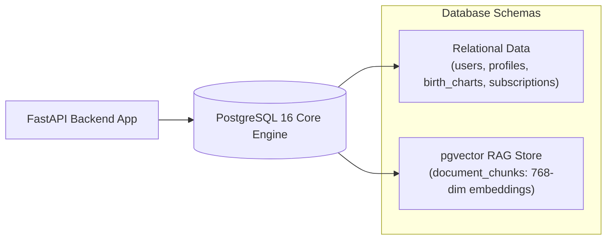

# Database Documentation (PostgreSQL 16 + pgvector)

Welcome to the database documentation for **Grahvani**. The primary data store is **PostgreSQL 16** with the **`pgvector`** extension.

---

## 📂 Database Documents Index

- 🏗️ **[Database Design](DATABASE_DESIGN.md)** — Relational data model principles, UUID v4 keys, isolation levels.
- 📐 **[ER Diagram](ER_DIAGRAM.md)** — Full entity-relationship diagram (Mermaid) across all domain modules.
- 📋 **[Tables DDL](TABLES.md)** — Complete, production-ready SQL DDL statements for all system tables.
- ⚡ **[Indexing Strategy](INDEXING.md)** — B-tree, GIN full-text, HNSW vector indexing specifications.
- 🔍 **[Vector Search](VECTOR_SEARCH.md)** — `pgvector` configuration, embedding dimensions, cosine distance search.
- 🔄 **[Database Migrations](MIGRATIONS.md)** — Alembic migration workflows, zero-downtime schema evolution.

---

## 🏛️ Storage Topology

