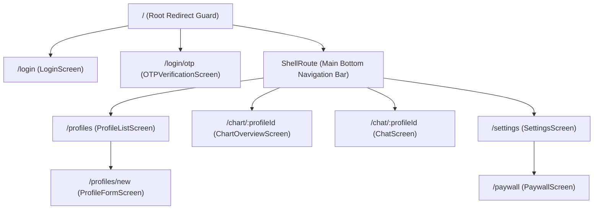

# Navigation & Routing Specification

## 1. Declarative Routing with `go_router`
**Grahvani** relies on **`go_router` 13.x** for declarative, type-safe route management, deep links, tab bar state preservation, and authenticated route guards.

---

## 2. Route Hierarchy & Tree



---

## 3. Router Setup & Guard Implementation

```dart
final routerProvider = Provider<GoRouter>((ref) {
  final authState = ref.watch(authNotifierProvider);

  return GoRouter(
    initialLocation: '/profiles',
    redirect: (BuildContext context, GoRouterState state) {
      final isLoggedIn = authState.value != null;
      final isLoggingIn = state.matchedLocation.startsWith('/login');

      if (!isLoggedIn && !isLoggingIn) {
        return '/login';
      }
      if (isLoggedIn && isLoggingIn) {
        return '/profiles';
      }
      return null;
    },
    routes: [
      GoRoute(
        path: '/login',
        builder: (context, state) => const LoginScreen(),
        routes: [
          GoRoute(
            path: 'otp',
            builder: (context, state) => const OTPVerificationScreen(),
          ),
        ],
      ),
      StatefulShellRoute.indexedStack(
        builder: (context, state, navigationShell) =>
            MainScaffoldWidget(navigationShell: navigationShell),
        branches: [
          StatefulShellBranch(
            routes: [
              GoRoute(
                path: '/profiles',
                builder: (context, state) => const ProfileListScreen(),
              ),
            ],
          ),
          StatefulShellBranch(
            routes: [
              GoRoute(
                path: '/chart/:profileId',
                builder: (context, state) => ChartOverviewScreen(
                  profileId: state.pathParameters['profileId']!,
                ),
              ),
            ],
          ),
          // Additional tabs...
        ],
      ),
    ],
  );
});
```
