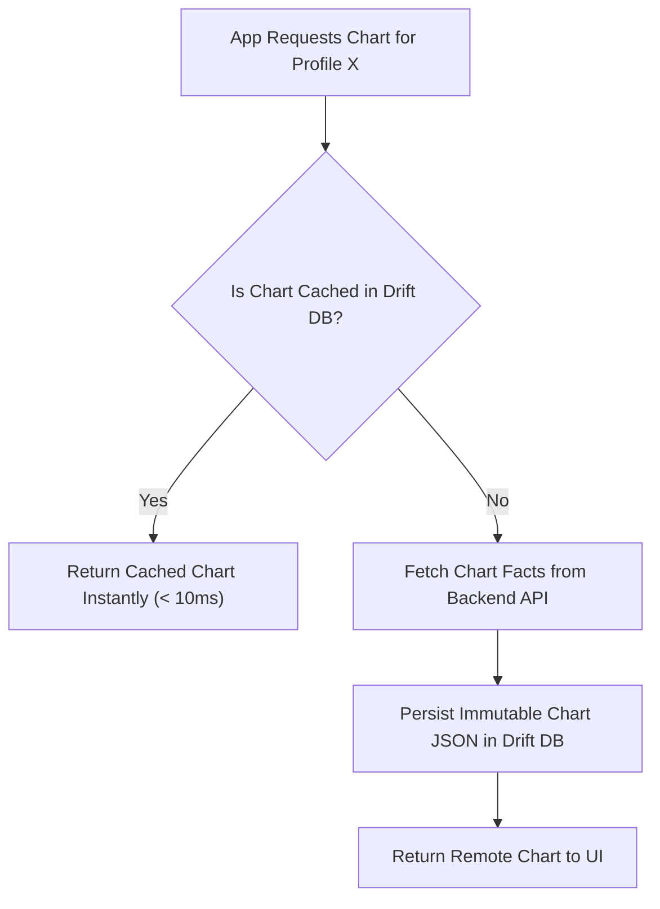

# Offline Storage & Caching Specification

## 1. Local Storage Strategy
To guarantee sub-second rendering latency and offline capability for saved birth profiles and generated charts, **Grahvani** implements a dual local storage architecture:
1. **Drift (SQLite)**: Strongly-typed relational database for local caching of birth profiles, generated birth chart facts, and chat message history.
2. **Flutter Secure Storage**: Encrypted key-value store backed by iOS Keychain & Android Keystore for JWT tokens and encryption keys.

---

## 2. Drift Database Schema (`AppDatabase`)

```dart
import 'package:drift/drift.dart';

class LocalProfiles extends Table {
  TextColumn get id => text()();
  TextColumn get fullName => text().withLength(min: 1, max: 100)();
  DateTimeColumn get dateOfBirth => dateTime()();
  TextColumn get timeOfBirth => text()();
  RealColumn get latitude => real()();
  RealColumn get longitude => real()();
  TextColumn get timezoneId => text()();
  DateTimeColumn get createdAt => dateTime()();

  @override
  Set<Column> get primaryKey => {id};
}

class LocalCharts extends Table {
  TextColumn get profileId => text().references(LocalProfiles, #id)();
  TextColumn get chartDataJson => text()(); // Immutable snapshot JSON string
  IntColumn get ayanamshaId => integer()();
  DateTimeColumn get calculatedAt => dateTime()();

  @override
  Set<Column> get primaryKey => {profileId, ayanamshaId};
}

@DriftDatabase(tables: [LocalProfiles, LocalCharts])
class AppDatabase extends _$AppDatabase {
  AppDatabase(QueryExecutor e) : super(e);

  @override
  int get schemaVersion => 1;
}
```

---

## 3. Cache Invalidation & Synchronisation Policy



- **Immutability Principle**: A calculated chart snapshot for a specific `(profile_id, ayanamsha_id)` never expires locally unless explicit user action ("Recalculate Chart with New Settings") is triggered.
