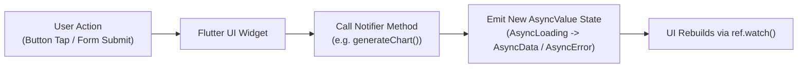

# State Management Specification (Riverpod)

## 1. State Management Architecture
**Grahvani** utilizes **Riverpod 2.x** with code generation (`riverpod_annotation`) for compile-safe, robust reactive state management. State flow follows an immutable unidirectional data cycle.

---

## 2. Unidirectional Data Flow



---

## 3. Core Providers Breakdown

### 3.1 Authentication Provider (`authNotifierProvider`)
Manages user authentication lifecycle, Firebase ID Tokens, and active user session.

```dart
@riverpod
class AuthNotifier extends _$AuthNotifier {
  @override
  FutureOr<AuthUser?> build() async {
    final repository = ref.read(authRepositoryProvider);
    return repository.getInitialSession();
  }

  Future<void> signInWithGoogle() async {
    state = const AsyncValue.loading();
    state = await AsyncValue.guard(() async {
      final repo = ref.read(authRepositoryProvider);
      return await repo.signInWithGoogle();
    });
  }

  Future<void> signOut() async {
    await ref.read(authRepositoryProvider).signOut();
    state = const AsyncValue.data(null);
  }
}
```

### 3.2 Birth Chart Provider (`chartNotifierProvider`)
Manages calculation, fetching, and local SQLite caching of birth chart facts.

```dart
@riverpod
class ChartNotifier extends _$ChartNotifier {
  @override
  FutureOr<BirthChart> build(String profileId) async {
    final repository = ref.watch(chartRepositoryProvider);
    return repository.getBirthChart(profileId);
  }

  Future<void> recalculateChart({required int ayanamshaId}) async {
    final profileId = arg;
    state = const AsyncValue.loading();
    state = await AsyncValue.guard(() async {
      final repo = ref.read(chartRepositoryProvider);
      return await repo.calculateChart(profileId: profileId, ayanamshaId: ayanamshaId);
    });
  }
}
```

---

## 4. `AsyncValue` UI Pattern Standard
Every screen rendering async network data must handle state exhaustively using Riverpod's `.when()` method:

```dart
class ChartScreen extends ConsumerWidget {
  final String profileId;
  const ChartScreen({super.key, required this.profileId});

  @override
  Widget build(BuildContext context, WidgetRef ref) {
    final chartState = ref.watch(chartNotifierProvider(profileId));

    return chartState.when(
      data: (chart) => BirthChartOverviewWidget(chart: chart),
      loading: () => const Center(child: CircularProgressIndicator()),
      error: (err, stack) => ErrorDisplayWidget(
        message: err.toString(),
        onRetry: () => ref.invalidate(chartNotifierProvider(profileId)),
      ),
    );
  }
}
```
