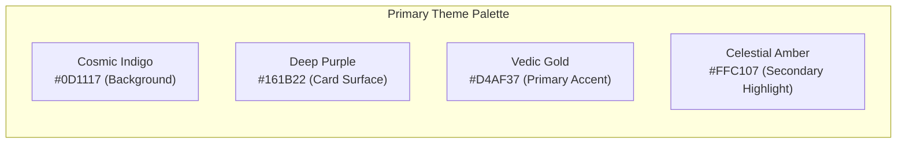

# UI Components & Design System Specification

## 1. Design Aesthetics & Branding
**Grahvani** adopts a modern, premium **Vedic Celestial theme** combining deep cosmic dark tones with warm gold accents. The UI follows **Material Design 3** guidelines on Android and adapts natively to **Cupertino** navigation patterns on iOS.

---

## 2. Color Palette & Design Tokens



| Token Name | Hex Code | Light Theme Equivalent | Usage Area |
| :--- | :--- | :--- | :--- |
| `colorSurfaceBackground` | `#0D1117` | `#F8F9FA` | Main screen background |
| `colorCardSurface` | `#161B22` | `#FFFFFF` | Custom cards, dialogs, bottom sheets |
| `colorPrimaryGold` | `#D4AF37` | `#B8860B` | Primary buttons, active tabs, chart borders |
| `colorTextPrimary` | `#F0F6FC` | `#1F2328` | Main headings, body text |
| `colorTextSecondary` | `#8B949E` | `#6E7781` | Subtitles, captions, metadata labels |
| `colorError` | `#F85149` | `#CF222E` | Form validation errors, network failures |

---

## 3. Custom Astrological Widgets

### 3.1 North Indian Birth Chart Painter (`D1ChartPainter`)
Rendered deterministically using Flutter’s `CustomPainter` API to ensure crisp, 60fps vector graphics across device pixel densities.

```dart
class D1ChartPainter extends CustomPainter {
  final BirthChart chart;
  final Color borderColor;
  
  D1ChartPainter({required this.chart, required this.borderColor});

  @override
  void paint(Canvas canvas, Size size) {
    final paint = Paint()
      ..color = borderColor
      ..strokeWidth = 2.0
      ..style = PaintingStyle.stroke;

    // Draw diamond grid for North Indian Chart
    final path = Path()
      ..moveTo(0, 0)
      ..lineTo(size.width, 0)
      ..lineTo(size.width, size.height)
      ..lineTo(0, size.height)
      ..close();

    // Inner diagonals
    canvas.drawLine(Offset(0, 0), Offset(size.width, size.height), paint);
    canvas.drawLine(Offset(size.width, 0), Offset(0, size.height), paint);
    
    // Outer diamond
    canvas.drawLine(Offset(size.width / 2, 0), Offset(size.width, size.height / 2), paint);
    canvas.drawLine(Offset(size.width, size.height / 2), Offset(size.width / 2, size.height), paint);
    canvas.drawLine(Offset(size.width / 2, size.height), Offset(0, size.height / 2), paint);
    canvas.drawLine(Offset(0, size.height / 2), Offset(size.width / 2, 0), paint);

    // Draw house numbers & planetary text glyphs...
  }

  @override
  bool shouldRepaint(covariant D1ChartPainter oldDelegate) =>
      oldDelegate.chart != chart;
}
```

### 3.2 Key UI Components Library

| Widget Component | File Path | Description |
| :--- | :--- | :--- |
| `GrahvaniButton` | `lib/core/widgets/grahvani_button.dart` | Gold-accented elevated button with loading indicator state. |
| `PlanetDegreeTile` | `lib/features/chart/presentation/widgets/planet_degree_tile.dart` | List tile showing planet name, sign, degree, retrograde indicator (`R`). |
| `DashaTimelineWidget`| `lib/features/chart/presentation/widgets/dasha_timeline_widget.dart` | Vertical timeline displaying Maha Dasha & Antar Dasha date spans. |
| `CitationBubble` | `lib/features/chat/presentation/widgets/citation_bubble.dart` | Clickable chip displaying RAG source citations (opens source modal). |
