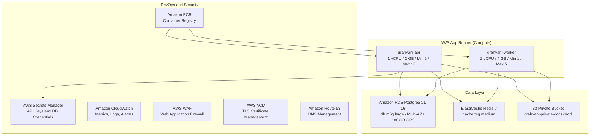

# AWS Services Configuration Specification

## Purpose
This document provides the authoritative configuration reference for all AWS services used in the Grahvani production environment (`ap-south-1`). It serves as the source of truth for infrastructure provisioning and IaC (Infrastructure as Code) configuration.

## Scope
Covers all AWS services in the production account. Staging mirrors this configuration with smaller instance sizes and no Multi-AZ.

---

## 1. AWS Services Overview

---

## 2. AWS App Runner Configuration

### 2.1 API Service (`grahvani-api`)

| Parameter | Value |
| :--- | :--- |
| **Service Name** | `grahvani-api-prod` |
| **Source** | Amazon ECR image: `grahvani-api:latest` |
| **CPU** | 1 vCPU |
| **Memory** | 2 GB |
| **Port** | 8000 |
| **Start Command** | `uvicorn app.main:app --host 0.0.0.0 --port 8000 --workers 4` |
| **Auto-Scale Min** | 2 instances (zero-downtime deploy protection) |
| **Auto-Scale Max** | 10 instances |
| **Scale Trigger** | > 80 concurrent requests per instance |
| **Health Check** | `GET /api/v1/health` -- 200 OK within 5 s |
| **Health Check Interval** | 10 seconds |
| **Deployment Trigger** | New ECR image tag (CI/CD automatic) |

### 2.2 Worker Service (`grahvani-worker`)

| Parameter | Value |
| :--- | :--- |
| **Service Name** | `grahvani-worker-prod` |
| **Source** | Amazon ECR image: `grahvani-worker:latest` |
| **CPU** | 2 vCPU |
| **Memory** | 4 GB |
| **Start Command** | `dramatiq app.tasks --processes 4 --threads 2` |
| **Auto-Scale Min** | 1 instance |
| **Auto-Scale Max** | 5 instances |
| **Scale Trigger** | Redis queue depth > 50 tasks |

---

## 3. Amazon RDS PostgreSQL Configuration

| Parameter | Value |
| :--- | :--- |
| **Engine** | PostgreSQL 16.x |
| **Instance Class** | `db.m6g.large` (2 vCPU, 8 GB RAM) |
| **Multi-AZ** | Enabled (automatic standby in second AZ) |
| **Storage Type** | GP3 SSD |
| **Initial Storage** | 100 GB |
| **Storage Auto-Scaling** | Enabled, max 500 GB |
| **Backup Retention** | 35 days |
| **Point-in-Time Recovery** | Enabled |
| **Encryption** | AWS KMS (aws/rds default key) |
| **Parameter Group** | Custom: `max_connections=200`, `shared_preload_libraries=vector` |
| **Extensions** | `uuid-ossp`, `vector` (pgvector 0.7+), `pg_trgm` |
| **Database Name** | `grahvani_prod` |
| **Publicly Accessible** | No |
| **VPC** | Grahvani production VPC (private subnets only) |

---

## 4. Amazon ElastiCache Redis Configuration

| Parameter | Value |
| :--- | :--- |
| **Engine** | Redis 7.2 |
| **Node Type** | `cache.t4g.medium` (2 vCPU, 3.09 GB RAM) |
| **Mode** | Single-node (no cluster mode -- sufficient for MVP) |
| **Encryption in Transit** | Enabled (TLS) |
| **Encryption at Rest** | Enabled (KMS) |
| **Eviction Policy** | `allkeys-lru` |
| **Max Memory** | 2.5 GB (leaving ~0.5 GB for overhead) |
| **Backup** | Daily automatic snapshots (7-day retention) |

---

## 5. Amazon S3 Configuration

| Parameter | Value |
| :--- | :--- |
| **Bucket Name** | `grahvani-private-docs-prod` |
| **Region** | `ap-south-1` |
| **Public Access Block** | All public access blocked |
| **Versioning** | Enabled |
| **Encryption** | SSE-S3 (AES-256, AWS-managed) |
| **Lifecycle Rules** | Delete incomplete multipart uploads after 7 days; archive exports/ to Glacier after 90 days |
| **Cross-Region Replication** | Target: `ap-southeast-1` for disaster recovery |

---

## 6. AWS Secrets Manager

| Secret Name | Description |
| :--- | :--- |
| `grahvani/prod/database_url` | Full PostgreSQL connection string |
| `grahvani/prod/redis_url` | Redis connection URL with TLS |
| `grahvani/prod/gemini_api_key` | LLM provider API key |
| `grahvani/prod/firebase_credentials` | Firebase Admin SDK JSON |
| `grahvani/prod/razorpay_webhook_secret` | Razorpay HMAC signing secret |
| `grahvani/prod/google_play_credentials` | Google Play service account JSON |

---

## 7. Amazon Route 53 and ACM

| Record | Type | Value |
| :--- | :--- | :--- |
| `api.grahvani.app` | CNAME | App Runner custom domain |
| `grahvani.app` | A / ALIAS | Future web app or marketing site |

ACM certificate for `*.grahvani.app` is auto-renewed by AWS Certificate Manager. DNS validation records are managed in Route 53.

---

## 8. Rationale

**Why AWS Mumbai (`ap-south-1`)?**  
India's largest urban population clusters and the target user base are located within 50-200ms of the Mumbai AWS region. This gives sub-100ms API response times for chart retrieval (the most common API call) before any caching.

**Why App Runner over ECS Fargate?**  
App Runner handles load balancing, TLS termination, auto-scaling, and deployment without requiring task definitions, service definitions, or cluster management. At MVP scale this reduces DevOps burden by an estimated 60%.

---

## 9. Related Documents

- [DEPLOYMENT.md](DEPLOYMENT.md) -- Deployment pipeline and Docker Compose
- [SECURITY.md](SECURITY.md) -- IAM roles, VPC topology, security groups
- [MONITORING.md](MONITORING.md) -- CloudWatch alarms and observability
- [BACKUP_AND_RECOVERY.md](BACKUP_AND_RECOVERY.md) -- RDS backup and disaster recovery
