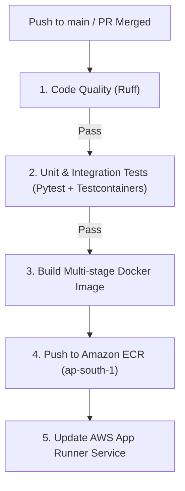
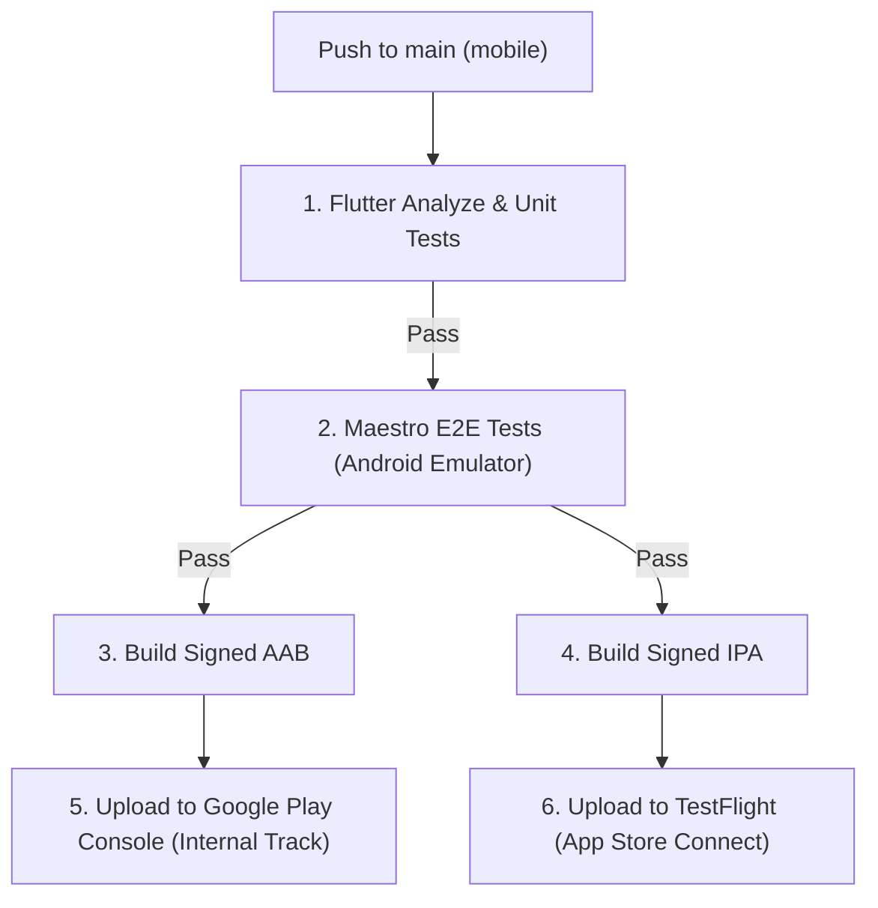

# CI/CD Pipeline Specification (GitHub Actions)

## Purpose
This document defines the continuous integration and continuous deployment (CI/CD) pipelines for both the Grahvani FastAPI backend and the Flutter mobile application. It ensures that no code reaches production without passing all quality gates.

## Scope
Applies to all workflows configured in `.github/workflows/`.

---

## 1. Backend CI/CD Pipeline (`backend-deploy.yml`)

The backend pipeline is triggered on pushes to the `main` branch.

### 1.1 Pipeline Stages



### 1.2 Quality Gates (The `test` Job)
If any of these commands fail, the pipeline halts and deployment is aborted:
```bash
# 1. Linting & Formatting
ruff check .
ruff format --check .

# 2. Type Checking
mypy app/

# 3. Unit & Integration Tests (requires Docker running on CI agent)
pytest tests/ --cov=app --cov-fail-under=80
```

### 1.3 Deployment Configuration
App Runner is configured for **Automatic Deployments**. When GitHub Actions pushes a new image tag (`latest` and a Git SHA tag) to ECR, App Runner automatically detects the change and triggers a zero-downtime rolling deployment.

```yaml
# Snippet from backend-deploy.yml
      - name: Build, tag, and push image to Amazon ECR
        env:
          ECR_REGISTRY: ${{ steps.login-ecr.outputs.registry }}
          ECR_REPOSITORY: grahvani-api
          IMAGE_TAG: ${{ github.sha }}
        run: |
          docker build -t $ECR_REGISTRY/$ECR_REPOSITORY:$IMAGE_TAG -t $ECR_REGISTRY/$ECR_REPOSITORY:latest .
          docker push $ECR_REGISTRY/$ECR_REPOSITORY:$IMAGE_TAG
          docker push $ECR_REGISTRY/$ECR_REPOSITORY:latest
```

---

## 2. Flutter Mobile CI/CD Pipeline (`mobile-build.yml`)

The mobile pipeline handles linting, testing, and generating signed release binaries for both Android and iOS.

### 2.1 Pipeline Stages



### 2.2 Quality Gates
```bash
# 1. Static Analysis
flutter analyze --fatal-infos

# 2. Unit and Widget Tests
flutter test --coverage
```

### 2.3 Secrets Management for Mobile CI
The following secrets must be injected into the GitHub Actions runner to sign the apps:
- `ANDROID_KEYSTORE_BASE64`: The `.jks` file encoded in base64.
- `ANDROID_KEYSTORE_PASSWORD`: Password for the keystore.
- `MATCH_PASSWORD`: iOS fastlane match password for provisioning profiles.
- `APP_STORE_CONNECT_API_KEY`: For TestFlight uploads.

---

## 3. Pull Request Workflow

Pushes to non-main branches that open a Pull Request trigger a restricted CI pipeline:
- **Runs**: Ruff, Mypy, Pytest, Flutter Analyze, Flutter Test.
- **Does NOT run**: Docker build, ECR push, AAB/IPA generation.
- **Status Check**: The PR cannot be merged into `main` until this check passes.

---

## 4. Rationale

Separating the CI/CD pipelines into backend and mobile ensures that backend API updates can be deployed in ~5 minutes independently of the much slower mobile build process (~30-45 minutes for iOS archiving). Relying on App Runner's native ECR webhook for deployment removes the need to script complex AWS CLI update commands in GitHub Actions.

---

## 5. Related Documents

- [testing/TESTING_STRATEGY.md](../testing/TESTING_STRATEGY.md) -- Detailed breakdown of the tests run in the pipeline
- [testing/E2E_TESTS.md](../testing/E2E_TESTS.md) -- Details on the Maestro E2E job
- [infrastructure/AWS.md](AWS.md) -- App Runner configuration details
