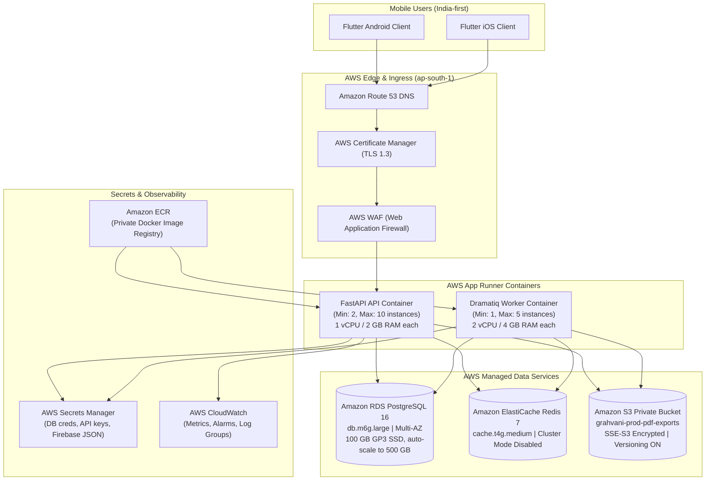
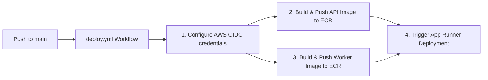

# Deployment Architecture & Operations Specification

## 1. Overview & Philosophy
**Grahvani** is deployed in the **AWS Mumbai (`ap-south-1`)** region — the closest AWS region to India's largest user concentration — to meet strict data residency expectations and provide sub-100ms API response times for users across India.

The deployment strategy deliberately avoids Kubernetes. Instead, it leverages **AWS App Runner** — a fully managed container runtime that auto-scales, handles TLS termination, and eliminates cluster maintenance overhead. Infrastructure is managed via **Terraform**.

---

## 2. Full AWS Infrastructure Architecture



---

## 3. Terraform Infrastructure Deployment

The infrastructure is fully defined as code in `infrastructure/aws/`.

### Prerequisites
1. **AWS CLI** configured with Administrator permissions.
2. **Terraform** v1.8+ installed.
3. Manually create an S3 bucket for Terraform state (e.g. `grahvani-terraform-state`).
4. Manually create a DynamoDB table for state locking (`grahvani-terraform-locks` with `LockID` string key).
5. Ensure `main.tf` is updated with your specific S3 bucket and DynamoDB table names.

### Step-by-Step Deployment

1. **Initialize Terraform:**
   ```bash
   cd infrastructure/aws
   terraform init
   ```

2. **Configure Variables:**
   Copy the example variables file and populate your real secrets:
   ```bash
   cp terraform.tfvars.example terraform.tfvars
   # Edit terraform.tfvars with your production secrets
   ```
   > [!CAUTION]
   > Never commit `terraform.tfvars` to version control.

3. **Plan and Apply:**
   ```bash
   terraform plan -out=tfplan
   terraform apply tfplan
   ```
   *Note: Creating an RDS Multi-AZ cluster takes ~15-20 minutes.*

4. **Database Initialization:**
   After the infrastructure is provisioned, wait for the GitHub Action to build and push the Docker image, then the FastAPI app will auto-run Alembic migrations on startup, or you can run them manually via a Bastion host.

---

## 4. Container Configuration (App Runner)

### 4.1 FastAPI API Container
| Parameter | Value |
| :--- | :--- |
| **Container Image** | `<account>.dkr.ecr.ap-south-1.amazonaws.com/grahvani:latest` |
| **CPU / Memory** | 1 vCPU / 2 GB RAM |
| **Auto-Scale Min** | 2 instances (zero-downtime deploys) |
| **Auto-Scale Max** | 10 instances |
| **Port** | 8000 |

### 4.2 Dramatiq Worker Container
| Parameter | Value |
| :--- | :--- |
| **Container Image** | `<account>.dkr.ecr.ap-south-1.amazonaws.com/grahvani:worker-latest` |
| **CPU / Memory** | 2 vCPU / 4 GB RAM |
| **Auto-Scale Min** | 1 instance |
| **Auto-Scale Max** | 5 instances |
| **Port** | 8080 (Dummy health check) |

---

## 5. Automated CI/CD Pipeline

The `.github/workflows/deploy.yml` pipeline triggers automatically on pushes to the `main` branch.



> [!IMPORTANT]
> The GitHub Actions pipeline requires an AWS OIDC identity provider configured in your AWS account to securely assume the deploy role without hardcoding long-lived access keys.

---

## 6. Secrets Management & Security

All sensitive variables (Database Passwords, Gemini API Keys, Razorpay credentials) are stored in **AWS Secrets Manager**. 

App Runner automatically resolves these secrets at container startup using the `runtime_environment_secrets` configuration in Terraform.
The FastAPI application's `app/core/aws_secrets.py` helper parses any JSON composites before overriding the Pydantic Settings.

### Database Password Rotation
The RDS database master password is automatically rotated every 30 days via a custom AWS Lambda function (`infrastructure/aws/lambda/rotate_db_password.py`). App Runner will automatically pull the new secret on its next container restart or deployment.

---

## 7. Local Development (Docker Compose)
All services required for local development are orchestrated via Docker Compose:

```bash
docker-compose up -d --build
```
This boots PostgreSQL (with pgvector), Redis, the FastAPI API, and the Dramatiq Worker locally.
