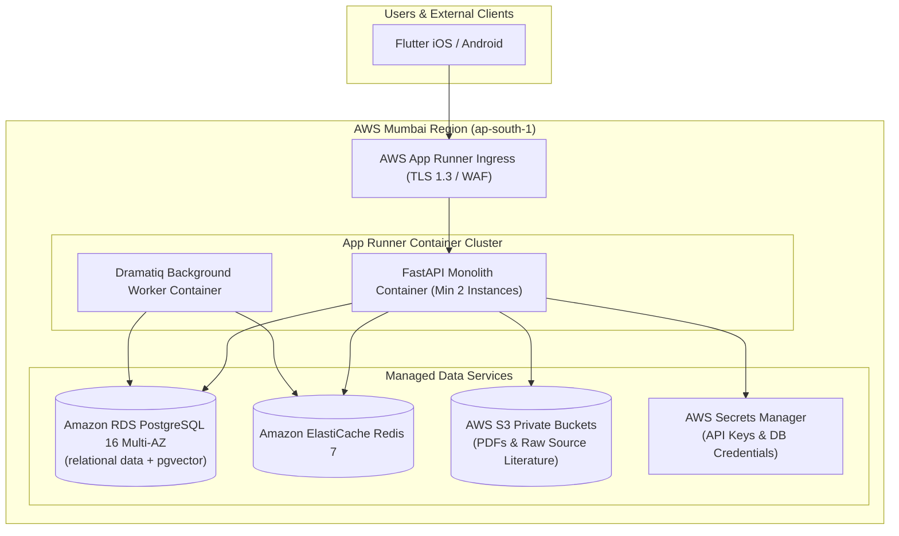

# Infrastructure & DevOps Documentation (AWS Mumbai)

Welcome to the infrastructure and DevOps documentation for **Grahvani**. Production infrastructure is hosted in **AWS Mumbai (`ap-south-1`)**.

---

## 📂 Infrastructure Documents Index

- 🚀 **[Deployment Architecture](DEPLOYMENT.md)** — Production topology on AWS App Runner, RDS PostgreSQL, Redis, S3.
- 🐳 **[Docker Setup](DOCKER.md)** — Multi-stage Dockerfiles for FastAPI API server and Dramatiq worker container.
- ☁️ **[AWS Services Configuration](AWS.md)** — App Runner, RDS Multi-AZ, S3 private buckets, Secrets Manager setups.
- 🔄 **[CI/CD Pipelines](CI_CD.md)** — GitHub Actions workflows for linting, testing, ECR image pushing, App Runner deployment.
- 📊 **[Monitoring & Logging](MONITORING.md)** — AWS CloudWatch metrics, Sentry exception tracking, health checks.
- 🔒 **[Security & IAM Policies](SECURITY.md)** — TLS 1.3, AES-256 at rest, AWS IAM least-privilege policies.
- 🔑 **[Environment Variables](ENVIRONMENT_VARIABLES.md)** — Exhaustive list of all backend, database, AWS, Firebase, and LLM env vars.
- 💾 **[Backup & Disaster Recovery](BACKUP_AND_RECOVERY.md)** — RDS automated daily backups, S3 versioning, RPO/RTO metrics.

---

## 🏛️ AWS Cloud Infrastructure Diagram

