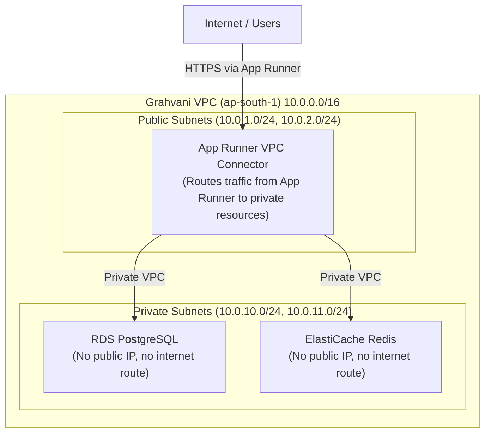

# Infrastructure Security and IAM Specification

## Purpose
This document defines the AWS-level security controls for Grahvani -- IAM roles, VPC network topology, security groups, WAF rules, and least-privilege access policies. It complements the application-level security documented in [security/THREAT_MODEL.md](../security/THREAT_MODEL.md).

## Scope
Covers all AWS infrastructure resources in the `ap-south-1` production account.

---

## 1. IAM Roles and Least-Privilege Policy

| IAM Role | Assigned To | Permissions Granted |
| :--- | :--- | :--- |
| `grahvani-api-runner-role` | App Runner API Service | Read from Secrets Manager (own secrets only), Write to CloudWatch Logs, Read/Write S3 (exports/ prefix only), Send to SQS (task queue) |
| `grahvani-worker-runner-role` | App Runner Worker Service | Read from Secrets Manager (own secrets only), Write to CloudWatch Logs, Read/Write S3 (all prefixes), Read from SQS |
| `grahvani-rds-monitoring-role` | RDS Enhanced Monitoring | CloudWatch metric publish only |
| `grahvani-deploy-role` | GitHub Actions CI/CD | ECR push, App Runner update service, read-only S3 |

**IAM Policy Snippet for API Role:**
```json
{
  "Version": "2012-10-17",
  "Statement": [
    {
      "Effect": "Allow",
      "Action": ["secretsmanager:GetSecretValue"],
      "Resource": "arn:aws:secretsmanager:ap-south-1:*:secret:grahvani/prod/*"
    },
    {
      "Effect": "Allow",
      "Action": ["s3:GetObject", "s3:PutObject"],
      "Resource": "arn:aws:s3:::grahvani-private-docs-prod/exports/*"
    },
    {
      "Effect": "Allow",
      "Action": ["logs:CreateLogGroup", "logs:CreateLogStream", "logs:PutLogEvents"],
      "Resource": "arn:aws:logs:ap-south-1:*:log-group:/grahvani/*"
    }
  ]
}
```

---

## 2. VPC Network Topology



**Key Security Properties:**
- **RDS has no public endpoint.** The only way to connect to the database is from within the VPC via the App Runner VPC Connector.
- **Redis has no public endpoint.** Same VPC-internal access only.
- **App Runner uses a VPC Connector** to route traffic to the private subnets without exposing RDS or Redis publicly.
- **No bastion host in production.** Database admin access is via AWS RDS Query Editor (IAM-authenticated) or a temporary bastion only for emergencies.

---

## 3. Security Groups

| Security Group | Attached To | Inbound Rules | Outbound Rules |
| :--- | :--- | :--- | :--- |
| `sg-api-runner` | App Runner VPC Connector | None (App Runner manages inbound) | All to `sg-rds` on 5432; all to `sg-redis` on 6379 |
| `sg-rds` | RDS PostgreSQL | TCP 5432 from `sg-api-runner` only | None |
| `sg-redis` | ElastiCache Redis | TCP 6379 from `sg-api-runner` only | None |

---

## 4. AWS WAF Rules

AWS WAF is attached to the App Runner service's custom domain via CloudFront:

| Rule | Action | Protects Against |
| :--- | :--- | :--- |
| AWS Managed Rules: Core Rule Set (CRS) | Block | SQL injection, XSS, common web vulnerabilities |
| AWS Managed Rules: Known Bad Inputs | Block | Log4j exploits, other known attack patterns |
| Rate Limiting: 1000 req/5min per IP | Block + Alert | DDoS, scraping, brute force |
| Geo Restriction (Phase 1) | Count (not block) | Monitor traffic from unexpected regions |

---

## 5. S3 Bucket Security

All S3 buckets enforce:
```json
{
  "Version": "2012-10-17",
  "Statement": [
    {
      "Effect": "Deny",
      "Principal": "*",
      "Action": "s3:*",
      "Resource": ["arn:aws:s3:::grahvani-private-docs-prod/*"],
      "Condition": {
        "Bool": { "aws:SecureTransport": "false" }
      }
    }
  ]
}
```
This bucket policy denies any non-HTTPS request to the bucket, enforcing encryption in transit even for internal AWS service calls.

---

## 6. Rationale

The "no public endpoints for databases" rule is the single most important security control. Historical AWS data breaches (Capital One, etc.) often involved misconfigured security groups with public RDS access. By making public access architecturally impossible (not just configured-off), Grahvani eliminates this entire threat class.

---

## 7. Future Improvements

- **AWS GuardDuty**: Enable for continuous threat detection (unusual IAM calls, compromised credentials, malware detection in S3).
- **AWS Config Rules**: Enforce compliance rules (e.g., "RDS must be encrypted", "S3 must have public access blocked") and alert on drift.
- **VPC Flow Logs**: Enable for network-level traffic analysis and incident investigation.
- **Separate AWS Accounts**: Use AWS Organizations with separate accounts for dev/staging/production to prevent blast radius from staging credential leaks.

---

## 8. Related Documents

- [security/THREAT_MODEL.md](../security/THREAT_MODEL.md) -- Application-level STRIDE threat analysis
- [security/ENCRYPTION.md](../security/ENCRYPTION.md) -- TLS and at-rest encryption details
- [security/SECRETS.md](../security/SECRETS.md) -- Secrets Manager and credential management
- [infrastructure/DEPLOYMENT.md](DEPLOYMENT.md) -- Full AWS service configuration
