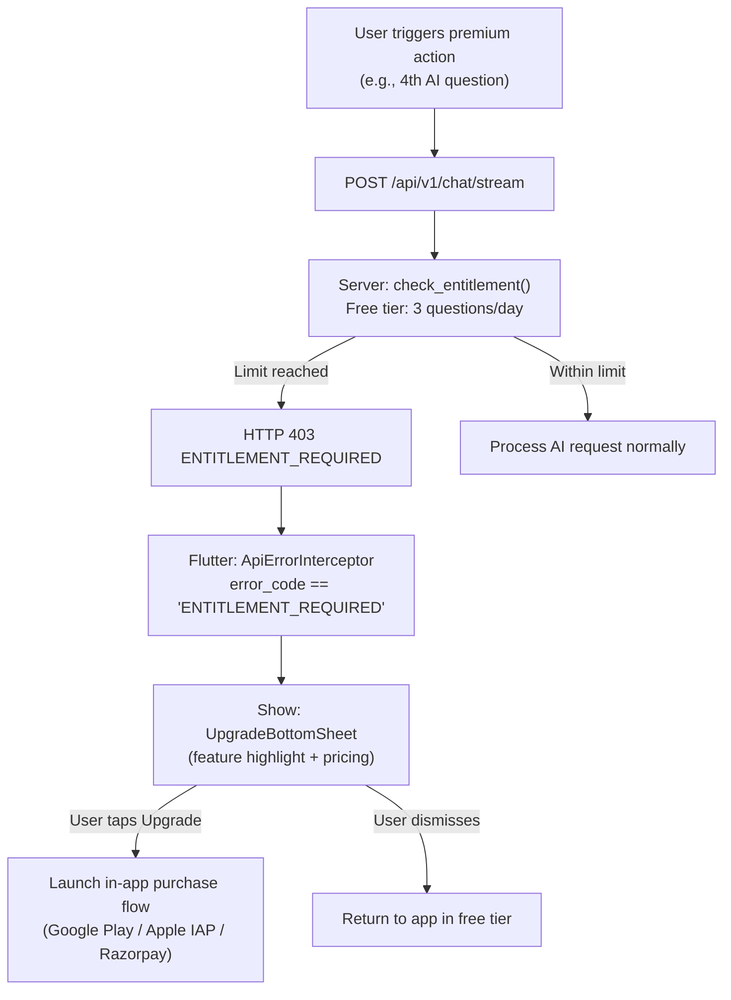

# Premium Features and Paywall Specification

## Purpose
This document defines the complete feature entitlement matrix for Grahvani, distinguishing Free and Premium tier capabilities, the paywall trigger conditions, and how the premium tier is enforced end-to-end (server and client).

## Scope
Covers the entitlement model, UI paywall behaviour, and premium feature roadmap.

---

## 1. Feature Entitlement Matrix

| Feature | Free Tier | Premium Tier |
| :--- | :---: | :---: |
| Birth profiles (saved) | 1 | Unlimited |
| D1 (Rasi) birth chart | Yes | Yes |
| D9 (Navamsa) chart | Yes | Yes |
| Vimshottari Dasha timeline | Yes | Yes |
| AI grounded chat questions/day | 3 | Unlimited (rate limited at 60/hour) |
| Priority SSE streaming (lower queue) | No | Yes |
| D10 (Dasamsa), D12, D60 divisional charts | No | Yes |
| Antar Dasha and Pratyantar breakdown | No | Yes |
| PDF birth chart export (high-resolution) | No | Yes |
| Chat history retention | 7 days | 12 months |
| Multiple profiles for family members | No | Yes |

---

## 2. Pricing (India Launch)

| Plan | Price | Billing | Store |
| :--- | :--- | :--- | :--- |
| Free | INR 0 | -- | -- |
| Monthly Premium | INR 299/month | Monthly auto-renew | Google Play / Apple IAP / Razorpay |
| Annual Premium | INR 2,499/year | Annual auto-renew | Google Play / Apple IAP / Razorpay |

> **Note**: Pricing for international markets (USD, GBP, EUR) is a Phase 3 consideration. Current launch targets India only.

---

## 3. Paywall Trigger Logic

The paywall is triggered on the **client side** when the server returns HTTP 403 with `error_code: ENTITLEMENT_REQUIRED`. The Flutter app intercepts this in the global API interceptor and shows the paywall bottom sheet.

---

## 4. Paywall UI Specification

The paywall is a **modal bottom sheet** (not a blocking full-screen page) to reduce friction:
- **Header**: "Unlock Grahvani Premium"
- **Feature highlights**: 3 bullet points highlighting the most relevant premium feature for the blocked action
- **Pricing display**: Monthly and Annual cards side-by-side (Annual highlighted as "Best Value")
- **CTA button**: "Start Premium" (primary, indigo gradient)
- **Dismiss**: Small "Not now" text link below CTA

---

## 5. Premium Feature: Divisional Charts (D10, D12, D60)

Premium users can access deeper divisional charts calculated from the same birth chart snapshot:

| Chart | Name | Purpose |
| :--- | :--- | :--- |
| D10 | Dasamsa | Career, profession, and vocation |
| D12 | Dwadasamsa | Parents and ancestry |
| D60 | Shashtiamsa | Karma, past life influences (highest resolution) |

These are computed on-demand from the stored `chart_facts_json` snapshot -- no re-calculation from Swiss Ephemeris is needed.

---

## 6. Rationale

The 3-question free tier is selected because:
- It is sufficient to let users experience the AI's quality (typically 2-3 questions needed to assess value).
- It creates a natural upgrade trigger at the point of maximum engagement (right after the 3rd question).
- At $0.0004 cost per question, 3 free questions cost ~$0.0012 per new user acquisition -- an acceptable acquisition cost.

---

## 7. Future Improvements

- **7-day Premium Trial**: Offer a 7-day free trial for new users to reduce paywall friction.
- **Family Plan**: Share one premium subscription across up to 5 family member profiles.
- **Lifetime License**: One-time purchase option for power users (pricing TBD in Phase 3).

---

## 8. Related Documents

- [MVP.md](MVP.md) -- MVP scope including what is Free vs Premium at launch
- [billing/ENTITLEMENTS.md](../billing/ENTITLEMENTS.md) -- Server-side entitlement enforcement code
- [billing/SUBSCRIPTIONS.md](../billing/SUBSCRIPTIONS.md) -- Subscription state machine
- [product/USER_FLOWS.md](USER_FLOWS.md) -- Paywall UX flow details
