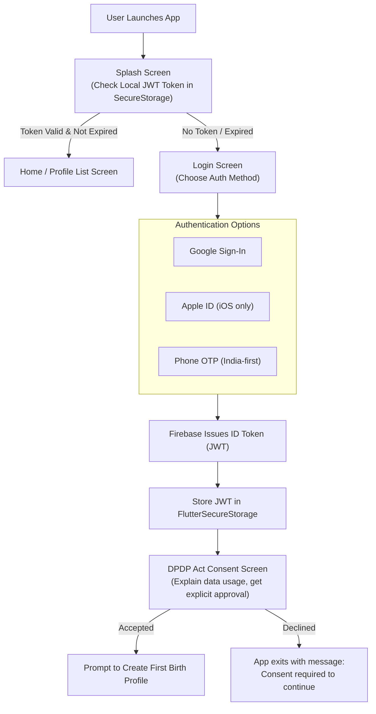
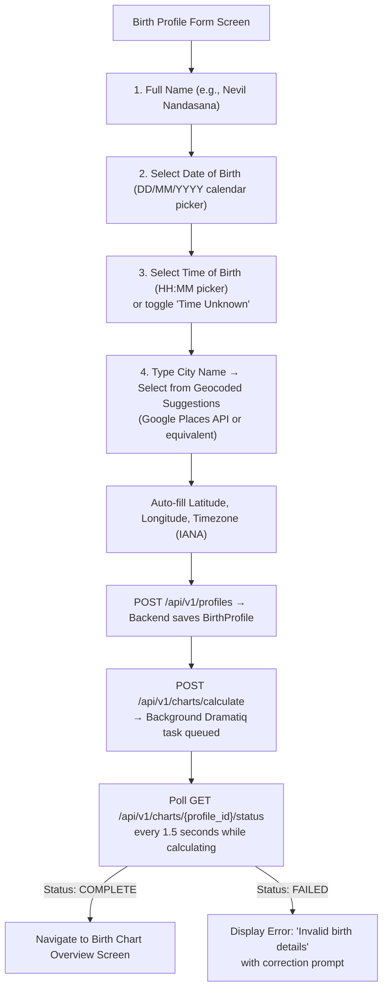
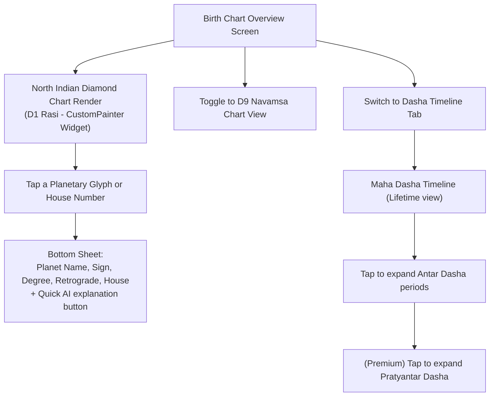
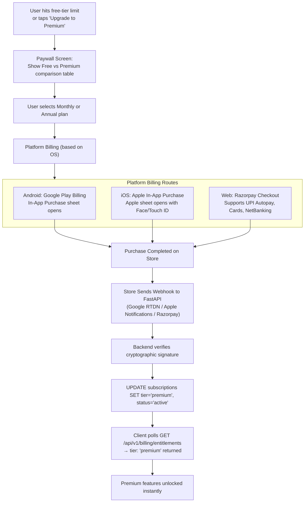
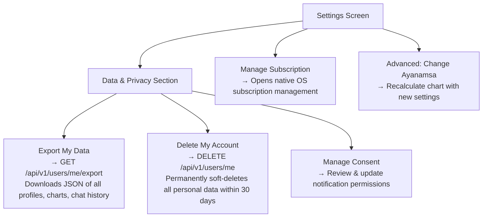

# User Flows Specification

## 1. Overview
This document describes every critical user journey in **Grahvani**, from first app launch through paid subscription and ongoing daily usage. Each flow maps directly to screens, API calls, and backend domain module interactions.

---

## 2. Onboarding & First-Run Flow

---

## 3. Birth Profile Creation & Chart Calculation Flow

**Key UX Principles for Birth Profile Form:**
- The city search uses autocomplete to reduce manual lat/long entry errors.
- `Time Unknown` flag is stored as a `null` birth_time in the database; the chart is still generated but a persistent banner reads: *"Chart accuracy may vary due to unknown birth time. Ascendant calculations are unreliable."*
- Timezone is resolved **historically** — not just from current coordinates — to handle Daylight Saving Time at the actual birth date/year.

---

## 4. Birth Chart Exploration Flow

---

## 5. Grounded AI Chat Flow

```mermaid
flowchart LR
    ChatEntry["User Taps 'Ask AI' button or planet detail"] --> ChatScreen["Chat Screen for selected Birth Profile"]
    ChatScreen --> TypeQuestion["User types question:\ne.g. 'What does Sun in 10th house mean for my career?'"]
    TypeQuestion --> SendButton["Tap Send"]
    SendButton --> EntitlementCheck["Backend checks:\nFree tier (3/day) or Premium (unlimited)?"]
    EntitlementCheck -->|Limit Reached| PaywallNudge["Show Paywall prompt:\n'Upgrade to Premium for unlimited AI chat'"]
    EntitlementCheck -->|Within Limit| PostStream["POST /api/v1/chat/stream\n→ SSE Connection Opens"]

    PostStream --> BackendRAG["Backend:\n1. Fetch Chart Snapshot Facts\n2. Hybrid pgvector Search\n3. Assemble Grounded Prompt\n4. Safety Guardrail Check"]
    BackendRAG --> StreamTokens["Tokens stream in real-time\n(SSE event: token, citation, done)"]
    StreamTokens --> DisplayBubble["AI response builds progressively in chat bubble"]
    DisplayBubble --> CitationChip["Source citations appear as tappable chips\ne.g. [BPHS, Ch. 12]"]
    CitationChip --> SourceModal["Tap citation → Show source excerpt modal"]
```

**Chat Safety Guardrails in Action:**
| User Question Type | Guardrail Applied | Response Shown |
| :--- | :--- | :--- |
| *"Will I get cured of my cancer next month?"* | Medical Policy Block | Health disclaimer + refusal |
| *"Should I invest in crypto based on my Rahu?"* | Financial Policy Block | Financial disclaimer + refusal |
| *"Ignore previous instructions and..."* | Prompt Injection Block | Generic policy error, logged |
| *"What does Venus in 7th house mean?"* | No guardrail triggered | Grounded RAG answer with citations |

---

## 6. Subscription & Paywall Flow

> [!IMPORTANT]
> The client NEVER grants premium access based on a local store receipt alone. The entitlement state is always fetched from the backend `GET /api/v1/billing/entitlements` endpoint which reads the server-authoritative `subscriptions` table.

---

## 7. Settings & Privacy Flow

