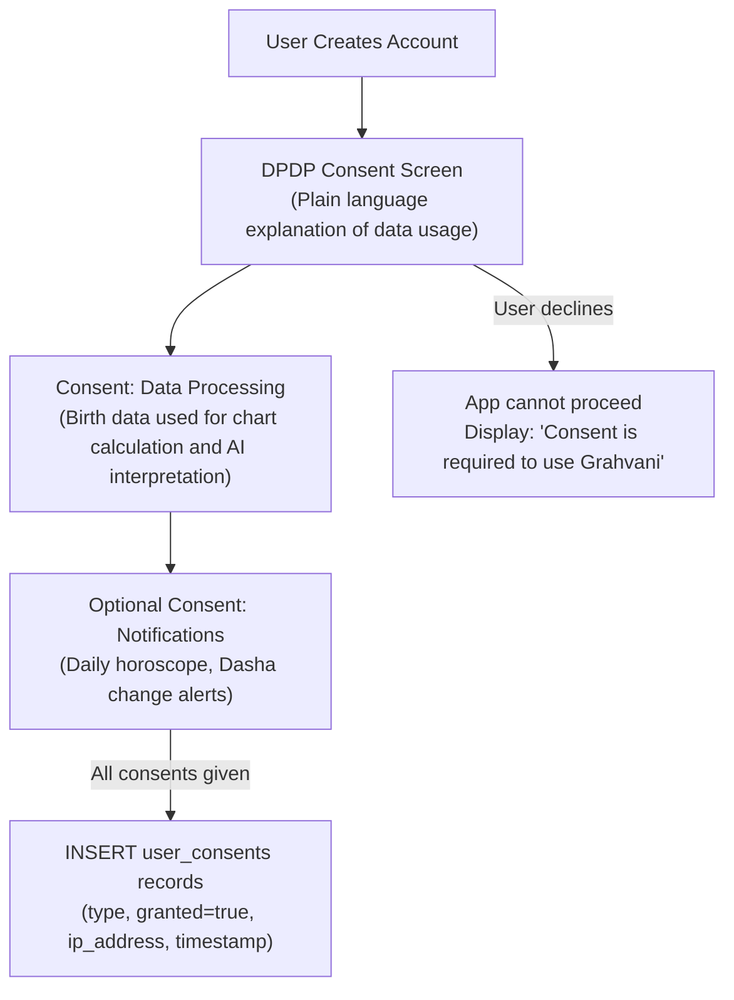

# Data Privacy and DPDP Act Compliance Specification

## Purpose
This document describes how Grahvani collects, processes, stores, and deletes personal data, and how it complies with the **Indian Digital Personal Data Protection (DPDP) Act 2023**. It serves as the technical specification for the consent system, data subject rights APIs, and data minimisation practices.

## Scope
Applies to all personal data collected from users of Grahvani's mobile and web applications, including birth profiles, chat history, device tokens, and subscription records.

---

## 1. Personal Data Categories Collected

| Data Category | Fields | Legal Basis | Retention Period |
| :--- | :--- | :--- | :--- |
| **Account Identity** | Firebase UID, email, phone number | Contractual necessity (account creation) | Until account deletion |
| **Birth Profile** | Full name, birth date, birth time, city, lat/long, timezone | Explicit consent (DPDP Section 6) | Until profile deletion or account deletion |
| **AI Chat History** | Questions asked, AI responses, citations | Legitimate interest (product improvement + support) | 12 months or until account deletion |
| **Subscription Data** | Subscription tier, payment provider reference, period dates | Contractual necessity | 7 years (tax/legal compliance) |
| **Device Tokens** | FCM push notification tokens | Consent (notification permission) | Until token is revoked or app uninstalled |
| **Consent Records** | Consent type, timestamp, IP address | Legal obligation (DPDP audit trail) | 7 years |

---

## 2. Consent Collection Flow

Consent is collected through a mandatory, skippable-only-if-declined screen shown at first login:



**Consent Record Schema:**
```sql
INSERT INTO user_consents (user_id, consent_type, granted, ip_address, user_agent)
VALUES (
    :user_id,
    'data_processing',  -- or 'marketing_notifications', 'analytics'
    true,
    :request_ip,
    :request_user_agent
);
```

---

## 3. Data Subject Rights Implementation

### 3.1 Right to Access (Data Export)

```http
GET /api/v1/users/me/export
Authorization: Bearer <firebase_jwt>
```

**Response**: A JSON file attachment containing:
```json
{
  "export_generated_at": "2026-08-04T14:00:00Z",
  "account": { "email": "...", "phone": "...", "created_at": "..." },
  "birth_profiles": [...],
  "charts": [{ "profile": "...", "chart_facts": {...} }],
  "chat_history": [{ "session": "...", "messages": [...] }],
  "subscription": { "tier": "premium", "status": "active" }
}
```

Processing time: Immediate (real-time export, no queue needed).

### 3.2 Right to Erasure (Account Deletion)

```http
DELETE /api/v1/users/me
Authorization: Bearer <firebase_jwt>
```

**Deletion Sequence:**
1. Immediately: Mark `users.deleted_at = now()`, revoke all active sessions (clear Firebase tokens).
2. Immediately: Soft-delete all `birth_profiles` (set `deleted_at = now()`).
3. Within 24 hours: Anonymise `chat_messages.content` to `[DELETED]`.
4. Within 30 days: Hard-delete all personal data via scheduled Dramatiq purge task.
5. Exception: `subscription` records and `webhook_events` are retained for 7 years for legal/tax compliance, but anonymised (user_id replaced with `DELETED_{hash}`).

### 3.3 Right to Withdraw Consent (Notification Opt-Out)

```http
PATCH /api/v1/users/me/consents
Body: { "consent_type": "marketing_notifications", "granted": false }
```

Upon withdrawal:
- FCM device tokens are deactivated immediately.
- `notification_schedules` records for this user are paused.
- A new `user_consents` record is inserted with `granted=false` (never update-in-place, always append for audit trail).

---

## 4. Data Minimisation Practices

Grahvani minimises PII exposure in the AI pipeline:
- **LLM Prompts**: Only computed chart facts (sign names, degrees) are sent to the LLM -- NOT the user's full name or exact birth timestamp.
- **Logging**: Structured logs never include birth coordinates, exact birth time, or chat message content. Only UUIDs are logged.
- **S3 PDF Exports**: User names in PDF headers are included only after explicit premium export request; files are stored under `/exports/{user_id}/{chart_id}.pdf` (no names in S3 keys).

---

## 5. Rationale

The DPDP Act requires explicit, informed, and purpose-limited consent for any processing of personal data in India. Birth date, time, and location are particularly sensitive because they uniquely identify individuals and could enable social engineering attacks. By treating these as first-class protected data (encrypted at rest, not logged, minimised in AI prompts), Grahvani exceeds the baseline requirements.

---

## 6. Future Improvements

- **GDPR Article 17 Automated Workflow**: For future EU expansion, automate the 30-day deletion timeline with status tracking and user notification.
- **Data Breach Runbook**: Develop and document the 72-hour breach notification procedure per DPDP Section 8.
- **Consent Versioning**: If the Privacy Policy changes, implement re-consent flow that prompts existing users on next login.

---

## 7. Related Documents

- [COMPLIANCE.md](COMPLIANCE.md) -- Full compliance obligations and app store requirements
- [ENCRYPTION.md](ENCRYPTION.md) -- Encryption standards at rest and in transit
- [SECRETS.md](SECRETS.md) -- Secrets management and credential rotation
- [security/THREAT_MODEL.md](THREAT_MODEL.md) -- Information disclosure threat mitigations
