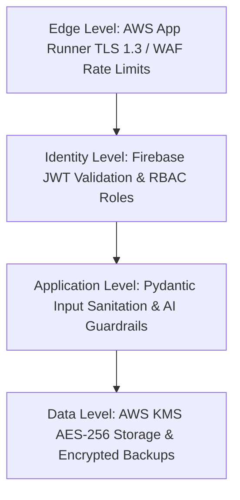

# Security & Compliance Specifications Index

Welcome to the security, privacy, and compliance documentation for **Grahvani**.

---

## 📂 Security Documents Index

- 🛡️ **[Threat Model](THREAT_MODEL.md)** — STRIDE threat modeling analysis for birth details, auth tokens, and AI pipelines.
- 📜 **[Data Privacy & DPDP](DATA_PRIVACY.md)** — Indian DPDP Act compliance, explicit consent recording, user data deletion/export APIs.
- 🔒 **[Encryption Specs](ENCRYPTION.md)** — TLS 1.3 in-transit, AWS KMS AES-256 at-rest, database field-level encryption.
- 🔑 **[Secrets Management](SECRETS.md)** — AWS Secrets Manager integration, environment separation, secret rotation policy.
- ⚖️ **[Compliance & Disclaimers](COMPLIANCE.md)** — Educational/entertainment disclaimers, Terms of Service, Privacy Policy.

---

## 🏛️ Security Architecture Layers

