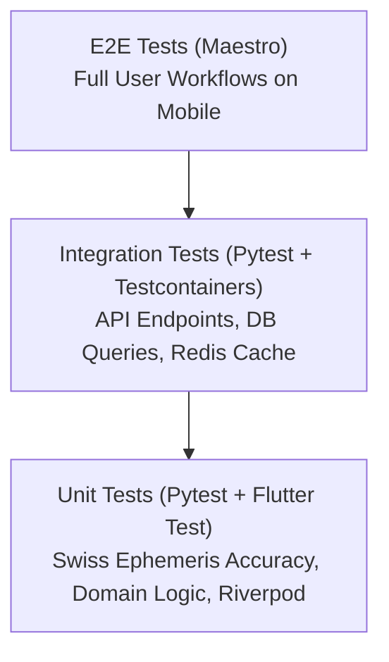

# Quality Assurance & Testing Documentation Overview

Welcome to the testing and quality assurance documentation for **Grahvani**. High reliability is essential for Grahvani because astronomical calculations MUST be mathematically exact, and AI interpretation output MUST stay within strict safety and grounded RAG boundaries.

---

## 1. The Grahvani Testing Pyramid

Grahvani follows a strict testing pyramid to ensure fast feedback loops and comprehensive quality coverage:



### Coverage Benchmarks
- **Backend Code Coverage**: **>= 85% line coverage** required on core domain modules (`services/api/app/modules/`).
- **Astrology Engine Test Vectors**: **100% test pass rate** against NASA JPL ephemeris benchmark vectors.
- **Frontend Code Coverage**: **>= 80% line coverage** on Riverpod state providers and data parsing repositories.

---

## 2. Testing Documentation Index

| Document | Scope & Focus |
| :--- | :--- |
| **[Testing Strategy](file:///e:/AI-WorkSpace/Projects/Active/Grahvani/docs/testing/TESTING_STRATEGY.md)** | Overall quality philosophy, test pyramid breakdown, and quality gates for deployment. |
| **[Unit Tests](file:///e:/AI-WorkSpace/Projects/Active/Grahvani/docs/testing/UNIT_TESTS.md)** | Fast isolated unit tests for backend Python logic, Swiss Ephemeris wrappers, and Flutter widgets. |
| **[Integration Tests](file:///e:/AI-WorkSpace/Projects/Active/Grahvani/docs/testing/INTEGRATION_TESTS.md)** | Database integration testing via Testcontainers, API route tests with `httpx.AsyncClient`. |
| **[E2E Testing](file:///e:/AI-WorkSpace/Projects/Active/Grahvani/docs/testing/E2E_TESTS.md)** | Cross-platform mobile end-to-end user journey tests using Maestro UI automation. |
| **[Load Testing](file:///e:/AI-WorkSpace/Projects/Active/Grahvani/docs/testing/LOAD_TESTING.md)** | Locust load testing scripts, concurrent user simulation, target throughput SLAs. |

---

## 3. Quickstart Command Execution

```bash
# 1. Run Python Unit Tests with Coverage Report
poetry run pytest tests/unit --cov=app --cov-report=term-missing

# 2. Run Backend Integration Tests (requires Docker for PostgreSQL container)
poetry run pytest tests/integration

# 3. Run Flutter Mobile Unit & Widget Tests
cd apps/mobile && flutter test

# 4. Execute Maestro Mobile E2E Tests on Android Emulator
maestro test .maestro/flows/chart_calculation_flow.yaml
```

---

## 4. Related Documents

- [Coding Guidelines](file:///e:/AI-WorkSpace/Projects/Active/Grahvani/docs/CODING_GUIDELINES.md) — Code style, linting rules, and formatting standards.
- [CI/CD Pipeline](file:///e:/AI-WorkSpace/Projects/Active/Grahvani/docs/infrastructure/CI_CD.md) — Automated testing steps in GitHub Actions.
